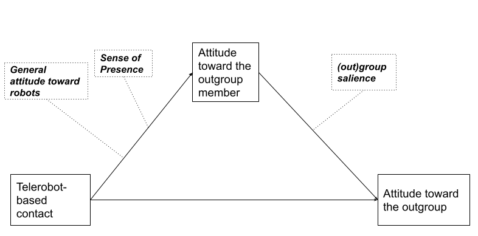
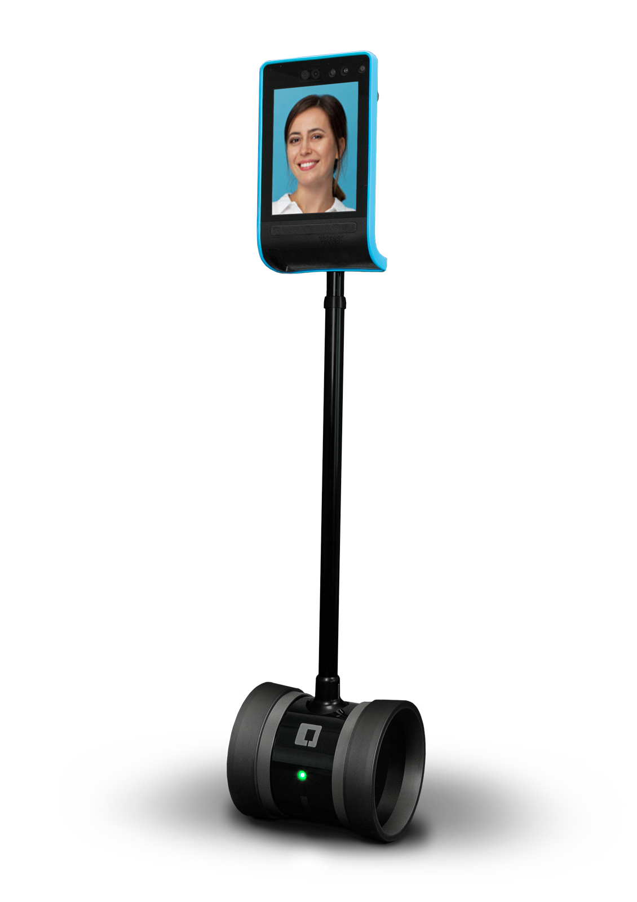

 
# Introduction
 
In evaluating the current state of human rights and ecological sustainability, the bright future promised by globalization and technological advancement has, so far, underperformed. On the one hand, an exponentially growing realization of the earth's finite resources [@latourWeHaveNever2012] meets the human race's seemingly inept ability to navigate the market to morally favorable prospects [@zizekFirstTragedyThen2009]. On the other hand, the prospect of a globally connected society has done little to alleviate hate, prejudice, and conflict between conflicting groups and nations. In some cases, the internet has even become a petri dish for disseminating prejudice and violence [@johnsonAngerFlamingComputermediated2009;@delvicarioEchoChambersEmotional2016;@waqasMappingOnlineHate2019;@stanoInternetSpreadConspiracy2020]. At the same time, we are dealing with the global COVID-19 pandemic, which provided a blatant reminder of both the perils and importance of physical closeness, and our reliance on technology to bridge over physical gaps.

This research investigates how communication technology could provide a more grounded and physical experience when face-to-face encounters are not possible. Particularly, we look for technology as a means for reconciliation and peacebuilding between groups in conflict that are plagued by a history of prejudice and racialized narratives. Building on the proven principles of the _intergroup contact hypothesis_, outlined by Gordon Allport in the 1954 seminal work _The Nature of Prejudice_ [-@allportNaturePrejudice1954], we explore _telerobotics_ (remotely operated robots) as a new medium that has the potential to facilitate positive intergroup contact. We hypothesize that if designed equally, openly, and with cultural sensitivity, the physical presence of robots as a communication tool could address a certain corporeal lack in virtual mediums of online contact. Telerobots could maintain the openness and accessibility of virtual spaces such as VR and Social Networking Services, but alleviate dissociations and confusions enacted by the dismissal of the body [@whiteImprovingIntergroupRelations2015;@schumannWhenComputermediatedIntergroup2017;@burgoonNonverbalSignals1994]. A more grounded interaction could also counteract tendencies for abstraction and reification of the other [@ahmedStrangeEncountersEmbodied2000;@gallagherHowBodyShapes2006;@silvaReificationFetishismProcesses2013] and to engage with the corporeality of identity [@hookRealRacializingEmbodiment2008]. Finally, by bringing online communication _Down to Earth_ [@latourEarthPoliticsNew2018] we make sure to not forget the importance of the environment that supports it.

We have previously established the potentialities of telerobot-based contact and suggested basic guidelines and possible pitfalls [@peledPotentialTelepresenceRobots2020]. In this article, we expound on this notion with a more comprehensive literature review and expand or conceptual model for full _telerobot contact hypothesis_.

# Taxonomy: telepresence, telerobots, and avatars
Telerobots are often referred to as _telepresence robots_. Originally, the term _telepresence_ was used by Marvin Minsky and Patrick Gunkel to describe a vision of a futuristic economy in which people perform manual, physical labor from remote locations [@minskyTelepresence1980]. While _teleoperation_ describes the broad action of remotely operating a robot, telepresence refers to the immersive experience of being in a remote environment, mediated by a physical sensing agent, that is, a _telerobot_[@sheridanTeleoperationTeleroboticsTelepresence1995;@campanellaEdenWireWebcameras2000; @kacTelepresenceBioArt2005]. In phenomenology the term  _re-embodiment_ is also used to describe the experience of telepresence [@dolezalRemoteBodyPhenomenology2009]. Today's telerobots go beyond industrial use and are deployed in social care [@michaudTelepresenceRobotHome2007], education [@tanakaTelepresenceRobotHelps2014], and interpersonal communication [@ogawaTelenoidTelepresenceAndroid2011], utilizing the internet as the medium for teleoperation.
 
When describing a telerobot serves as a remote representation of a human operator, it is often referred to as its _avatar_. The human operator could then be referred to as the _inhabiter_ of that avatar. An avatar is an antonym for _agent_, a computer-controlled entity that acts autonomously without any human intervention. A telerobot is usually, however, _semi-autonomous_; its actions are predominantly decided by the human operator, but supported by machine-controlled algorithms. A semi-autonomous telerobot is sometimes referred to as  _surrogate_ [@hughesHumanSurrogatesRemote2014;@nagendranSymmetricTelepresenceUsing2015], a combination of agent and avatar. While intergroup contact may as well take place against, or supported by, a fully simulated agent [@haslerVirtualPeacemakersMimicry2014;@hoffmanDesignEvaluationPeripheral2015;@jungUsingRobotsModerate2015;@shenStopSeeConflict2018;@rifinskiHumanhumanrobotInteractionRobotic2020], here we focus our attention on scenarios in which at least one of the group members is represented by a robotic avatar, which was shown to increase social influence [@foxAvatarsAgentsMetaAnalysis2015].

# Conceptual model
Previous research on intergroup contact provides us with conceptual and computational tools that we can use to model the path from initial contact to the eventual reduction of prejudice toward the outgroup. The model suggested by Pettigrew [@pettigrewIntergroupContactTheory1998] outlines a longitudinal process of prejudice reduction: the ingroup member initially _decategorizes_ the outgroup member from its group, then reduces prejudice from the general outgroup, and finally dissolves the border between ingroup and outgroup. Researchers have also formulated empirical models that predict and verify the link between common mediators such as anxiety and empathy, or moderators such as group salience to the outcome of the contact [@vociIntergroupContactPrejudice2003;@brownIntegrativeTheoryIntergroup2005;@pagottoEffectivenessIntergroupContact2010].
 
Based on these examples, we suggest a path model for telerobot-based contact (see [@fig:path_model]) which includes the stages of projecting the telerobot interaction to the interpersonal and then projecting the interpersonal to the intergroup. The path depends on the type of experience - interaction with a telerobot or operation of a telerobot. In the case of interaction, we hypothesize  the attitude toward the outgroup member will be moderated by the degree of perceived _co-presence_. Initially formulated by Goffman as a measure of our awareness of another human being in our physical space [@goffmanBehaviorPublicPlaces2008], the term is now used in similar fashion for virtual [@soeffnerCopresenceSharedVirtual2007;@casanuevaEffectsAvatarsCopresence2001;@benteAvatarMediatedNetworkingIncreasing2008], and physical [@hwangAugmentedRobotAgent2008;@choiWhoThisIdentity2017] environments. Co-presence was found to mediate positive attitude and intimacy in social networks [@al-ghaithUnderstandingSocialNetwork2015]. 

When operating a telerobot we are looking for a close and long-lasting social link between the operator and its robotic avatar. Several models are used in the literature to describe these phenomenon, including: Belk's _extended self_[@belkExtendedSelfDigital2013], the _proteus effect_ [@yeeProteusEffectImplications2009], _parasociality_ [@jinParasocialInteractionMy2009], and _self-presence_ [@behm-morawitzMirroredSelvesInfluence2013]. Self-presence entails engagement and a lasting social effect and was shown to mediate intergroup friendship, we therefore chose it as a moderator. However, it was not found to be a sufficient moderator for improving the broad attitude toward the outgroup [@alvidrezVerbalMimicryPredicts2020;@behm-morawitzEffectsVirtualRacial2016].

Indeed, the final stage of outgroup generalization and reduction of prejudice proves to be the most elusive. Most factors have received mixed results in online and VR contact, but significant evidence suggests that outgroup group salience (the presence of cues suggesting the outgroup member's group affiliation) is important [@vociIntergroupContactPrejudice2003;@brownIntegrativeTheoryIntergroup2005;@kenworthyIntergroupContactWhen2005]. However, in the case of ingroup identity salience, the effect is not clear, commonly intertwined with other variables[@penaVirtualRealityPolitical2021;@alvidrezVerbalMimicryPredicts2020] and in some cases achieving the opposite effect [@alvidrezContactVRTesting2020].

{#fig:path_model}

The following sections present our hypotheses for telerobot and interaction design . We look into questions of robot appearance, functionality, interaction modalities and peacebuilding scenarios.

# Design hypotheses
 
## System architecture
A communication event that is mediated by telerobots could manifest in one of three different architectures that we identified as _telerobot systems_: asymmetric, symmetric bidirectional, and symmetric unidirectional [@peledPotentialTelepresenceRobots2020]. [@Fig:sym_asym] illustrates the three types Utilizing concepts from Paynter's generalized systems theory [@paynterAnalysisDesignEngineering1961;@hannafordFeelingBelievingHistory2000], we describe two types of interactions: _signal_, and _physical_. _Physical_ refers to real word interactions between elements sharing a physical environment, such as a hand-shake or holding an object. _Signal_ interactions occur on an abstract level. They represent a unidirectional logical flow of cause and effect; for example, text that is typed on one end of online communication and appears on the other end.

{#fig:sym_asym}

Although the _symmetric unidirectional_ system has its own merits, in our hypothesis we assume that  that at least one participant is physically interacting with a robot, therefore we focus on the first two systems.

Due to their nature, symmetric telerobot systems provide the hardware foundation for equality - one of Allport's conditions for positive intergroup contact. Equality in communication was also shown to promote peacebuilding in the Israeli-Palestinian conflict[@maozEvaluatingCommunicationGroups2005]. A symmetric system also assures that telerobot operation incorporates maximum self-presence and engagement, since it is a seamless experience for the operator. In symmetric systems the telerobot  mirrors the actions of the operator without any need of intentional operation. 
 
Asymmetric systems, however, produce an experience that is different in nature for both sides. The side that is operating the telerobot from a remote control interface is more aware of the interaction medium and may feel concealed behind it. Consequently, they may exhibit behaviors that characterize anonymous computer-mediated-communication (CMC). Research models have shown a varying effect of CMC on the outcome of intergroup contact and the reduction of prejudice [@waltherComputermediatedCommunicationReduction2015]. The _deindividuation_ model warns that anonymity may release a person from social regulation and norms, leading to a negative effect on the conversation. SIDE theory [@spearsWhenAreNet2002] provides a contrasting view in which a depersonalized encounter increases group salience, as it motivates individuals to act under a group context while pronouncing enhanced norms and tropes. Models such as SIP (social information theory) and _hyperpersonal_ communication
[@waltherComputermediatedCommunicationImpersonal1996] advocate that more intimate interpersonal relations may form in online contact because of the need for the participants to make up for the lack of non-verbal cues.
 
The side that is interacting with the robot in an asymmetric system will have stronger senses of agency, ownership and identifiability when interacting directly with the robot [@gallagherPhilosophicalConceptionsSelf2000;@coleImmunityPrincipleView2000]. They are, therefore expected to exhibit less of the CMC-related effects. However, insofar as the robot is perceived as a medium rather than an avatar (meaning a low level of co-presence), the interlocutors may still be conscientious of the mediation taking place and experience effects of deindividuation.
 
In our previous experiment with asymmetric telerobotic contact between minority and majority groups in Finland we have reported on possible benefits in empowering disadvantaged groups, but also on an incurred discomfort and resentment to due unequal setting [@peledSoftRoboticIncarnation2019, p.132, @peledPotentialTelepresenceRobots2020].
 
To summarize, asymmetric telepresence systems may have some benefits associated with CMC and deindividuation, but may also induce a sense of inequality in communication. Symmetric systems provide the foundation for equal grounds and provide a high level of self-presence in operation. 

  
## Visual appearance
The effect of a robot's appearance on a human's attitude toward it has been studied extensively in the literature, predominantly in studies of Human-Robot Interaction (HRI) and social robotics [@hancockMetaAnalysisFactorsAffecting2011]. In relevance to intergroup to contact, we identify three main aspects to address: anthropomorphism, avatar self-resemblance, and cues. However, we also identity two guiding principles: Firstly, as suggested in a studies by Bremner et al. on personality perception of robot avatars tele-operators [@bremnerPersonalityPerceptionRobot2016;@bremnerPersonalityPerceptionRobot2017], while a robotic avatar's appearance may shift the perception of the teleoperator's personality, it is highly dependent on context, on the behavior of the operator, and on additional cues such as speech and nonverbal communication. A person conducting a serious interview via an avatar of a stuffed bear as in Kuwamara's experiment[@kuwamuraPersonalityDistortionCommunication2012] may invoke a confusion and a low sense of co-presence, but a teleoperated animal puppet theater as in Kawahara et al [@kawaharaTransformedHumanPresence2016] is likely to prompt different perceptions. 

Secodnly, in accordance with Allport's condition of equality, a telerobot's appearance should consider its target audience and context so to not seem overly powerful or week in comparion to its interlocutors. A study by Rae et al. found that the height of the robot has an effect on the introloctur's perception of the operator [@raeInfluenceHeightRobotmediated2013]. We anticipate similar consequences when inequality is accentuated in other characteristics of the robot such as power, speed, and volume.

### Anthropomorphism
We have previously established the intricate relationship between human-likeness and the experience of the interlocutors in a telerobotic interaction [@peledPotentialTelepresenceRobots2020]. While anthropomorphism could increase co-presence and lower the risk of dehumanizing attitudes, it also decreases the sense of self-presence and increases the risk of negative attitudes due to the uncanny valley effect. A recent study measured perceived trust toward the most modern models of anthropomorphic robots and found that the uncanny valley is still present [@nissenAnthropomorphismTrustUncanny2021]. [@tbl:anthropomorphism] provides a summary of the  factors that correlate with anthropomorphism.

Seeing that the above analysis calls for an intermediate approach, it is worthwhile to look at the solution of _theomorphic robots_ provided by Trovato [@trovatoIntroducingTheomorphicRobots2016]. Such robots attempt to portray a divine, nonanthropomorphic appearance, without dehumanizing the avatar.


| Level of anthropomorphism | Risk of the uncanny valley | Risk of dehumanization | Operator's sense of self-presence | Interlocutor's sense of co-presence |
| ------------------------- | -------------------------- | ---------------------- | ---------------------------------- | ----------------------------------- |
| Low                       | Low                        | High                   | High                               | Low                                 |
| High                      | High                       | Low                    | Low                                | High                                |
: Anthropomorphism: summary table. {#tbl:anthropomorphism}

### Self-resemblance

### Group cues
When participants are aware of their interaction partner’s group membership and if the interaction partner is regarded as a (typical) representative of his or her group, positive effects of the interpersonal encounter are more likely to generalize to the outgroup as a whole. One approach, suggested by Pettigrew [@pettigrewIntergroupContactTheory1998], is to expose group identities gradually, starting with a low salience, allowing initial contact to form, and increasing it over time as the interaction partners establish an interpersonal relationship.
 
Group identity can be transmitted through a variety of channels in robotic telepresence, beginning with the design of the avatar; its appearance, voice, and its surroundings, and proceeding into the content of the interaction. A robotic avatar may have a non-humanoid appearance, but still maintain group identity through group symbols, cues, and language. It may speak in a group-specific language or accent, wear typical accessories or flaunt national colors. The freedom to use material objects brings up new design possibilities that are not available in an online encounter. Group cues may be positioned in subtle ways to be gradually revealed by the interlocutor. If the initial appearance and behavior of the robot are engaging enough, an interpersonal bond may form despite the presence of group-related cues.


## Use of an embedded display
The telepresence robot market is rapidly growing, and is predicted to accelerate even more in the upcoming years due to increased demand for advanced technological solutions to support remote working and social services ^[https://www.marketwatch.com/press-release/telepresence-robots-market-size-2020-to-showing-impressive-growth-by-2024-industry-trends-share-size-top-key-players-analysis-and-forecast-research-2020-04-20]. Telerobot forms are continuously branching into new directions, but the dominant form remains that of a tablet device attached to a motor vehicle [@kristofferssonReviewMobileRobotic2013] (See [@fig:double_robot]). The tablet typically displays the operator’s head, as in a video call. Examples from market leaders include _Double Robotics_ ^[https://www.doublerobotics.com/], _Mantaro_ ^[http://www.mantarobot.com/products/teleme-2/index.htm] and Revolve Robotics ^[https://telepresencerobots.com/robots/kubi]. Such telepresence robots are geared toward remote offices and public service environments, such as hospitals or schools. 
 
{#fig:double_robot width=30%}
 
The question of using a simulated face display on a robot, vis-à-vis an embodied, mechatronic face, has been troubling the HRI community since the early days of personal service robots [@thrunFrameworkHumanRobotInteraction2004]. Recently, the sense of inconsistency felt when interacting with a 2D display on a telepresence robot was verbalized by Choi and Kwak as the _dual ecologies problem_  [@choiCanYouFeel2016]. In their study, the perceived presence of a user in a tablet-based video call was higher when it was disembodied (tablet only) than when the tablet was attached to a wheeled robotic body. The authors explain this by referring to the different ecologies present in the same robot; One is a 2D projection of the remote location, and another is the physical presence of the robotic body in a shared space. They suggest that the receiver of communication experiences confusion, having to interact simultaneously with the immediate environment, and with the depiction of the remote environment.
 
Our initial test showed similar results: the use of a display on the body of the telerobot was disruptive to the participants' perceived sense of co-presence. Participants reported reverting to the experience of using a phone-like device while they were interacting with the display, despite having to touch the robot to initiate actions in the virtual interface [@peledSoftRoboticIncarnation2019, p.127]. 
 
Back projection solutions such as those of _Furhat Robotics_ ^[https://furhatrobotics.com/] attempt to solve this incongruence by projecting 3d-mapped virtual information directly onto the robot's surface. While this may moderate the negative effects of the display, it does not entirely address the dual ecologies problem of having two different spatial sources combined into one. We, therefore, recommend the use of a display to be planned carefully for intergroup contact. Preferably, the appearance of the robot could be designed without an external display, maintaining uniformity and consistency.

## Voice
In a telepresence robot-based contact, an operator may choose to use their voice or a synthetic voice that does not disclose their personality, gender, and culture. They may also use a synthetically cloned voice that is highly similar to their natural voice [@jiaTransferLearningSpeaker2019]. A synthetic voice adds modalities for speech augmentation and language translation, as we discuss in the section regarding interaction modalities.
 
Research about the effect of an avatar's voice on user attitude shows that as with visual appearance, one must strike a balance between relatedness and consistency. Lee and Nass studied the sense of social presence of e-commerce agents with machine-generated voices [@leeSocialPsychologicalOriginsFeelings2005] concerning their personality (introvert or extrovert). When the voice personality of an agent is closer to that of the interlocutor, the perceived sense of social presence increased. However, the consistency of the voice with its personality is essential. Social presence drops if a voice's style is incongruent with its textual character. Another study by Mitchel et al. [@mitchellMismatchHumanRealism2011] found that a mismatch between the voice and face of a talking head generated an uncanny sensation. A human with a synthetic voice felt as uncanny as a robot with a human voice. Therefore, an optimal voice would be one that takes the telepresent human into account, without diverging abruptly the physical form of the avatar.
 
## Materiality
The choice of materials has considerable implications for robot design. In industrial robots, materials are chosen _functionally_, following the task at hand. In robots designated for human interaction, rather than materials, we examine _materiality_. Conceptualized by Hayle, materiality is "physical qualities that present themselves to us" [@haylesSpeculativeAestheticsObjectoriented2014, p.72]. Materiality is exhibited through two main aspects of a robot's constitution: 1) The outer skin: the part of the robot that touches and is touched, and 2) Actuation: the material that actuates, generating the robot's movements. With the former, we place materials on a scale of firmness and rigidness; how soft they feel to the touch. With the latter, we define materials on a scale of flexibility and linearity that describes the nature of the material's movement.
 
Previous research in social robotics supports the use of soft materials for the outer skin of robots, especially in interaction with children [@kozimaSocialRobotsChildren2006] and in elderly care [@broekensAssistiveSocialRobots2009;@kiddSociableRobotEncourage2006]. Soft materials contribute to a sense of _affective touch_ between the robot and humans [@kerruishAffectiveTouchSocial2017;@stiehlDesignTherapeuticRobotic2005]. The human body and other natural forms are inherently soft, favoring co-existence with other soft materials [@daneseSoftMachine2003]. However, carrying an object closer to the realm of the living risks invoking an uncanny feeling as with an anthropomorphic appearance. For example, touching a smooth, soft, material that is also cold evokes the uncanny [@willemseAffectiveBehavioralResponses2017;@nieCanYouHold2012].
 
A soft touch on the surface doesn't necessarily imply a softness as a whole. For example, a gripping robotic hand made from powerful servo motors wrapped in a soft skin could still easily, and inadvertently, crush soft tissue. _Soft Robotics_ is a rapidly developing research field for robots that operate on soft materials down the level of actuation [@baoSoftRoboticsAcademic2018]. Commonly used materials are fabrics and silicone rubbers, while the most typical form of actuation is pneumatic: applying air pressure or vacuum. Presently, the largest consumers of soft robotics are the medical industry, utilizing the soft materials for invasive and surgical procedures. The use of soft robots for human interaction is nonetheless actively researched and has so far exhibited positive results [@bewleyDesigningBlonutDesign2018;@jorgensenAppealPerceivedNaturalness2018;@walkerSoftGrippersNot2019]. In our test of soft robotic telepresence, we have reached similarly promising conclusions [@peledSoftRoboticIncarnation2019]. 
 
Designers using soft robotics for interaction should take special note to some idiosyncratic features of soft actuators. Due to the highly organic style of soft-robotic actuation, the risk of falling into the uncanny valley is increasing as the robot moves like a living creature. Additionally, pneumatic soft robots are often tethered (connected by a cable), which restricts their ability to move around the space [@richUntetheredSoftRobotics2018]. Nevertheless, a soft approach deems viable for telepresence contact. Soft movement and touch may increase empathy and intimacy between the participants, resulting in a more positive evaluation of the group they represent. Softness also instills a notion of safety; an inability to cause harm. That is a desirable climate in situations of intergroup conflict.
 
## AI
The outstanding benefit of mediated verbal interaction for intergroup contact is the ability to translate between different languages and dialects [@amichai-hamburgerReducingIntergroupConflict2012]. Often groups in conflict do not speak a common language and are required to speak in a third language in the language of the advantaged/majority group. This situation forms an obstacle to achieving equality in contact. Language translation may reinforce equality in communication, as all participants can express themselves in their native language. Machine translation, however, may also be destructive to cultural and political nuances [@lehman-wilzigTowerBabelVs2000;@croninTranslationDigitalAge2012], and contemporary deep-learning translators exhibit stylistic and gender bias based on their training datasets [@hovyCanYouTranslate2020;@stanovskyEvaluatingGenderBias2019]. Models such as Timo Honkella's "peace machine" [@honkelaRauhankoneTekoalytutkijanTestamentti2017;@kouluHowWillAI2019] attempt to resolve this problem by preserving cultural-dependent meanings within a translation.
 
While no data exist on the implications of machine translation in intergroup contact, human translators and interpreters often suffer from a lack of trust by the participants who fear of bias and misinterpretation [@monzo-nebotTranslatorsInterpretersAgents2019]; a machine translator may enfold similar risks. In our initial test for automatic language translation in contact between minority and majority groups in Finland,  participants enjoyed their newly acquired ability to speak to one another in their language, but have raised concerns about being misrepresented by the machine [@peledSoftRoboticIncarnation2019]. Further research should focus on implementing and evaluating feedback mechanisms within the translation process that may reduce the fear of misinterpretation.
 

# Interaction modalities
In this section we explore possible affordances [@gibsonSensesConsideredPerceptual1966, p.285] in telerobot design, and theorize over different modalities [@kressMultimodalitySocialSemiotic2009], modes for interaction, that may assist in intergroup contact, and consider implementation detail.

## Movement in space
The ability to move a body in space distinguishes robots from other interactive technologies. However, not all robots have the same degrees of freedom and granularity when it comes to movement. In the field of social robots,_mobile robots_ typically travel around using wheeled motion. Examples include service robots, such as Pepper^[https://www.softbankrobotics.com/emea/en/pepper] and Samsung bots^[https://research.samsung.com/robot], and telepresence robots such as Double Robotics^[https://www.doublerobotics.com/] and Beam^[https://suitabletech.com/]. Other robots only move their body while remaining stationary in place; for example, care robots such as PARO ^[http://www.parorobots.com/], and telepresence robots from Ishiguru laboratories ^[http://www.geminoid.jp/en/robots.html]. Due to the complexity of maintaining both modalities in interaction, mobile robots often keep a physical distance from the user, interacting using voice and visuals they travel around the space. Stationary robots, on the other hand, tend to rely more on haptic interaction, allowing the user to hold and touch them. Only a few robots attempt to combine both modalities, such as Teo [@bonariniHuggableMobileRobot2016].
 
Touch-based human-robot interactions have an affective value [@andreassonAffectiveTouchHuman2018;@kerruishAffectiveTouchSocial2017] that may benefit intergroup contact and should hold a high priority in the design process. Furthermore, in the case of symmetric telepresence, moving around is in itself limited since the operator does not have a dedicated control interface for traveling, and movement relies only on body tracking. In asymmetric systems, camera navigation is possible but may still divert the attention of the operator from the primary task at hand, which is maintaining intimate interpersonal interactions.
 
Movement in space may nonetheless prove beneficial in intergroup conflict scenarios when groups are not allowed to travel to the opposing group's location. In such cases, there is a political value in the ability to move around a forbidden area. Moreover, in asymmetric conflicts where the oppressed group suffers from tight movement restrictions in their day-to-day life, as is the situation in Palestine [@brownImmobileMassMovement2004], an operator may feel empowered by having the ability to travel with their avatar. That, in turn, may contribute to a greater sense of equality and confidence within the conversation.
 
 
## Nonverbal communication and emotional expression
 
Nonverbal communication (NVC) signals such as facial expressions, eye gaze, and bodily gestures play a substantial role in our day-to-day interactions. In telepresence-based contact, those signals need to be accurately picked up from the operator and portrayed using the telerobot's body without losing or changing their meaning.
 
In a pioneering work by Argyle [@argyleBodilyCommunication2013], nonverbal signals were enumerated and categorized according to their level of awareness. The majority of them, as defined by Argyle, are _mostly unaware_ on the part of the sender and _mostly aware_ on the receiver side [@argyleBodilyCommunication2013, p. 5]. For example, we are seldom aware that we are smiling during a conversation, but the sentiment is registered much more attentively with our conversation partner.
 
Since NVCs communicate emotion, we should handle them with great care in telepresence contact. Unaware emotional signals from the operator can be detected using facial recognition, prosodics, and body tracking, but modern deep learning systems are still subjected to noise and errors, and can only recognize generic emotions [@zhangMultimodalDeepConvolutional2016;@hossainEmotionRecognitionUsing2019]. A mistake in communicating an emotional state could lead to confusion and frustration in the conversation. Therefore, it may be safer to rely strictly on explicit gestures made by the operator with full awareness. Expression of emotions in an asymmetric system could be invoked by the operator using emojis [@kayeEmojisInsightsAffordances2017] or other dedicated buttons that activate an emotional gesture in the robot. In body-tracking systems, explicit body gestures could be used (such as a thumbs-up, or a sign-language symbol), or touch-based interactions, such as a pat or a stroke on the robot's body, a high-five, or a hug.
 
Even if body signals are accurately detected, their meaning is not guaranteed to preserve across cultures. Gestures require active translation [@haslerRealtimeGestureTranslation2017], and facial expressions are no longer regarded as universal [jackFacialExpressionsEmotion2012]. The problem further exacerbates when opting for a non-anthropomorphic avatar that does not have eyebrows and is not capable of granular gaze motion as in the humanoid SEER robot [@todoSEERSimulativeEmotional2018].
 
A possible solution could be to use the _flow_ and _rhythm_ of body movements to express emotions instead of explicitly formed gestures [@hoffmanDesigningRobotsMovement2014]. Dance is suggested to be cross-culturally universal [@sieversMusicMovementShare2013], and much of our emotional states are expressed through the body rather than facial expressions [@aviezerBodyCuesNot2012]. Successful attempts that use movement as a mechanism for expression in robots have made use of existing frameworks and tools, including Laban's movement analysis (LMA) [@labanMasteryMovement1971;shafirEmotionRegulationMovement2016] in [@nakataExpressionEmotionIntention1998;@masudaMotionRenderingSystem2010 and the PAD emotional state model [@mehrabianApproachEnvironmentalPsychology1974] in [@ardilaAdaptiveFuzzyPredictive2019;@noguchiOMOYHandheldRobotic2020].
 
Some signals, such as shifts in gaze and body orientation, are completely unaware-of during the conversation, yet they have an impact on turn-taking and attention signaling [@kendonConductingInteractionPatterns1990;@richardsonConversationGazeCoordination2009]. A smooth turn-taking flow can promote the sense of equality in contact, and it was demonstrated to benefit human-robot interaction [@vazquezRobotAutonomyGroup2017;@lalaSmoothTurntakingRobot2019]. Turn-taking signals cannot be explicitly pronounced by the operator, without impairing the flow of the conversation. Instead, they should be a part of the robot's semi-autonomous functionality. In symmetric systems, end-of-turn could be predicted using several tracking modalities [@dekokMultimodalEndofturnPrediction2009], while an asymmetric interface can infer the end-of-turn using typing and clicking indicators.
 
 
## Verbal communication
Language, as defined by critical theorist Jürgen Habermas, is the medium through which we acquire a fundamental mutual-understanding between individuals [-@habermasTheoryCommunicativeAction1984].  While its use may cause both de-escalation and escalation of the conflict, it is often the only tool available to convey layered and abstract information. In the CMC world, we may also use language in creative ways to make up for the lack of embodied interaction and nonverbal modalities [@keatingChallengesConductingInteraction2017].
 
The outstanding benefit of mediated verbal interaction for intergroup contact is the capacity to translate between different languages and dialects in real-time [@amichai-hamburgerReducingIntergroupConflict2012]. Often groups in conflict do not speak a common language and are required to speak in a third language in the language of the advantaged/majority group. This situation forms an obstacle to achieving equality in contact. Language translation may reinforce equality in communication, as all participants can express themselves in their native language. Machine translation, however, may also be destructive to cultural and political nuances [@lehman-wilzigTowerBabelVs2000;@croninTranslationDigitalAge2012], and contemporary deep-learning translators exhibit stylistic and gender bias based on their training datasets [@hovyCanYouTranslate2020;@stanovskyEvaluatingGenderBias2019]. The loss of cultural context during translation can be especially harmful in conflict resolution [@cohenLanguageConflictResolution2001], and new deep learning models are required for this task. On example is Timo Honkella's "peace machine" [@honkelaRauhankoneTekoalytutkijanTestamentti2017;@kouluHowWillAI2019], which focuses on preserving cultural-dependent meanings within a translation.
 
While no data exist on current implications of machine translation during intergroup contact, human translators and interpreters often suffer from a lack of trust by the participants who fear of bias and misinterpretation [@monzo-nebotTranslatorsInterpretersAgents2019]; a machine translator may enfold similar risks. In our initial test for automatic language translation in contact between minority and majority groups in Finland,  participants enjoyed their newly acquired ability to speak to one another in their language, but have raised concerns about being misrepresented by the machine [@peledSoftRoboticIncarnation2019].
 
Some mitigating steps could be taken to improve the experience of the participants. First, when using speech recognition, feedback of the result in the operator's native tongue should be provided, perhaps at the cost of delaying the flow of conversation. Second, when possible, the interface should display the confidence level of the translation before it gets sent to the other side. Finally, in case a mistake was realized by the operator only after submitting, there can be a quick "oops'' button that has the robot express an apologizing gesture. If used according to those principles of design and interaction, real-time language translation could be an important facilitator for telepresence intergroup contact.
 
## Synchrony, reciprocity and feedback

Synchrony and reciprocity facilitate interpersonal sympathy and empathy across all communication modalities [@bernieriInterpersonalCoordinationBehavior1991;@burgoonAdaptationDyadicInteraction1993;@sevdalisCapturedMotionDance2011]. The process is also referred to as "social entrainment" [@phillips-silverEcologyEntrainmentFoundations2010;@stupacherSynchronySympathySocial2017]. It includes interactions such as rhythmic movements (e.g., clapping, jumping), a smooth conversation beat, synchronized dance, give-and-receive interactions, gaze synchrony, affective matching, and mimicry. Positive effects are also observed in human-robot interaction scenarios, particularly in cases of care and therapy robots for children and the elderly [@aucouturierCheekChipDancing2008;@lorenzSynchronyReciprocityKey2016].
 
Achieving interpersonal synchrony over mediated communication stumbles upon the problem of _latency_ [@campbellInterpersonalCoordinationComputerMediated2015]. The unavoidable time delay due to physical distance between the participants can instill confusion and frustration when performing rhythmic and simultaneous tasks. Research in the field of online music performance is at the forefront of tackling such issues [@odaToolsTechniquesRhythmic2017] and can be used as an inspiration. Semi-autonomous methods in the likes of action prediction, lag compensation, and global metronomes enable musicians to collaborate in jam sessions from different locations around the globe. The same methods can assist in synchronizing robot-mediated activities. In symmetric systems, the participants would be coordinating the same action, for example, clapping. In asymmetric systems, one participant would use a control interface, for example, by tapping or shaking a mobile phone, while another would act in front of the telerobot.
 
Some reciprocal actions do not require real-time synchrony between the participants and could be implemented easily. For example, the above mentioned hand-shake example and other similar gestures such as a "high five" could be performed in a turn-based flow, where one participant reaches out first, and then the other reciprocates. Such actions may not have the same valence as real-time synchronization, but could still benefit the conversation due to their reciprocal nature. Additionally, people tend to be forgiving toward the sluggishness of robots, which may lower the sense of awkwardness that might occur during the use of reciprocal actions in an FtF encounter.
 
In asymmetric systems where the robot's operator is using a control interface, having instant feedback to the control actions provides a sense of reciprocity with the control medium and can increase perceived agency and ownership within the operator [@dolezalRemoteBodyPhenomenology2009]. At the high-end of the spectrum, advanced control systems, such as the ones for 'Robonauts' at the Johnson Space Center [@@coleImmunityPrincipleView2000], mix Virtual Reality and haptic feedback. As a bare minimum, an operator should have visual feedback on how the robot acts in response to control commands. 
 
In our initial experiment, participants expressed concern over their inability to see the facial expressions they were invoking with the robot, or their avatar's arm when it was being touched [@peledSoftRoboticIncarnation2019]. When designing an asymmetric control interface, it is necessary to provide maximum visibility of the telerobot's body to the operator. If one camera is not enough, multiple camera angles could be utilized. Additionally, placing mirrors on-site could allow the operators to examine their re-embodied appearance. Finally, practicing the use of the telerobot ahead of the encounter could help operators to get comfortable with the new interface without the pressure of the ensuing intergroup contact.

# Discussion
The guidelines set forth in this article provide a foundation for further research and implementation of an innovative medium for intergroup contact. Any organized forms of intergroup contact should always be questioned and scrutinized regarding its internal motivation, especially in the context of violent, asymmetric conflict. When involving technology, a transparent and fully open-source strategy should be employed to expose inherent biases and avoid concentrations of power. The practice of _Co-Design_ can increase the involvement of minority groups in the process, disseminate technological knowledge, and reduce the notion of a higher power from above coming to restore peace without perceiving the situation and its nuances.
 
Moreover, Groom et al. showed that operators had a greater sense of self-extension to a robot that was assembled by them, rather than another [@groomAmMyRobot2009]. Robots were also successfully co-designed with children as the target users [@alves-oliveiraYOLORobotCreativity2017;@henkemansCodesignPalRobot2016], and co-design methods improved the general attitude of students toward robots in educational settings [@reich-stiebertInvolveUserChanging2019].
 
Toward the first installment of telepresence robots in sensitive conflict situations, benefits and risks are to be carefully evaluated in dedicated focus groups and with A/B testing of particular features and interactions. We look forward to unveiling the potential of telepresence robots for intergroup contact in further research, ultimately leading to positive social change.

\newpage
# Appendix A: Summary table

```{=latex}
\begin{table}[]
\begin{tabular}{lll}
\textbf{Aspect}                                                                         & \textbf{Hypothesis}                                                                                                                                                                                                                                                                                                                                                                                                                                                                                                                                                                            & Implementation considerations                                                                                                                                                                                                                                                                                                                                                                     \\
\textit{System architecture}                                                            & \begin{tabular}[c]{@{}l@{}}• An asymmetric system would invoke CMC related theories such as\\ SIDE and hyperpersonal communication that are positive for contact, but only\\  in one side of the conversation. \\ • An asymmetric system may provide a power advantage for oppressed groups \\ and highlight existing inequalities, but may also cause inconvenience to the participants.\\ • A symmetric system would provide a more equal foundation for the conversation and \\ a stronger sense of agency and ownership for the operators since the interface is transparent.\end{tabular} & • Asymmetric systems are easier to implement and to disseminate than symmetric systems                                                                                                                                                                                                                                                                                                            \\
\textit{Visual appearance}                                                              & When choosing the level of anthropomorphism, the following should be considered: • A highly anthropomorphic design may invoke negative emotions due to the uncanny valley.• A non-anthropomorphic design increases the risk of dehumanization of the out-group member.• A non-anthropomorphic design increases the sense of self extension from operator to avatar.• An anthropomorphic design increases the sense of co-presence from interlocutor to avatar .External appearance and design cues may balance the effects of anthropomorphism and increase the level of group salience        & The use of a 2D face-display embedded in the robot is not recommended due to the dual ecologies problem                                                                                                                                                                                                                                                                                           \\
\textit{Voice}                                                                          & A synthetic voice that maintains a human tone but is consistent with the non-anthropomorphic appearance of the avatar:• Maintains co-presence and group salience.• Enables speech augmentation and language translation.                                                                                                                                                                                                                                                                                                                                                                       &                                                                                                                                                                                                                                                                                                                                                                                                   \\
\textit{Materiality}                                                                    & Use of soft materials and soft actuators:• Supports intimacy and empathy due to the relatable nature of movement and touch.• Promotes a sense of safety and non-violence among the participants.                                                                                                                                                                                                                                                                                                                                                                                               & • Soft actuators are largely tethered and therefore restrict movement.• Organic movement increases the risk of the uncanny.• The combination of soft and cold skin also invokes uncanny emotions.                                                                                                                                                                                                 \\
\textit{Co-design}                                                                      & A co-design approach to robotic avatars:• Increases operator self-extension toward the avatar.• Improves general attitude toward robots.• Supports expressive therapy and empowerment.                                                                                                                                                                                                                                                                                                                                                                                                         & • Robot design and assembly requires more effort and knowledge from the participants than in a virtual setting.• Requires active participation of the engineers.                                                                                                                                                                                                                                  \\
\textit{Movement in space}                                                              & Stationary robots:• Allow the operator to focus on the interaction rather than on mobility.• Encourage the use of affective touch-based interactions.Mobile robots:• May empower group members who suffer from movement restrictions due to territorial conflict.                                                                                                                                                                                                                                                                                                                              & • A symmetric system restricts mobility since the operator cannot see the space around the avatar without losing attention from the interaction.                                                                                                                                                                                                                                                  \\
\textit{Nonverbal communication}                                                        & • Turn-taking and attention signals such a gaze aversion promote the sense of equality.  • Explicit emotional gestures avoid the risk of false emotion recognition on the operator's side. •  Movement-based emotional expression based on frameworks as LMA and PAD avoids the risk of mis-interpreted emotion on the interlocutor side, especially when using non-anthropomorphic avatars.                                                                                                                                                                                                   & • Turn-taking signals should be performed autonomously by the telerobot.  • In an asymmetric system, explicit gestures could be triggered using emojis or other dedicated buttons and end-of-turn can be more easily recognized when typing and clicking.  • In a symmetric system, explicit gestures could be triggered by defined body gestures or haptic interactions on the telerobot's body. \\
\textit{Verbal communication}                                                           & • Automatic language translation could assist in communication, but is prone to error.• Detailed feedback of the translation process and an ability to take back utterances could relieve anxiety from the participants of being misunderstood.                                                                                                                                                                                                                                                                                                                                                & AI should be used with sensitivity and transparency.                                                                                                                                                                                                                                                                                                                                              \\
\textit{\begin{tabular}[c]{@{}l@{}}Synchrony, reciprocity\\  and feedback\end{tabular}} & • Rhythmic synchronized activities such as dance and mimicry, as well as reciprocal actions such as handshake and gaze matching  promote empathy and sympathy.* Feedback over performed teleoperations reduces anxiety, allowing operators to see how their avatar behaves.                                                                                                                                                                                                                                                                                                                    & • Internet latency is a challenge for telepresence synchronization. • Symmetric systems have a transparent interface and do not require teleoperation feedback.                                                                                                                                                                                                                                   \\
\textit{Public space interventions}                                                     & • External hints on group identity and a full exposure upon contact  balance the potential to reach as many people and the danger of a negative reaction in involuntary contact.                                                                                                                                                                                                                                                                                                                                                                                                               & • In a symmetric system two robots are placed in separate public spaces, waiting for passersby.• In an asymmetric system people connect remote to one public space and have more freedom to examine their environment.• Cues that can be seen or heard from a distance may help engage people in conversation.                                                                                    \\
\textit{Interaction content}                                                            & • Games support peacebuilding and may use the robot's body as a game controller.• Semi-autonomous mediation could support empowerment and recognition of the participants, but may decrease the sense of co-presence                                                                                                                                                                                                                                                                                                                                                                           & • The dual ecologies problem may rise if using interactive visuals.• Machine learning tools should be used cautiously.                                                                                                                                                                                                                                                                            \\
\textit{Ethical considerations}                                                         & • Recognizing existing power relations within the system and telerobot design may tackle "Anti-Normalization"" discourses.                                      &                                                
\end{tabular}
\end{table}
```

\renewcommand\bibnumfmt[1]{#1.}
\renewcommand{\bibsection}{\section{References}}