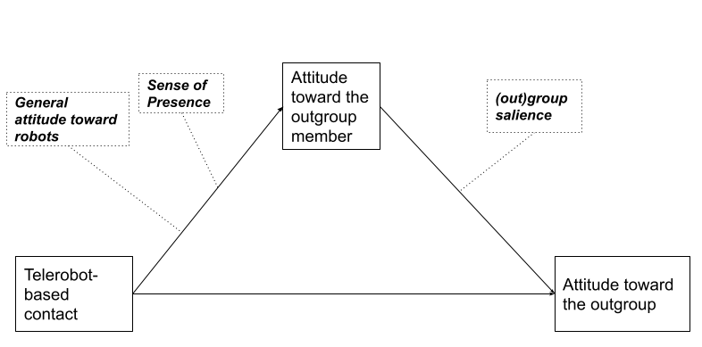
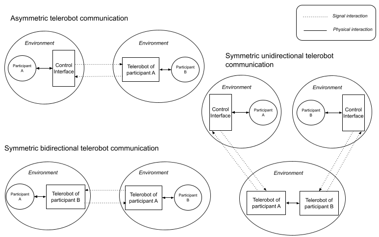
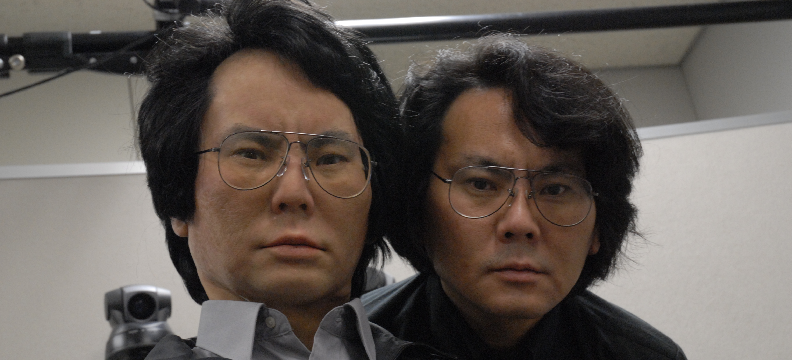
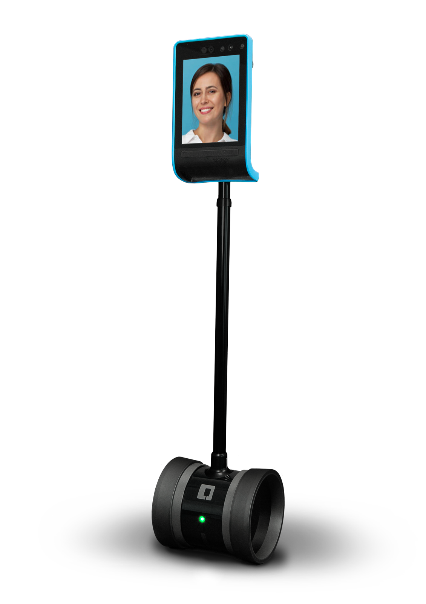

---
title: 'The Telerobot Contact Hypothesis\thanks{Supported by The Kone Foundation.}'
author: "```{=latex}\nAvner Peled\\inst{1}\\orcidID{0000-0002-0525-6385} \\and Teemu Leinonen\\inst{1}\\orcidID{0000-0002-6227-052X} \\and  Béatrice Hasler\\inst{2}\\orcidID{0000-0002-3251-4677}\n```\n"
date: 07/2021
geometry: a4paper
fontsize: 12pt
output:
    pdf_document: {citation_package: natbib, pandoc_args: ['--filter=pandoc-crossref', '--pdf-engine-opt=-outdir=./tex-junk']}
documentclass: llncs
classoption:
    - runningheads
biblio-style: splncs04
bibliography: aalto.bib
natbiboptions: 'numbers,sort'
link-citations: true
toc: false
numbersections: true
abstract: '\keywords{Intergroup Contact \and Human-Robot Interaction \and Telepresence  Conflict Resolution}'
header-includes: "```{=latex}\n\\usepackage{graphicx}\n\\usepackage[%\n     rm={oldstyle=false,proportional=true},%\n     sf={oldstyle=false,proportional=true},%\n     tt={oldstyle=false,proportional=true,variable=false},%\n     qt=false%\n ]{cfr-lm}\n\\hypersetup{colorlinks=true,linkcolor=blue, citecolor=blue, urlcolor=blue}\n\\renewcommand\\UrlFont{\\color{blue}\\rmfamily}\n\\authorrunning{P. Avner et al.} \\institute{Department of Media, Aalto University, Espoo, Finland \\\\\n\\email{\\{avner.peled, teemu.leinonen\\}@aalto.fi} \\\\\n\\and Sammy Ofer School of Communications, Interdisciplinary Center Herzliya, Herzliya, Israel \\\\\n\\email{hbeatrice@idc.ac.il}}\n```\n"
---  
  
  
#  Introduction  {#introduction }
In evaluating the current state of human rights and ecological sustainability, the bright future promised by globalization and technological advancement has, so far, underperformed. On the one hand, an exponentially growing realization of the earth's finite resources [@latourWeHaveNever2012] meets the human race's seemingly inept ability to navigate the market to morally favorable prospects [@zizekFirstTragedyThen2009]. On the other hand, the prospect of a globally connected society has done little to alleviate hate, prejudice, and conflict between conflicting groups and nations. In some cases, the internet has even become a petri dish for disseminating prejudiced and violent dispositions [@johnsonAngerFlamingComputermediated2009;@delvicarioEchoChambersEmotional2016;@waqasMappingOnlineHate2019;@stanoInternetSpreadConspiracy2020]. 
At the same time, we are dealing with the global COVID-19 pandemic, which provided a blatant reminder of both the perils and importance of physical closeness and our reliance on technology to bridge physical gaps.
  
This research investigates how communication technology could provide a more grounded and physical experience when face-to-face encounters are scant. In particular, we look for technology as a means for reconciliation and peacebuilding between groups that are plagued by a history of prejudice and racialized narratives. Building on the proven principles of the _intergroup contact hypothesis_, outlined by Gordon Allport in the 1954 seminal work _The Nature of Prejudice_ [@allportNaturePrejudice1954], we explore _telerobotics_ (remotely operated robots) as a new medium that has the potential to facilitate positive intergroup contact. We hypothesize that if designed equally, openly, and with cultural sensitivity, the physical presence of robots as a communication tool could address the intercorporeal lack that exists in virtual mediums. Telerobots live in the middle ground between physical and virtual[@robertsonRobotAvatarsVicarious2020]. They maintain the openness and accessibility of virtual spaces such as VR and Social Networking Services, yet they do not suffer from dissociations and confusions enacted by the dismissal of the body [@whiteImprovingIntergroupRelations2015;@schumannWhenComputermediatedIntergroup2017;@burgoonNonverbalSignals1994]. A more grounded interaction could also counteract tendencies for abstraction and reification of the other [@ahmedStrangeEncountersEmbodied2000;@gallagherHowBodyShapes2006;@silvaReificationFetishismProcesses2013] and to engage with the corporeality of identity [@hookRealRacializingEmbodiment2008]. Finally, by bringing online communication _Down to Earth_ [@latourEarthPoliticsNew2018], we make sure not to forget the importance of the environment that supports it.
  
We have previously established the potentialities of telerobot-based contact and suggested basic guidelines and possible pitfalls [@peledPotentialTelepresenceRobots2020]. In this article, we expound on this notion by conducting a more comprehensive literature review and by devising a complete _telerobot contact hypothesis_.
  
#  Taxonomy: telepresence, telerobots, and avatars {#taxonomy-telepresence-telerobots-and-avatars }
Telerobots are often referred to as _telepresence robots_. Marvin Minsky and Patrick Gunkel used the term  _telepresence_ to describe their vision of a futuristic economy in which people perform manual, physical labor from remote locations [@minskyTelepresence1980]. While _teleoperation_ refers to operating a robot remotely, telepresence describes an immersive experience of _being_ in a remote environment, mediated by a physical sensing agent - a _telerobot_[@sheridanTeleoperationTeleroboticsTelepresence1995;@campanellaEdenWireWebcameras2000; @kacTelepresenceBioArt2005]. In phenomenology, the term  _re-embodiment_ is used to describe the experience of telepresence [@dolezalRemoteBodyPhenomenology2009]. Today's telerobots go beyond industrial use and are deployed in social care [@michaudTelepresenceRobotHome2007], education [@tanakaTelepresenceRobotHelps2014], and interpersonal communication [@ogawaTelenoidTelepresenceAndroid2011], utilizing the internet as the medium for teleoperation.
  
When a telerobot serves as a remote representation of a human operator, it is often referred to as its _avatar_. An avatar is an antonym for _agent_, a computer-controlled entity that acts autonomously without human intervention. A telerobot is usually, however, _semi-autonomous_; its actions are predominantly decided by the human operator, but supported by machine-controlled algorithms. A semi-autonomous telerobot is sometimes referred to as  _surrogate_ [@hughesHumanSurrogatesRemote2014;@nagendranSymmetricTelepresenceUsing2015], a combination of agent and avatar. While intergroup contact may as well take place against, or supported by, a fully simulated agent [@haslerVirtualPeacemakersMimicry2014;@hoffmanDesignEvaluationPeripheral2015;@jungUsingRobotsModerate2015;@shenStopSeeConflict2018;@rifinskiHumanhumanrobotInteractionRobotic2020], we focus our attention on scenarios in which at least one of the group members is inhabiting a robotic avatar, thus forming mediated contact.
  
#  Conceptual model {#conceptual-model }
Previous research on intergroup contact provides us with conceptual and computational tools that we can use to model the path from initial contact to the eventual reduction of prejudice toward the outgrou[@pettigrewIntergroupContactTheory1998;@vociIntergroupContactPrejudice2003;@brownIntegrativeTheoryIntergroup2005;@pagottoEffectivenessIntergroupContact2010]. Based on these examples, we suggest a path model for telerobot-based contact (see [@fig:path_model]). 
  
The path begins with telerobotic interaction, then the participants form interpersonal opinions on one another and finally project their attitudes toward the outgroup. The interpersonal shift is moderated by the sense _presence_, depending on the type of experience. For a person interacting with a telerobot, we hypothesize that the attitude toward the outgroup member (the teleoperator) is moderated by the perceived _co-presence_[@goffmanBehaviorPublicPlaces2008]. The term is used to describe the sense of cohabiting with another living person in both virtual [@soeffnerCopresenceSharedVirtual2007;@casanuevaEffectsAvatarsCopresence2001;@benteAvatarMediatedNetworkingIncreasing2008] and physical [@hwangAugmentedRobotAgent2008;@choiWhoThisIdentity2017] spaces. Co-presence was found to mediate positive attitude and intimacy in social networks [@al-ghaithUnderstandingSocialNetwork2015]. 
  
For a person operating a telerobot, we look for a close and long-lasting social link between the operator and its avatar. Several models are used in the literature to describe these phenomena, including: Belk's _extended self_[@belkExtendedSelfDigital2013], the _proteus effect_ [@yeeProteusEffectImplications2009], _parasociality_ [@jinParasocialInteractionMy2009], and _self-presence_ [@behm-morawitzMirroredSelvesInfluence2013]. Self-presence entails engagement and a lasting social effect and was shown to mediate intergroup friendship. We, therefore, chose it as a moderator. 
  
The final stage of outgroup generalization and reduction of prejudice has been the most challenging to model, with many factors providing mixed results in online and VR contact studies. Nonetheless, significant evidence suggests that outgroup group salience (the presence of cues depicting the outgroup member's group affiliation) is beneficial [@brownChangingAttitudesIntergroup1999; @caoRevisitingContactHypothesis2017]. Another model, suggested by Gaertner and Dovido, is the _common ingroup identity model_[@gaertnerCommonIngroupIdentity1993]. According to this model, priming the participants with the fact that they belong under a shared superordinate group helps to reduce intergroup bias. However, recent attempts to achieve this effect in VR have either failed to create a common ingroup [@alvidrezVerbalMimicryPredicts2020;@alvidrezContactVRTesting2020] or have found that it had no significant impact[@penaVirtualRealityPolitical2021] on the results. This indicates that perhaps the model needs to be revised for computer-mediated contact.
  
{#fig:path_model width=80%}
  
The following sections present our hypotheses for telerobot and interaction design. We look into questions of robot appearance, functionality, interaction modalities, and peacebuilding scenarios. A summary is available in appendix A, table 2.
  
#  Design hypotheses {#design-hypotheses }
  
##  System architecture {#system-architecture }
A communication event mediated by telerobots could manifest in one of three different architectures that we identified as _telerobot systems_. [@peledPotentialTelepresenceRobots2020]. [@Fig:sym_asym] illustrates the three types. Utilizing concepts from Paynter's generalized systems theory [@paynterAnalysisDesignEngineering1961;@hannafordFeelingBelievingHistory2000], we describe two types of interactions: _signal_, and _physical_. _Physical_ refers to real-world interactions between elements sharing a physical environment, such as a hand-shake or holding an object. _Signal_ interactions occur on an abstract level, representing a unidirectional logical flow of cause and effect. For example, text that is typed on one end of online communication and appears on the other end.
  
{#fig:sym_asym width=80%}
  
Although the _symmetric unidirectional_ system has its own merits, we focus here on the first two systems in which at least one participant is physically interacting with a robot. 
  
Due to their nature, symmetric telerobot systems provide the hardware foundation for equality - one of Allport's conditions for positive intergroup contact and a proven prompter of peace efforts in the Israeli-Palestinian conflict[@maozEvaluatingCommunicationGroups2005]. Symmetric systems also assure that telerobot operation incorporates maximum self-presence and engagement since they form a seamless experience for the operator. In symmetric systems, the telerobot mirrors the actions of the operator without any need for intentional operation. 
  
Asymmetric systems produce an experience that is different in nature on both ends. The participant operating the telerobot from a remote control interface is more aware of the interaction medium and may feel concealed behind it.  In our previous experiment utilizing an asymmetric telerobotic system we have reported on possible benefits in empowering disadvantaged groups, but also on an incurred discomfort and resentment due to the unequal setting [@peledSoftRoboticIncarnation2019, p.132; @peledPotentialTelepresenceRobots2020].
  
Teleoperators in asymmetric systems may exhibit behaviors that characterize anonymous computer-mediated communication (CMC). Research models have shown a varying effect of CMC on the outcome of intergroup contact and the reduction of prejudice [@waltherComputermediatedCommunicationReduction2015]. The _deindividuation_ model warns that anonymity may release a person from social regulation and norms, leading to a negative effect on the conversation. SIDE theory [@spearsWhenAreNet2002] provides a contrasting view, demonstrating that if group identity cues are present, anonymity further increases group salience, as it motivates individuals to act under a group context while pronouncing enhanced norms and tropes. Models such as SIP (social information theory) and _hyperpersonal_ communication
[@waltherComputermediatedCommunicationImpersonal1996] advocate that more intimate interpersonal relations may form in online contact because of the need for the participants to make up for the lack of non-verbal cues.
  
Participants interacting with the robot in an asymmetric system will thus have stronger senses of agency, ownership, and identifiability [@gallagherPhilosophicalConceptionsSelf2000;@coleImmunityPrincipleView2000] compared to their teleoperator counterparts. They are, therefore, expected to exhibit fewer CMC-related effects than the operators. However, insofar as the robot is perceived by the interlocutors as a medium rather than an avatar (meaning a low level of co-presence), the interlocutors may still be conscientious of mediation taking place and experience effects of deindividuation. 
  
To summarize, asymmetric telepresence systems may have some benefits associated with CMC and deindividuation, but may also induce a sense of inequality in communication. Symmetric systems provide the foundation for equal grounds and a high level of self-presence in operation. 
  
  
##  Visual appearance {#visual-appearance }
The effect of a robot's appearance on attitude toward it has been studied extensively in the literature, predominantly in Human-Robot Interaction (HRI) and social robotics [@hancockMetaAnalysisFactorsAffecting2011]. In relevance to intergroup to contact, we discuss two considerations: anthropomorphism and avatar customization. We also note, however, two guiding principles: Firstly, as suggested in studies by Bremner et al. on personality perception of robot teleoperators [@bremnerPersonalityPerceptionRobot2016;@bremnerPersonalityPerceptionRobot2017], while a robotic avatar's appearance may project on the personality of its operator, the process is highly dependent on context, the behavior of the operator, and additional cues such as speech and nonverbal communication. For example, a person conducting serious interviews using a stuffed bear avatar, as in Kuwamara's experiment[@kuwamuraPersonalityDistortionCommunication2012], may invoke a sense of confusion and a low sense of co-presence within its users. However, a teleoperated animal puppet theater, as in Kawahara et al[@kawaharaTransformedHumanPresence2016], is likely to prompt more natural responses. In robot-mediated communication, we can place physical cues with the robot, such as setting props or clothing accessories. Those can include cues about the current context, or group identity cues using cultural or religious symbols.
  
Secondly, following Allport's condition of equality, a telerobot's appearance should consider its target audience and context so it would not seem overly powerful or weak in comparison. A study by Rae et al. found that the height of the robot affects the interlocutor's perception of the operator's persuasiveness [@raeInfluenceHeightRobotmediated2013]. We anticipate that if inequality is accentuated in characteristics of the robot such as height, power, speed, and volume, it may hamper intergroup relations.
  
###  Anthropomorphism {#anthropomorphism }
We have previously established the intricate relationship between human-likeness and the experience of the interlocutors in a telerobotic interaction [@peledPotentialTelepresenceRobots2020]. While anthropomorphism may increase the sense of co-presence and lower the risk of dehumanizing attitudes, it may also decrease the sense of self-presence and increase the risk of negative attitudes due to the uncanny valley effect. A recent study measured perceived trust toward the most modern models of anthropomorphic robots and found that the uncanny valley is still present [@nissenAnthropomorphismTrustUncanny2021]. [@tbl:anthropomorphism] provides a summary of the factors that correlate with anthropomorphism.
  
Seeing that the above analysis calls for an intermediate approach, it is worthwhile to look at solutions like those of  _theomorphic robots_ provided by Trovato [@trovatoIntroducingTheomorphicRobots2016]. Such robots attempt to portray a divine, nonanthropomorphic appearance without dehumanizing the avatar. As mentioned earlier, the effect of anthropomorphism is highly dependent on context and other cues. For example, if using a nonhuman appearance, cues reminding the operator's human origin could be placed at the scene.
  
| Level of anthropomorphism | Risk of the uncanny valley | Risk of dehumanization | Operator's sense of self-presence | Interlocutor's sense of co-presence |
| ------------------------- | -------------------------- | ---------------------- | ---------------------------------- | ----------------------------------- |
| Low                       | Low                        | High                   | High                               | Low                                 |
| High                      | High                       | Low                    | Low                                | High                                |
: Anthropomorphism: summary table. {#tbl:anthropomorphism}
  
###  Customization {#customization }
The ability to customize an avatar is widespread in video games, virtual reality, and social media applications. It improves engagement with the platform [@ngExaminingEffectsAvatar2013] and primes the user's mindset to achieving certain goals [@sahAreYouWhat2017]. In robotics, customizing an avatar is a more complex task than in a virtual environment. Design options are constrained by the hardware platform of the robot, requiring co-design between the robot engineers and the user. Assembling the robot takes physical effort and requires basic knowledge in mechatronics. Nevertheless, involving users in the design and assembly process of their robotic avatar may have benefits. Groom et al. showed that operators had a greater sense of self-extension to a robot that was assembled by them, rather than by another [@groomAmMyRobot2009]. Robots were also successfully co-designed with children as the target users. The YOLO robot focused on creativity and storytelling, allowing children to design behaviors and movements [@alves-oliveiraYOLORobotCreativity2017], while the PAL involved children in designs for diabetes self-management [@henkemansCodesignPalRobot2016]. Co-design methods also improved the general attitude of students toward robots in educational settings [@reich-stiebertInvolveUserChanging2019].
  
In the context of intergroup contact, and especially in situations of conflict, co-designing avatars may have even greater virtues. Participants could control their representation and its behavior, considering how they wish to be seen by the other side; thus, supporting ‘controlled’ means for escalation and de-escalation that has been found beneficial in other media-based intergroup contact projects [@zancanaroConarratingConflictInteractive2012]. The assembly work in itself may be therapeutic, both as a tactile experience [@sholtTherapeuticQualitiesClaywork2006] and as a self-expressive art form [@muriFaceArtTherapy2007]. Finally, a participatory approach for robot-building has the potential to empower oppressed groups and minorities by providing meaningful education in modern communication technologies.
  
Highly anthropomorphic robotic avatars could also be modeled to resemble their operator. The most notable example is _Geminoid_ from Ishiguru laboratories ^[http://www.geminoid.jp/projects/kibans/resources.html]. In a small-scale survey among visitors in Ars Electronica, their impression of Geminoid was a combination of amusement and fear due to the uncanny valley effect [@becker-asanoEXPLORINGUNCANNYVALLEY2010]. Additionally, as noted in a VR study by Peña et al., self-resembling avatars could have mixed results on the result of intergroup contact [@penaVirtualRealityPolitical2021]. On the one hand, the priming effect mentioned earlier my strengthened one's beliefs and ideologies which in turn amplified the social distance to the outgroup. On the other hand, customizing an avatar to resemble one's self increased the sense of identifiability which reduced the negative effects of deindividuation (mostly relevant to asymmetric systems). Finally, the VR study by Alvidrez and Peña found that self-resembling avatars decreased the operator's engagement presence. The result resonates with the research by Groom et al. [@groomAmMyRobot2009], which concluded that robot operators have a greater sense of _self-extension_ [@belkPossessionsExtendedSelf1988] to their avatar when it is non-human.
  
{#fig:geminoid width=80%}
  
  
##  Use of an embedded display {#use-of-an-embedded-display }
The telepresence robot market is growing rapidly, and is predicted to accelerate even more in the upcoming years due to increased demand for advanced technological solutions to support remote working and social services ^[https://www.marketwatch.com/press-release/telepresence-robots-market-size-2020-to-showing-impressive-growth-by-2024-industry-trends-share-size-top-key-players-analysis-and-forecast-research-2020-04-20]. Telerobot forms are continuously branching into new directions but the dominant form remains that of a tablet device attached or embedded in a motor vehicle [@kristofferssonReviewMobileRobotic2013] (See [@fig:double_robot]). The tablet typically displays the talking head of the operator, as in a video call. Examples from market leaders include _Double Robotics_ ^[https://www.doublerobotics.com/], _Mantaro_ ^[http://www.mantarobot.com/products/teleme-2/index.htm] and Revolve Robotics ^[https://telepresencerobots.com/robots/kubi]. Such telepresence robots are geared toward remote offices and public service environments, such as hospitals or schools. 
  
{#fig:double_robot width=30%}
  
The question of using a flat face display on a robot, vis-à-vis an embodied, mechatronic face, has been troubling the HRI community since the early days of personal service robots [@thrunFrameworkHumanRobotInteraction2004]. More recently, the sense of inconsistency felt when interacting with a 2D display on a telepresence robot was verbalized by Choi and Kwak as the _dual ecologies problem_  [@choiCanYouFeel2016]. In their study, the perceived presence of a user in a tablet-based video call was higher when it was disembodied (tablet only) than when the tablet was attached to a wheeled robotic body. The authors explain this by referring to the different ecologies present in the same robot; One is a 2D projection of the remote location, and another is the physical presence of the robotic body in a shared space. The authors suggest that the receiver of communication experiences confusion, having to interact simultaneously with the immediate environment, and with the depiction of the remote environment.
  
Our initial test showed similar results: the use of a display on the body of the telerobot was disruptive to the participants' perceived sense of co-presence. Participants reported reverting to the experience of using a phone-like device while they were interacting with the display, despite having to touch the robot to initiate actions in the virtual interface [@peledSoftRoboticIncarnation2019, p.127]. We, therefore, recommend the use of a display to be planned carefully for intergroup contact. Preferably, the robot could be designed without an external display, maintaining uniformity and consistency.
  
##  Voice {#voice }
In a telerobot-based contact, an operator may choose to use their voice or a synthetic voice that does not disclose their personality, gender, and culture. They may also use a synthetically cloned voice that is highly similar to their natural voice [@jiaTransferLearningSpeaker2019]. A synthetic voice adds modalities for speech augmentation and language translation, as we discuss in the section regarding interaction modalities.
  
Research about the effect of an avatar's voice on user attitude shows that as with visual appearance, one must strike a balance between relatedness and consistency. Lee and Nass studied the sense of social presence of e-commerce agents with machine-generated voices [@leeSocialPsychologicalOriginsFeelings2005] concerning their personality (introvert or extrovert). When the voice personality of an agent is closer to that of the interlocutor, the perceived sense of social presence increased. However, the consistency of the voice with its personality is essential. Social presence drops if a voice's style is incongruent with its textual character. Another study by Mitchel et al. [@mitchellMismatchHumanRealism2011] found that a mismatch between the voice and face of a talking head generated an uncanny sensation. A human with a synthetic voice felt as uncanny as a robot with a human voice. Therefore, the optimal voice would take the human teleoperator into account, without diverging abruptly the physical form of the avatar.
  
##  Materiality {#materiality }
The choice of materials has considerable implications for robot design. In industrial robots, materials are chosen _functionally_ following the task at hand. In robots designated for human interaction, we examine _materiality_ - the physical qualities of material as we sense them [@haylesSpeculativeAestheticsObjectoriented2014]. Materiality is exhibited through two main aspects of a robot's constitution: 1) The outer skin: the part of the robot that touches and is touched, and 2) Actuation: the material that actuates, generating the robot's movements. With the former, we place materials on a scale of firmness and rigidness; how soft they feel to the touch. With the latter, we define materials on a scale of flexibility and linearity that describes the nature of the material's movement.
  
Previous research in social robotics supports the use of soft materials for the outer skin of robots, especially in interaction with children [@kozimaSocialRobotsChildren2006] and in elderly care [@broekensAssistiveSocialRobots2009;@kiddSociableRobotEncourage2006]. Soft materials contribute to a sense of _affective touch_ between the robot and humans [@kerruishAffectiveTouchSocial2017;@stiehlDesignTherapeuticRobotic2005]. The human body and other natural forms are inherently soft, favoring co-existence with other soft materials [@daneseSoftMachine2003]. However, carrying an object closer to the realm of the living risks invoking an uncanny feeling as with an anthropomorphic appearance. For example, touching a smooth, soft material that is also cold evokes the uncanny [@willemseAffectiveBehavioralResponses2017;@nieCanYouHold2012].
  
A soft touch on the surface doesn't necessarily imply a softness as a whole. For example, a gripping robotic hand made from powerful servo motors wrapped in a soft skin could still easily, and inadvertently, crush soft tissue. _Soft Robotics_ is a rapidly developing research field for robots that operate on soft materials down the level of actuation [@baoSoftRoboticsAcademic2018]. Commonly used materials are fabrics and silicone rubbers, while the most typical form of actuation is pneumatic: applying air pressure or vacuum. Presently, the largest consumers of soft robotics are the medical industry, utilizing soft materials for invasive and surgical procedures. The use of soft robots for human interaction is nonetheless being actively researched and has so far exhibited positive results [@bewleyDesigningBlonutDesign2018;@jorgensenAppealPerceivedNaturalness2018;@walkerSoftGrippersNot2019]. In our test of soft robotic telepresence, we have reached similarly promising conclusions [@peledSoftRoboticIncarnation2019]. 
  
Designers using soft robotics for interaction should nevertheless take special note of some idiosyncratic features of soft actuators. Due to the highly organic style of soft-robotic actuation, the risk of falling into the uncanny valley is increasing as the robot moves like a living creature. Additionally, pneumatic soft robots are often tethered (connected by a cable), restricting their ability to move around the space [@richUntetheredSoftRobotics2018]. Nevertheless, a soft approach deems viable for telerobotic contact. Soft movement and touch may increase empathy and intimacy between the participants, resulting in a more positive evaluation of the group they represent. Softness also instills a notion of safety; an inability to cause harm. That is a desirable climate in situations of intergroup conflict.
  
  
#  Interaction modalities {#interaction-modalities }
  
##  Movement in space {#movement-in-space }
The ability to move a body in space distinguishes robots from other interactive technologies. However, not all robots have the same degrees of freedom and granularity when it comes to movement. In the field of social robots,_mobile robots_ typically travel around using wheeled motion. Examples include service robots, such as Pepper^[https://www.softbankrobotics.com/emea/en/pepper] and Samsung bots^[https://research.samsung.com/robot], and telepresence robots such as Double Robotics^[https://www.doublerobotics.com/] and Beam^[https://suitabletech.com/]. Other robots only move their body while remaining stationary in place; for example, care robots such as PARO ^[http://www.parorobots.com/], and telepresence robots from Ishiguru laboratories ^[http://www.geminoid.jp/en/robots.html]. Due to the complexity of maintaining both modalities in interaction, mobile robots often keep a physical distance from the user, interacting using voice and visuals they travel around the space. Stationary robots, on the other hand, tend to rely more on haptic interaction, allowing the user to hold and touch them. Only a few robots attempt to combine both modalities, such as Teo [@bonariniHuggableMobileRobot2016].
  
Touch-based human-robot interactions have an affective value [@andreassonAffectiveTouchHuman2018;@kerruishAffectiveTouchSocial2017] that may benefit intergroup contact and should hold a high priority in the design process. Furthermore, in the case of symmetric telepresence, moving around is in itself limited since the operator does not have a dedicated control interface for traveling, and movement relies only on body tracking. In asymmetric systems, camera navigation is possible but may still divert the attention of the operator from the primary task at hand, which is maintaining intimate interpersonal interactions.
  
Movement in space may nonetheless prove beneficial in intergroup conflict scenarios when groups are not allowed to travel to the opposing group's location. In such cases, there is a political value in the ability to move around a forbidden area. Moreover, in asymmetric conflicts where the oppressed group suffers from tight movement restrictions in their day-to-day life, as is the situation in Palestine [@brownImmobileMassMovement2004], an operator may feel empowered by having the ability to travel with their avatar. That, in turn, may contribute to a greater sense of equality and confidence within the conversation.
  
  
##  Nonverbal communication and emotional expression  {#nonverbal-communication-and-emotional-expression }
Nonverbal communication (NVC) signals such as facial expressions, eye gaze, and bodily gestures play a substantial role in our day-to-day interactions. In telerobot-based contact, those signals need to be accurately picked up from the operator and portrayed using the telerobot's body without losing or changing the meaning.
  
In a pioneering work by Argyle [@argyleBodilyCommunication2013], nonverbal signals were enumerated and categorized according to their level of awareness. The majority of them, as defined by Argyle, is _mostly unaware_ on the part of the sender and _mostly aware_ on the receiver side [@argyleBodilyCommunication2013, p. 5]. For example, we are seldom aware that we are smiling during a conversation, but the sentiment is registered much more attentively with our conversation partner.
  
Since NVCs communicate emotion, we should handle them with great care in intergroup contact. While unaware emotional signals from the operator could be detected using facial recognition, prosodics, and body tracking, deep learning systems are still subjected to noise and error [@zhangMultimodalDeepConvolutional2016;@hossainEmotionRecognitionUsing2019]. A mistake in communicating an emotional state could lead to confusion and frustration in the conversation. Therefore, it may be safer to rely strictly on explicit gestures made by the operator with full awareness. Expression of emotions in an asymmetric system could be invoked by the operator using emojis [@kayeEmojisInsightsAffordances2017] or other dedicated buttons that activate an emotional gesture in the robot. In body-tracking systems, explicit body gestures could be used (such as a thumbs-up, or a sign-language symbol), or touch-based interactions, such as a pat or a stroke on the robot's body, a high-five, or a hug.
  
Even if body signals and facial expressions are accurately detected, their meaning is not guaranteed to preserve across cultures[jackFacialExpressionsEmotion2012]. Gestures require active translation [@haslerRealtimeGestureTranslation2017]. The problem further exacerbates in nonanthropomorphic avatars that do not have eyebrows and cannot exhibit exgranular gaze motion as in the humanoid SEER robot [@todoSEERSimulativeEmotional2018].
  
A possible solution could be to use the _flow_ and _rhythm_ of body movements to express emotions instead of explicitly formed gestures [@hoffmanDesigningRobotsMovement2014]. Dance is recognized as cross-culturally universal [@sieversMusicMovementShare2013], and much of our emotional states are expressed through the body rather than facial expressions [@aviezerBodyCuesNot2012]. Successful attempts that use movement as a mechanism for expression in robots have made use of existing frameworks and tools, including Laban's movement analysis (LMA) [@labanMasteryMovement1971;@shafirEmotionRegulationMovement2016] in [@nakataExpressionEmotionIntention1998;@masudaMotionRenderingSystem2010] and the PAD emotional state model [@mehrabianApproachEnvironmentalPsychology1974] in [@ardilaAdaptiveFuzzyPredictive2019;@noguchiOMOYHandheldRobotic2020].
  
Some signals, such as shifts in gaze and body orientation, are completely unaware of during the conversation, yet they have an impact on turn-taking and attention signaling [@kendonConductingInteractionPatterns1990;@richardsonConversationGazeCoordination2009]. A smooth turn-taking flow can promote the sense of equality in contact, and was demonstrated to benefit human-robot interaction [@vazquezRobotAutonomyGroup2017;@lalaSmoothTurntakingRobot2019]. Turn-taking signals cannot be explicitly pronounced by the operator, without impairing the flow of the conversation. Instead, they should be a part of the robot's semi-autonomous functionality. In symmetric systems, the end-of-turn could be predicted using several tracking modalities [@dekokMultimodalEndofturnPrediction2009], while an asymmetric interface can infer the end-of-turn using typing and clicking indicators.
  
##  Verbal communication {#verbal-communication }
Language is often the best tool to convey layered and abstract information, as required during peacebuilding efforts. Previously we have outlined the risks and benefits of using machine translation for verbal communication [@peledPotentialTelepresenceRobots2020]. Despite the benefit of enabling dialogue between speakers that do not speak the same language, caution is required when using automatic interfaces. Minute mistakes in translation could impair participants' confidence and trust in the process.  
  
Some mitigating steps could be taken to improve the experience of the participants when using machine translation. First, when using speech recognition, feedback of the result in the operator's native tongue should be provided, perhaps at the cost of delaying the flow of conversation. Second, when possible, the interface should display the confidence level of the translation before it gets sent to the other side. Finally, in case a mistake was realized by the operator only after submitting, there can be a quick "oops'' button that has the robot express an apologizing gesture. If used according to those principles of design and interaction, real-time language translation could be an important facilitator for telerobot-based contact.
  
##  Synchrony, reciprocity, and feedback {#synchrony-reciprocity-and-feedback }
Synchrony and reciprocity facilitate interpersonal sympathy and empathy across all communication modalities [@bernieriInterpersonalCoordinationBehavior1991;@burgoonAdaptationDyadicInteraction1993;@sevdalisCapturedMotionDance2011]. The process is referred to as "social entrainment" [@phillips-silverEcologyEntrainmentFoundations2010;@stupacherSynchronySympathySocial2017]. It includes interactions such as rhythmic movements (e.g., clapping, jumping), a smooth conversation beat, synchronized dance, give-and-receive interactions, gaze synchrony, affective matching, and mimicry. Positive effects are also observed in human-robot interaction scenarios, particularly in cases of care and therapy robots for children and the elderly [@aucouturierCheekChipDancing2008;@lorenzSynchronyReciprocityKey2016].
  
Achieving interpersonal synchrony over mediated communication stumbles upon the problem of _latency_ [@campbellInterpersonalCoordinationComputerMediated2015]. The unavoidable time delay due to physical distance between the participants can instill confusion and frustration when performing rhythmic and simultaneous tasks. Research in online music performance is at the forefront of tackling such issues [@odaToolsTechniquesRhythmic2017] and can be used as an inspiration. Semi-autonomous methods in the likes of action prediction, lag compensation, and global metronomes enable musicians to collaborate in jam sessions from different locations around the globe. The same methods can assist in synchronizing robot-mediated activities. In symmetric systems, the participants would be coordinating the same action, for example, clapping. In asymmetric systems, one participant would use a control interface, for example, by tapping or shaking a mobile phone, while another would act in front of the telerobot.
  
Some reciprocal actions do not require real-time synchrony between the participants. For example, a hand-shake and a "high five" could be performed in a turn-based flow, where one participant reaches out first, and then the other reciprocates. Such actions may not have the same valence as real-time synchronization, but could still benefit the conversation due to their reciprocal nature. Additionally, people tend to be forgiving toward the sluggishness of robots, which may lower the sense of awkwardness that might occur during the use of reciprocal actions in a face-to-face encounter.
  
In asymmetric systems where the robot's operator is using a control interface, having instant feedback to the control actions provides a sense of reciprocity with the control medium and can increase perceived agency and ownership within the operator [@dolezalRemoteBodyPhenomenology2009]. At the high-end of the spectrum, advanced control systems, such as the ones for 'Robonauts' at the Johnson Space Center [@@coleImmunityPrincipleView2000], mix Virtual Reality and haptic feedback. As a bare minimum, an operator should have visual feedback on how the robot acts in response to control commands. 
  
In our initial experiment, participants expressed concern over their inability to see the facial expressions they were invoking with the robot, or their avatar's arm when it was being touched [@peledSoftRoboticIncarnation2019]. When designing an asymmetric control interface, it is necessary to provide maximum visibility of the telerobot's body to the operator to increase the sense of self-presence. If one camera is not enough, multiple camera angles could be utilized. Additionally, placing mirrors on-site could allow the operators to examine their re-embodied appearance. Finally, practicing the use of the telerobot ahead of the encounter could help operators get comfortable with the new interface without the pressure of the ensuing intergroup contact.
  
##  Semi-autonmous functions {#semi-autonmous-functions }
The formed conversation between the participants can be guided using the robot's semi-autonomous functions. Modern types of interaction may include cooperative games and simulations that engage the participant toward a common goal, in line with the principles set by Allport. Games have shown potential for peacebuilding in face-to-face meetings [@brynenPeacebuildingGamesSimulations2013] and online contact [@haslerOnlineIntergroupContact2013]. When interacting with a robot, its body parts may be appropriated as game controllers, for example, by squeezing the arms of the robot; Thus, indirectly forming touch interactions between the participants. However, when integrating interactive visuals, it is necessary to embed a 2D display within the telerobot or place one beside it. In such cases, the interface design should carefully manage the attention of the user to avoid the dual ecologies problem.
  
Traditional forms of conflict resolution can also benefit from robotic mediation. At the forefront of technological conflict resolution, machine learning is sought as a tool for peacebuilding that can understand complex sentiments and situations [@honkelaRauhankoneTekoalytutkijanTestamentti2017], predict conflict escalation before it occurs [@perryMachineLearningConflict2013], and offer help to resolve issues [@sycaraMachineLearningIntelligent1993]. Nevertheless, machine learning tools should be used with transparency to avoid issues of trust and suspected bias in the process. Active mediation may also decrease the sense of co-presence, as the robot is perceived more like a middle-agent rather than an avatar.
  
#  Public space interventions {#public-space-interventions }
Robotic avatars are an excellent communication tool for organized intergroup encounters where participants are unable to meet face-to-face. However, the physical presence of telerobots makes them exceptionally suitable for public space interventions. Robots can transcend national borders and roam public spaces, having the potential to reach crowds that wouldn't normally engage in intergroup contact. In symmetric systems, robots could be placed in public urban areas on both sides and facilitate bi-directional contact. In asymmetric systems, one robot is placed in a public spot while operators inhabit the avatar from their home or a dedicated control spot. An advantage of public space interventions is that any form of intergroup contact which is observed by a public audience manifests as _Viacrious Contact_[@robertsonRobotAvatarsVicarious2020]: an indirect contact with the outgroup member supported by the imagination of the audience. Vicarious contact was shown to improve attitude between groups [@vezzaliImprovingIntergroupRelations2014], even if it is watched on television [@preussVideoInterventionEvery2020]. When planning a public space intervention, the designated site and its demographics should be considered along with the design of the robot and interaction content. Tailoring the contact experience to its local context may increase the likelihood of public engagement and improve the outcome of the encounter. We elaborate on two types of public space interventions: dyadic and performative. 
  
##  Dyadic intervention {#dyadic-intervention }
In a dyadic intervention, a telerobotic avatar appears in a public space, ready to engage in a one-on-one conversation with passersby. The group identity of the telerobot's operator could be widely exposed to passersby via physical cues, allowing them to make a voluntary decision to make contact, or they could first approach the robot and only then realize its group identity during the conversation. According to a meta-analysis by Pettigrew et al. [@pettigrewRecentAdvancesIntergroup2011] contact that begins voluntarily is less likely to exacerbate intergroup attitudes. 
  
A robot that emerges in the middle of public space might be intriguing enough for some people to approach, particularly those who generally have positive attitudes towards robots. One method to get even more public interest would be to equip the telerobot with some actions designed to draw a crowd. For example, play a sound, a musical theme, or perform an inviting gesture. In an asymmetric system, an operator has more control over the robot's interaction with the environment. They may look around by moving a camera or even drive around using wheeled motion. 
  
##  Performative intervention {#performative-intervention }
A performative type of intervention is oriented toward an audience and typically consists of remotely controlled storytelling rather than direct dialogue. For example, a theatrical performance by a member of an oppressed group as a form of political activism (see Boal's _theatre of the oppressed_[@boalTheatreOppressed2008]]). An advantage of this type of intervention is that it does not portray the telerobots as avatars of the operator, but rather as _puppets_, thus avoiding the risk of dehumanization and confusion (at the cost of a lower co-presence). To remind the audience that a human outgroup member is operating the show, physical cues could be added. The performance could be an asymmetric single-performer show against an audience or asymmetric collaboration with a performer at another location.
  
#  Conclusion {#conclusion }
This article sets a theoretical scaffold for using robots to facilitate intergroup contact. We set a conceptual framework that can be developed for an empirical study and formulate a set of hypotheses derived from existing literature, that are now in need of verification. In doing so, we also further establish what sets telerobotics apart from other forms of online communication, and underline the exciting opportunities they present.  Toward any organized attempt for intergroup contact, one should always consider the broader context, the long-term effects, and the ethics of research. That is especially true in the context of violent, asymmetric conflicts, where one group is a dominant majority, and another is an oppressed minority; even more so, when technology is involved, along with its inherent biases and connotations of power. A common concern is that the act of leveling the play-field, treating both groups as equals, will dissolve the real-world injustices and reduce the motivation for social change [@saguyIronyHarmonyIntergroup2009;@hewstoneLivingApartLiving2009]. That is reflected in the Israeli-Palestinian setting by the "Anti-Normalization" movement [@salemAntinormalizationDiscourseContext2005]. The movement rejects attempts for normalizing relations between Israel and Palestine that are not predated by an overall restoration of justice in the area.
  
We have suggested some ways to tackle this concern by recognizing power relations and injustices from within the system architecture, the design of the telerobot, and the practice of participatory co-design. Finally, we stress that complete transparency should accompany any attempt to insert technology into a conflicted scenario. That includes disclosing any source of funding for resources, the identity of the platform designers, and the location and maintainers of the internet servers. Teleoperation software and hardware should be open-sourced to their and training sets for any machine learning models used should be disclosed, opting for open-source datasets instead of data owned by commercial companies.
  
The guidelines presented here, while being tailored for use in intergroup conflict scenarios, may also apply to other contexts of robot-mediated communication. Our design considerations focus on empathy, equality, understanding, and mutual respect, essential values in any human-to-human interaction. In an era where communication is becoming increasingly remote, robots present an opportunity to bring back material and tangible aspects to our communications. We are excited to further evaluate the use of telerobots as a means of conflict resolution and as a positive social tool in our daily lives.
  
#  Appendix A: Summary table {#appendix-a-summary-table }
  
```{=latex}
\begin{table}
\caption{Summary table}\label{tab1}
\begin{tabular}{|l|l|l|}
\hline
\textbf{Aspect}                                                                         & \textbf{Hypothesis}                                                                                                                                                                                                                                                               & \textbf{Implementation considerations}                                                                                                                                                                                   \\
\textit{\begin{tabular}[c]{@{}l@{}}System \\ architecture\end{tabular}}                 & \begin{tabular}[c]{@{}l@{}}• Asymmetric systems invoke\\ CMC-related effects in one side \\ of the conversation. \\ • Symmetric systems provide a \\ more equal foundation.\\ • Symmetric systems increase \\ self-presence in operation.\end{tabular}                            & \begin{tabular}[c]{@{}l@{}}• Asymmetric systems are easier to \\ implement and disseminate.\\ • Symmetric systems require a \\ seamless/transparent control \\ interface.\end{tabular}                            \\
\textit{Visual appearance}                                                              & \begin{tabular}[c]{@{}l@{}}• Anthropomorphism has both\\ advantages and disadvantages\\ (refer to table 1).\\ • Robot self-customization increases\\ engagement.\\ • Avatar self-resemblance increases\\ prejudice/social distance.\\ • Maintain context congruency.\end{tabular} &                                                                                                                                                                                                                   \\
Embedded display                                                                        & Decreases co-presence.                                                                                                                                                                                                                                                            & \begin{tabular}[c]{@{}l@{}}Required in some \\ semi-autonomous functions.\end{tabular}                                                                                                                            \\
\textit{Voice}                                                                          & \begin{tabular}[c]{@{}l@{}}A synthetic voice that maintains a human tone\\ and is consistent with the appearance of \\ the telerobot increases co-presence.\end{tabular}                                                                                                          & \begin{tabular}[c]{@{}l@{}}A synthetic voice is\\ required for language translation.\end{tabular}                                                                                                                                     \\
\textit{Materiality}                                                                    & \begin{tabular}[c]{@{}l@{}}Soft materials and actuators \\ increase intimacy and empathy.\end{tabular}                                                                                                                                                                            & \begin{tabular}[c]{@{}l@{}}• Soft actuators restrict movement.\\ • Soft actuators and skin increase\\  the risk of the uncanny.\end{tabular}                                                                      \\
\textit{Movement in space}                                                              & \begin{tabular}[c]{@{}l@{}}Stationary robots encourage the \\ use of affective touch.\end{tabular}                                                                                                                                                                                & A symmetric system restricts mobility.                                                                                                                                                                            \\
\textit{\begin{tabular}[c]{@{}l@{}}Nonverbal \\ communication\end{tabular}}             & \begin{tabular}[c]{@{}l@{}}• Turn-taking and attention signals\\  promote the sense of equality.\\ • Movement-based emotional expression \\ increases reliability and trust.\end{tabular}                                                                                         & \begin{tabular}[c]{@{}l@{}}• Turn-taking signals could be \\ performed autonomously.\end{tabular}                                                                                                                 \\
\textit{Verbal communication}                                                           & \begin{tabular}[c]{@{}l@{}}Automatic language translation could assist in \\ communication.\end{tabular}                                                                                                                                                                          & \begin{tabular}[c]{@{}l@{}}AI is prone to error.\\ Should be used with sensitivity\\  and transparency.\end{tabular}                                                                                              \\
\textit{\begin{tabular}[c]{@{}l@{}}Synchrony, reciprocity\\  and feedback\end{tabular}} & \begin{tabular}[c]{@{}l@{}}• Rhythmic synchronization promotes empathy.\\ • Reciprocal actions promote empathy. \\ • Operation feedback reduces anxiety\\ and increases self-presence.\end{tabular}                                                                               & \begin{tabular}[c]{@{}l@{}}• Internet latency is a challenge for\\  telepresence synchronization.\\ • Symmetric systems have a \\ transparent interface and do\\ not require teleoperation feedback.\end{tabular} \\
\textit{\begin{tabular}[c]{@{}l@{}}Semi-autonomous\\ functions\end{tabular}}            & \begin{tabular}[c]{@{}l@{}}• Could engage participants.\\ • May decrease co-presence.\end{tabular}                                                                                                                                                                                &     \\                                                                                                                                                                                       \textit{Public space interventions}                                                     & \begin{tabular}[c]{@{}l@{}}• Public audience undergoes \\ vicarious contact.\\ • Voluntary approach results in\\  a more positive attitude.\\ • Performative interventions are less restricted,\\ but decrease co-presence.\end{tabular}                                          &                                                                                                                                                                                            \\                                       
\hline
\end{tabular}
\end{table}
```
\newpage
  
  
\renewcommand\bibnumfmt[1]{#1.}
\renewcommand{\bibsection}{\section{References}}
\small
\setlength{\bibsep}{0pt plus 0.3ex}
  