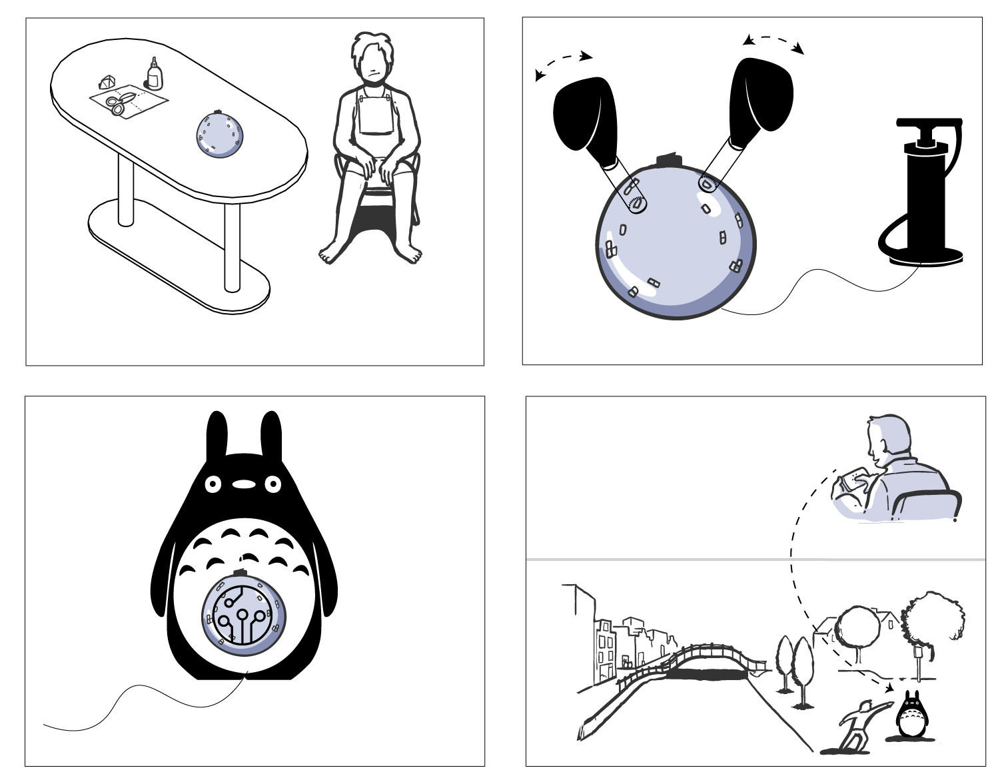

\maketitle
\tableofcontents
\pagebreak
    
# 1 Introduction
The proposed research investigates how robots could facilitate contact between groups in conflict who are
unable to meet face-to-face. It uses a multidisciplinary approach, combining communication and media
studies, social psychology, art, design, and robot engineering with one principal objective: reducing prejudice
between groups. 
Telepresence robots (robots that are remotely operated by humans) are increasingly used in
social situations, social situations, from public services such as health care and education to the private sector in working places and residential homes. New demands for robotic avatars also surfaced in light of the COVID-19 pandemic, where physical distancing is imposed on society. The theoretical foundation for the research stems from the principles of intergroup contact outlined by Gordon Allport in the 1954 seminal work _The Nature of Prejudice_ [-@allportNaturePrejudice1954]. The spiritual motivation for the research is the dire need for practical, innovative solutions to the violent, long-term conflict in my home country, Israel. From this extreme use-case, wider-scale lessons regarding social robot design, physical interaction, and mediated communication can be acquired and applied in other contexts of social relations.

This research will contribute to the academic community in three main goals over four years: 

1) Conceptualization of the robotic telepresence contact hypothesis; theorizing on the conditions required for a positive robot-mediated encounter between groups in conflict.

2) A novel design for a robotic avatar toolkit that is tailored specifically for telepresence contact and is designed to be fabricated in a dedicated workshop by an inexperienced user.

3) The first field test for robotic telepresence contact in the context of the Israeli-Palestinian conflict. 

Each milestone includes a publication, with the final dissertation aggregating and concluding the research

# 2 Conceptual framework
## 1.1 Intergroup contact hypothesis
The contact hypothesis, as formulated by Gordon Allport, [-@allportNaturePrejudice1954], specifies four conditions that need to be fulfilled during positive intergroup contact: equal status, having common goals, active cooperation, and institutional support. Fifty years later, a meta-analysis across more than 500 studies in a variety of intergroup contexts [@pettigrewMetaanalyticTestIntergroup2006] has revealed that contact is an effective means to reduce prejudice. However, the meta-analysis also showed that the conditions are not strictly essential for a positive outcome, yet they are factors among others that facilitate it. Later research focused on expanding the theory to include more conditions such as forming cross-group friendships [@cookSystematicAnalysisSocially1962] and identifying affective drivers, such as empathy and (reduced) anxiety, that play a mediating role in contact interventions [@pettigrewRecentAdvancesIntergroup2011;@brownIntegrativeTheoryIntergroup2005]. An additional factor that moderates the outcome of contact is _group salience_, the degree in which the participants' group identity is evident. A high level of group salience facilitates the generalization of attitudes from the interpersonal level to the group level [@vociIntergroupContactPrejudice2003]. 
 
Most previous intergroup contact studies were conducted in face-to-face (FtF) settings. However, face-to-face contact can be challenging to implement, particularly in areas of violent conflict [@haslerOnlineIntergroupContact2013]. Organizers commonly face practical issues such as gathering diverse groups, finding a neutral, accessible location, and compensating participants for travel expenses. Therefore, recent projects have used technology (especially online communication) to facilitate intergroup encounters.
 
## 2.2 Online contact
Communication technologies expand the models of contact and add new modalities of interaction while compromising on the benefits of traditional FtF encounters. Research on online intergroup contact has shown its potential to reduce prejudice and aid in conflict resolution [@amichai-hamburgerStructuredUnstructuredIntergroup2015;@haslerOnlineIntergroupContact2013;@waltherComputermediatedCommunicationReduction2015]. However, online contact is not always constructive, and may result in a negative outcome and increased prejudice. The remote nature of the medium makes participants less accountable for their actions and less engaged in the conversation [@whiteImprovingIntergroupRelations2015;@schumannWhenComputermediatedIntergroup2017]. The lack of nonverbal cues [@burgoonNonverbalSignals1994] obstructs the path to a mutual understanding and impairs the turn-taking process, which may evoke negative feelings between the group members, such as anger and frustration [@johnsonAngerFlamingComputermediated2009].
 
Virtual reality (VR) is studied as a medium that offers an immersive communication experience that increases the user’s sense of embodiment during communication [@kilteniSenseEmbodimentVirtual2012]. It was positively evaluated for use in intergroup contact, both as a space for dialog [@haslerVirtualPeacemakersMimicry2014], and as a tool that allows individuals to immerse themselves in the perspective of the other side [@hassonEnemyGazeImmersive2019;@kabiljoVirtualRealityFostering2019]. However, along with its promise, VR also raises a number of ethical and moral concerns. While the experience of _being_ in the virtual space intensifies as the technology develops, our corporeal body is left behind as we subsume an abstract representation as our new reality [@pennyVirtualBodybuilding1993]. This quintessential mind-body split may alter one’s relation to corporeality, leading to psychological deficits, such as _depersonalization_ and _derealization_ or body neglect [@spiegelEthicsVirtualReality2018]. Additionally, immersive perspective-taking risks in assuming an ‘improper distance’ [@chouliarakiImproperDistanceCritical2011;@nashVirtualRealityWitness2018] between the viewer and the outgroup member, in which one subordinates the other, incorporating their representation, rather than recognizing their irreducible alterity. 
 
Prejudice can be seen as an abstraction of the human body [@ahmedStrangeEncountersEmbodied2000]; yet despite the inherent abstraction in virtual mediums and the widely recognized role the body in forming social cognition 
[@deweyExperienceEducation1986;@merleau-pontyPhenomenologyPerception2013;@gallagherHowBodyShapes2006;
@malafourisHowThingsShape2013], little attention has been given to robots as a tool for intergroup contact. Remotely controlled robots (telerobots) have a lot in common with online mediums and may carry similar risks when used for contact. Nevertheless, telerobots have a physical presence; we use our bodies to interact with robots just as we would with a living being. They provide corporeal depth to mediated contact, situating a midpoint between online communication and an FtF meeting.
  
## 2.3 Telepresence and telerobots
Originally, the term _telepresence_ was used by Marvin Minsky and Patrick Gunkel to describe a vision of a futuristic economy in which people perform manual, physical labor from remote locations [@minskyTelepresence1980]. Although the term is nowadays used to describe a human's presence in a virtual environment [@steuerDefiningVirtualReality1992], telepresence originally refers to the experience of being in a remote environment that is _real_ and mediated by a physical sensing agent, that is, a _telerobot_. [@campanellaEdenWireWebcameras2000]. When a telerobot serves as a remote representation of a human operator, it is referred to as its _avatar_. In phenomenological terms, the experience of operating a telerobot is named _re-embodiment_ [@dolezalRemoteBodyPhenomenology2009]. Today's telerobots go beyond industrial use and are deployed in social care [@michaudTelepresenceRobotHome2007], education [@tanakaTelepresenceRobotHelps2014], and interpersonal communication [@ogawaTelenoidTelepresenceAndroid2011], utilizing the internet as the medium for tele-operation.

Research in Human-Robot-Interaction (HRI) over the past two decades offers insight on a wide range of possibilities for designing social robots (robots that conduct social interaction with humans). Key factors that influence the attitude toward the robot include the level of anthropomorphism of the robot's appearance [@hancockMetaAnalysisFactorsAffecting2011;@finkAnthropomorphismHumanLikeness2012], the use of an external display on the body of the robot [@thrunFrameworkHumanRobotInteraction2004;@choiCanYouFeel2016], the use of affective touch and soft materials [@kerruishAffectiveTouchSocial2017;@stiehlDesignTherapeuticRobotic2005;@baoSoftRoboticsAcademic2018], and the use of nonverbal cues [@hiranoCommunicationCuesHumanRobot2016;@lalaSmoothTurntakingRobot2019]. In telepresence, research focused on factors affecting the sense of presence and self-extension from operators toward their robotic avatars. Key elements include the responsiveness and feedback level of the control interface [@coleImmunityPrincipleView2000;@dolezalRemoteBodyPhenomenology2009] and appearance of the robotic avatar [@leeDesigningAppearanceTelepresence2015;@groomAmMyRobot2009]. [@Fig:telepresence_robots] depicts a variety of existing telerobot designs. Designs vary from the commonly used video conferencing tablet on wheels to full-body anthropomorphic, zoomorphic, and caricature appearances.

The above factors are all relevant for establishing trust and positive relations between interlocutors and robotic avatars. In this research, however, we focus on the design and architectural elements that may be of particular importance to intergroup contact and conflict resolution. By juxtaposing theories of HRI, Computer-Mediated Communication (CMC) and theories of intergroup contact and conflict resolution, we can explore the use telepresence robots as a means to reduce prejudice between groups.

![Telepresence Robots. Left to right: Double Robotics^[https://www.doublerobotics.com/], Telenoid [@ogawaTelenoidTelepresenceAndroid2011], BOCCO ^[https://www.bocco.me/en/], stuffed-bear robot [@kuwamuraPersonalityDistortionCommunication2012].](./telepresence_robots.png){#fig:telepresence_robots}

# 3 Milestones

As a prelude to this research, a position paper titled "The Potential of Telepresence Robots for Intergroup Contact" was submitted and accepted to the CHIRA 2020 conference on Computer-Human Interaction. The paper lists potential pitfalls and opportunities toward the first implementation of telepresence-based intergroup contact. Following that, we will conduct a four-year study and produce four publications, divided into the following milestones:

## 3.1 The robot contact hypothesis
In a conceptual article, we will lay the foundation for future implementations of telepresence robots designed for intergroup conflict resolution. Following a comprehensive literature review in HRI and intergroup contact theory, and induction of design principles, we will conduct a user-survey in Israel and Palestine regarding user preferences and willingness for intergroup robot-mediated encounters. 

The survey would include a representative demographic sample with diverse political ideologies, estimating the potential for robot-mediated contact to reach those who carry a negative and prejudice opinion toward the outgroup. The survey would also serve us as a means to construct a user-base for the practical implementation detailed in the next milestone.

## 3.2 Avatar-making workshop
We will produce a novel design for a robot avatar-making toolkit that allows inexperienced users to fabricate their robotic avatars, design their appearances and movements,  and use them to occupy remote locations. The toolkit will include lessons learned in Master's thesis soft-robotic implementation [@peledSoftRoboticIncarnation2019], and move toward a new approach for textile-based, pneumatic-driven robots that are modular, easily customizable, and exhibit flexible motion.

Textile-based soft robots are an emerging field that utilizes commercially-available fabrics for creating flexible robotic actuators [@pykaUseTextileMaterials2020]. Textile actuators are safer for the human body, exhibit a wide range of organic movements and can be produced using readily-available equipment such as a sewing machine and an impulse sealer [@cappelloExploitingTextileMechanical2018]. While such actuators are currently used primarily for medical purposes, such as wearable assistive gloves [@geDesignModelingEvaluation2020], the aforementioned properties make them ideal for creating customized robotic avatars in a workshop setting. 

The practice of _Co-Design_ in mediated intergroup contact can increase the involvement of minority groups in the process, disseminate technological knowledge, and reduce the notion of a higher power from above coming to restore peace without perceiving the situation and its nuances. Moreover, Groom et al. showed that operators had a greater sense of self-extension to a robot that was assembled by them, rather than another [@groomAmMyRobot2009]. Robots were also successfully co-designed with children as the target users [@alves-oliveiraYOLORobotCreativity2017;@henkemansCodesignPalRobot2016], and co-design methods improved the general attitude of students toward robots in educational settings [@reich-stiebertInvolveUserChanging2019].

In the workshop we will provide participants with a ready-made  communication controller and central pneumatic system, providing built in conversation and actuation capabilities, including language translation and remote control via the mobile web (see [@fig:storyboard]). Participants will use the provided fabrics and elastic materials to design and create their robotic avatar. Tutoring will draw inspiration from expressive art therapy [@muriFaceArtTherapy2007; @sholtTherapeuticQualitiesClaywork2006], encouraging participants to express themselves and their group identity through the avatar. They will design their expressions into the robot, whether it is an offensive hand gesture or an offer for peace.

As a first stage, workshops would be conducted in Finland, Israel, and Palestine, and analyzed qualitatively, through pre/post-session interviews and observations made in the field. The approach of _Constructive Design Research_ [@koskinenDesignResearchPractice2011] combines lab-work with participatory practices and ethnographic field work, aiming to improve the design and tailor it to situated scenarios. The feedback from the participants and the designs created would prepare us for the final milestone of conducting the workshops in Israel and Palestine and deploying the robots in the field.

{#fig:storyboard}

## 3.3 Telepresence robot contact in Israel-Palestine
A field test for telepresence robot contact in the context of the Israeli-Palestinian conflict: Based on the developed toolkit, we will conduct workshops in Israel and Palestine and organize robot-mediated encounters and public-space appearances of robots from across the separation barrier. Results from the events would be documented and analyzed using qualitative analysis of pre and post-session interviews, field notes, and coded memos, as well as quantitative analysis of data that was automatically gathered by the robots.

## 3.4 Dissertation
 The final dissertation would aggregate the previous articles and conclude them with a monograph that reflects on the creative process and organizes the findings for further development.

# Time-line
The milestones are arranged on hte following timeline. In addition to publications, I will take 60 ECTS of courses. 

```{#fig:timeline .pyplot caption="Research timeline draft" links=false}
import numpy as np
from matplotlib import pyplot as plt

x_arr = np.zeros(48)
y_arr = np.arange(48)

x_arr[0] = -24
x_arr[1] = 24
x_arr[2] = -24
x_arr[5] = 24
x_arr[6] = -24
x_arr[10] = -24
x_arr[12] = 24
x_arr[14] = -24
x_arr[15] = 24
x_arr[18] = -24
x_arr[19] = 24 
x_arr[21] = -24
x_arr[22] = 24
x_arr[24] = -24
x_arr[26] = 24
x_arr[28] = -24
x_arr[30] = 24
x_arr[32] = 24
x_arr[34] = -24
x_arr[36] = 24
x_arr[38] = -24
x_arr[41] = -24
x_arr[42] = 24
x_arr[47] = 24

plt.hlines(y_arr, 0, x_arr, color='red')  # Stems
plt.plot(x_arr, y_arr, 'D')  # Stem ends
plt.plot([0, 0], [y_arr.min(), y_arr.max()], '--')  # Middle bar
plt.ylabel("Month")
ax = plt.gca()
ax.invert_yaxis()
ax.annotate("Beginning of studies", xy=(-24, 0), xytext=(0,10), textcoords="offset points", fontsize='large')
ax.annotate("Contact hypothesis:\nliterature review", xy=(24, 1), xytext=(-180,-30), textcoords="offset points", fontsize='large')
ax.annotate("User survey", xy=(-24, 1), xytext=(0,-30), textcoords="offset points", fontsize='large')
ax.annotate("Courses:\nResearch design", xy=(-24, 6), xytext=(0,-30), textcoords="offset points", fontsize='large')
ax.annotate("Contact hypothesis:\nWriting", xy=(24, 5), xytext=(-180,-30), textcoords="offset points", fontsize='large')
ax.annotate("Contact hypothesis:\nSurvey analysis", xy=(-24, 10), xytext=(0,-30), textcoords="offset points", fontsize='large')
ax.annotate("Contact hypothesis:\nPublication", xy=(24, 12), xytext=(-180,-30), textcoords="offset points", fontsize='large')
ax.annotate("Avatar workshop:\nrobotics research", xy=(-24, 14), xytext=(0,-30), textcoords="offset points", fontsize='large')
ax.annotate("Courses:\nMechanical engineering", xy=(24, 15), xytext=(-180,-30), textcoords="offset points", fontsize='large')
ax.annotate("Avatar workshop:\nexperimentation", xy=(-24, 18), xytext=(0,-30), textcoords="offset points", fontsize='large')
ax.annotate("Avatar workshop:\nimplementation", xy=(24, 19), xytext=(-180,-30), textcoords="offset points", fontsize='large')
ax.annotate("Courses:\nArtitsic research", xy=(-24, 21), xytext=(0,-30), textcoords="offset points", fontsize='large')
ax.annotate("Avatar workshop:\nDesign workshops", xy=(24, 22), xytext=(-180,-30), textcoords="offset points", fontsize='large')
ax.annotate("Avatar workshop:\nanalysis", xy=(-24, 24), xytext=(0,-30), textcoords="offset points", fontsize='large')
ax.annotate("Avatar workshop:\nDesign iteration", xy=(24, 26), xytext=(-180,-30), textcoords="offset points", fontsize='large')
ax.annotate("Avatar workshop:\nPublication", xy=(-24, 27), xytext=(0,-43), textcoords="offset points", fontsize='large')
ax.annotate("Coordinating Palestine collaboration", xy=(24, 30), xytext=(-195,-17), textcoords="offset points", fontsize='large')
ax.annotate("Coures:\nGeneral studies", xy=(24, 32), xytext=(-180,-30), textcoords="offset points", fontsize='large')
ax.annotate("Field test:\nPlanning", xy=(-24, 34), xytext=(0,-30), textcoords="offset points", fontsize='large')
ax.annotate("Field test:\nImplementation rounds", xy=(24, 36), xytext=(-180,-30), textcoords="offset points", fontsize='large')
ax.annotate("Field test: Analysis", xy=(-24, 36), xytext=(0,-42), textcoords="offset points", fontsize='large')
ax.annotate("Field test:\nPublication", xy=(-24, 41), xytext=(0,-30), textcoords="offset points", fontsize='large')
ax.annotate("Finalizing dissertation\nmanuscript", xy=(24, 42), xytext=(-180,-30), textcoords="offset points", fontsize='large')
ax.annotate("End of studies", xy=(24, 47), xytext=(-80, -17), textcoords="offset points", fontsize='large')

ax.axes.get_xaxis().set_ticks([])

fig = plt.gcf()
fig.set_size_inches(8, 12)
```
\newpage

# Advisors 

I have confirmed the availability of three advisors for my studies: 

1. **Prof. Teemu Leinonen:** Head of the Learning Environments research group and supervisor of my studies.

2. **Dr. Béatrice Hasler:** Founder of VR-CORE: Virtual Reality Lab for Conflict Research in IDC Herzliya research school in Israel. Béatrice has years of experience researching virtual intergroup contact in the Israeli-Palestinian conflict and has studied online collaboration. Beatrice graciously offered to advise and participate in this research and has introduced me to missing links in social psychology that are essential for this dissertation.

3. **Dr. Mia Muurimäki:** A former Aalto Media Lab faculty and now a service designer team leader in Futurice. Mia has helped me during my Master's thesis in a multitude of ways. She directed me to relevant literature, suggested design changes and advised me on project management and schedules. Mia has been conducting participatory and co-design workshops in Futurice and I am sure she will also be able to advise me in that field.


# References
