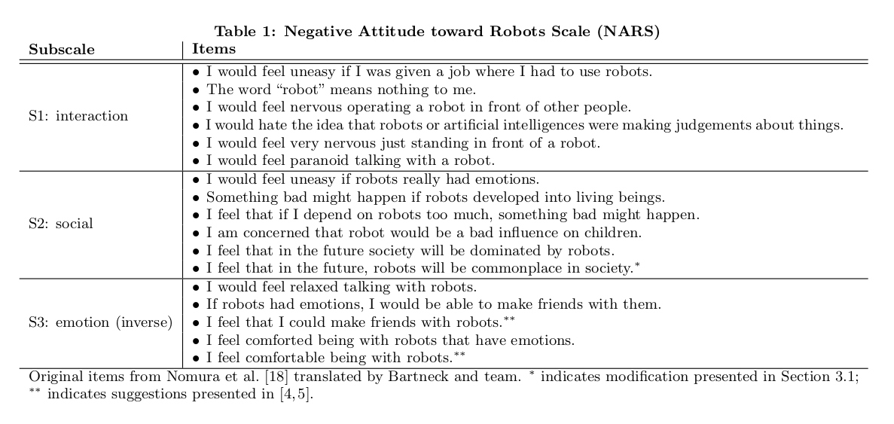

```{r , include=FALSE}
library(dplyr)
library(purrr)
library(haven)
library(ltm)
library(psych)
knitr::opts_chunk$set(echo = TRUE)
```



# Calculate Cronbach's alpha for subscales
```{r}
reg_s1 <- "^Q_ROBOT_STATEMENTS_[1-6]$"
reg_s3 <- "^(Q_ROBOT_STATEMENTS_)([7-9]|10|11)$"

regs <- c(reg_s1, reg_s3) %>% set_names(c("S1", "S3"))
```

## Total
```{r}
  map_df(regs, ~ 
            Telerobot_sorted %>% 
            dplyr::select(dplyr::matches(.x)) %>%
            type.convert(as.is = TRUE) %>%
            psych::alpha() %>% .$total
            ,
            .id = "scale"
    )
```
## By Gender

```{r}
  genders <- c(1, 2) %>% set_names(c("Female", "Male" )) 
  map_df(regs, ~ 
          map_df(genders, ~
            Telerobot_sorted %>% 
            filter(Q_DEMOGRAPHICS_2 == .x) %>%
            dplyr::select(dplyr::matches(.y)) %>%
            type.convert(as.is = TRUE) %>%
            psych::alpha() %>% .$total
            ,
            .y=.x, .id="gender"
          )
          ,
          .id = "scale"
  )
```
## By group
```{r}
  groups <- c("PS", "IL") %>% set_names(c("PS", "IL" )) 
  map_df(regs, ~ 
          map_df(groups, ~
            Telerobot_sorted %>% 
            filter(v == .x) %>%
            dplyr::select(dplyr::matches(.y)) %>%
            type.convert(as.is = TRUE) %>%
            psych::alpha() %>% .$total
            ,
            .y=.x, .id="group"
          )
          ,
          .id = "scale"
  )
```

## Fill in the subscales
S1 = Q_ROBOT_STATEMENTS_1 + Q_ROBOT_STATEMENTS_2 + Q_ROBOT_STATEMENTS_3 + Q_ROBOT_STATEMENTS_4 + Q_ROBOT_STATEMENTS_5 + Q_ROBOT_STATEMENTS_6
S2 = Not present
S3 (Inverse) = Q_ROBOT_STATEMENTS_7 + Q_ROBOT_STATEMENTS_8 + Q_ROBOT_STATEMENTS_9 + Q_ROBOT_STATEMENTS_10 + Q_ROBOT_STATEMENTS_11 

```{r}
Telerobot_nars <- Telerobot_sorted %>% 
  mutate(Q_ROBOT_S1 = Q_ROBOT_STATEMENTS_1 + Q_ROBOT_STATEMENTS_2 + Q_ROBOT_STATEMENTS_3 + Q_ROBOT_STATEMENTS_4 + Q_ROBOT_STATEMENTS_5 + Q_ROBOT_STATEMENTS_6) %>%
  mutate(Q_ROBOT_S3 = Q_ROBOT_STATEMENTS_7 + Q_ROBOT_STATEMENTS_8 + Q_ROBOT_STATEMENTS_9 + Q_ROBOT_STATEMENTS_10 + Q_ROBOT_STATEMENTS_11) %>%
  mutate(Q_ROBOT_NARS = Q_ROBOT_S1 - Q_ROBOT_S3) %>%
  relocate(Q_ROBOT_S1, .after = Q_ROBOT_STATEMENTS_11) %>%
  relocate(Q_ROBOT_S3, .after = Q_ROBOT_S1) %>%
  relocate(Q_ROBOT_NARS, .after = Q_ROBOT_S3)
```


