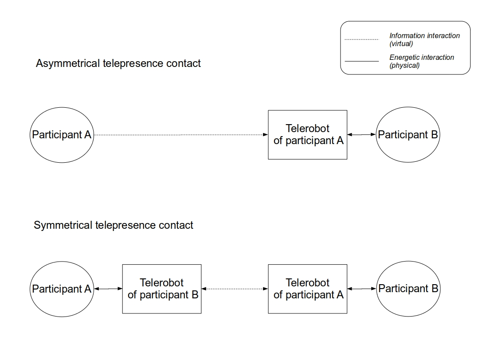

\title[mode=title]{}

\author[1,2]{Avner Peled}[type=editor,
    auid=000,bioid=1,
    prefix=Sir,
    role=Researcher,
    orcid=0000-0001-7511-2910,
    facebook=<facebook id>,
    twitter=<twitter id>,
    linkedin=<linkedin id>,
    gplus=<gplus id>]

\begin{keywords}
 Soft robotics \sep Second keyword \sep Third keyword \sep Fourth keyword
\end{keywords}

\maketitle

Intuitively, one might assume that in an era of widespread communication, global mass-culture, and commonplace self-expression, negative stereotypes and prejudice between social groups would gradually diminish. Surely, if group members are able to freely express themselves and communicate their intentions to the world via the internet, the complexity and specificity of their human character would reveal itself and dissolve stubborn concentrations of human abstraction that are sedimented in people's minds. 

However, while computer mediated intergroup contact has proven to be effective in reducing prejudice between conflicted groups [@waltherComputermediatedCommunicationReduction2015], the continuous and steady prevalence of intergroup prejudice, e.g anti-Muslim [??], anti-refugee, and conservative-liberal  [@crawfordIdeologicalSymmetriesAsymmetries2014], indicates that online contact is either not taking place in significant amounts, despite group members having internet access, or that the majority of contact events taking place are not aiding in the reduction of prejudice and stereotypes; indeed a question of both the _quantity_ and _quality_ of contact, as suggested by Brown and Hewstone [@brownIntegrativeTheoryIntergroup2005]. Conversely, the internet as a communication medium has also negative effects on intergroup relations, when phenomenons such as _echo chambers_ [@delvicarioEchoChambersEmotional2016] and _fake news_ [@stanoInternetSpreadConspiracy2020] contribute to group polarization and intensify negative emotions within groups.

Such a demanding state of affairs requires thinking outside the box of common communication mediums and considering new forms of interaction that may increase both the quality and quantity of intergroup contact. We propose using _robotic telepresence_, a communication medium that combines elements from both realities - the physical and the virtual. We begin by reviewing current research on intergroup contact.

# 1. The Contact Hypothesis

Gordon Allport has laid the foundation for intergroup contact research in the 1954 book _The nature of Prejudice_ [@allportNaturePrejudice1954]. The book features a comprehensive review of multiple contact situations and analyzes their effect on prejudice. In chapter 16: _The effect of contact_, Allport defines key conditions that moderate the positive influence of contact over the dissolution of prejudice: 1) An equal status of the group members within the contact, 2) a cooperative pursue of common goals during contact, and 3) support from institutional authorities toward a positive outcome.  

Since then, Allport's hypothesis has been studied extensively. The theory was largely ratified in meta-analytical findings [@pettigrewMetaanalyticTestIntergroup2006;@pettigrewDoesIntergroupContact2013], but has also been adamantly challenged and extended by the research community [@dovidioIntergroupContactPresent2003]. A modern integrative theory of contact by Brown and Hewstone outlines the primary moderating and mediating variables in contact: _Group salience_, the level in which the contacted individual is perceived as a member of its group, was identified as the principal moderator; a higher group salience increases the capacity of a pleasant contact (i.e a contact resulting in friendship, trust, and forgiveness) to project its positivity over the entire group. As for mediating variables, research has turned its focus to affective factors such as anxiety, intimacy and empathy, that serve as emotional routes that lead the pathway toward or away from an assimilation of positive beliefs. One element that was found to be a strong positive force along those routes is _self disclosure_, the sharing of personal and intimate details between the participants [@brownIntegrativeTheoryIntergroup2005, p. 293].

A key remaining question regards the influence of group salience over affective mediators. According to Kenworthy et al: "whereas interpersonal encounters were likely to be pleasant, they might fail to generalize without some salience of group membership; conversely, salient intergroup encounters could generalize to the whole outgroup, but might be undermined by the concomitant generation of intergroup anxiety".[@kenworthyIntergroupContactWhen2005, p.291]. Brown and Hewstone argue, however, that "an interpersonal mode of interaction is not necessarily at odds with the maintenance of high levels of intergroup salience". Such discrepancies may be explained if we analyze contact not as a linear, homogenous event, but rather as a dynamic, nonlinear process in which different factors come into play and form a system of effects that is moderated by the site, context and situation of the contact. 

New forms of contact that emerged on top of the traditional face-to-face encounter add further complexity to the mix of theoretical conditions. _Extended contact_, an intergroup acquaintance of a second degree nature ('friend of a friend') is still regarded meaningful for inter-group relations [@vezzaliImprovingIntergroupRelations2014], and _imagined contact_, where the encounter takes place strictly in ones mind, was shown to improve attitude toward the group [@turnerImaginingIntergroupContact2007]. The widest horizon of new possibilities for contact appears along with advances in communication technology. The internet as a transport medium, along with communication devices such as smart phones, PCs and VR headsets, create new spaces and embodiments for contact. We begin by examining current research in online contact.
 
# 2. Online contact

Gordon Allport hadn't lived to see the advent of the internet, but considering his interest in radio as a tool for mass-communication [@allportNaturePrejudice1954] it is likely that he saw the potential of communication technology as a facilitator of contact. Apart from the sheer power of the net to instantly connect individuals in remote locations, thus increasing the potential quantity of encounters in orders of magnitude, the internet allows its users to easily manipulate their identity, their embodiment and to design and context and content of encounters in finely tuned manners. 

Previous research provides evidence on how online contact could assist in fulfilling not only the initial conditions defined by Allport, but also those addressed in later findings such as group salience and anxiety [@amichai-hamburgerContactHypothesisReconsidered2006;@haslerOnlineIntergroupContact2013]. In regards to Allport's conditions, a sense of equal status can be achieved by dissociating real-world power relations and identities from their virtual counterparts. Cooperative tasks could be performed online in a variety of formats from online games in  imaginary worlds, to work related tasks in virtual office spaces. The robustness and flexibility of the online medium allows organizers to moderate, augment, and mold the environment in ways that may increase the likelihood of a positive encounter. This also requires a certain degree of _structure_ to online contact, as noted by Amichai-Hamburger et al [@amichai-hamburgerStructuredUnstructuredIntergroup2015].

Problems with online authentication:

## 2.1 Lack of self-accountability

"individuals may feel less accountable for the content they post online or underestimate the social sanctioning of their behavior" [@whiteImprovingIntergroupRelations2015]

## 2.2 Lack of engagement with a reduced social presence

 “Out-group members' reduced social presence was further associated with negative out-group attitudes, notably because the intergroup interaction itself was considered as less interesting, satisfying, cheerful, and involving” [@schumannWhenComputermediatedIntergroup2017]

## 2.3 Lack of physical turn taking cues.

"a delayed response in an interaction can also work to incite tension in the intergroup relationship...This is particularly pertinent point for online interactions where there can be a lack of physical cues" [@whiteImprovingIntergroupRelations2015]

## 2.4 Lack of opportunity for contact 
Not much opportunities for online contact, especially in the age of filter bubbles and echo chambers.

A more intricate discussion revolves around the use of  anonymous online contact between groups. While some research has shown that anonymity in computer-mediated communication can promote self-disclosure [@joinsonSelfdisclosureComputermediatedCommunication2001;@ho2008social] and ameliorate social anxiety [@mckennaSocialIdentitySelf2005], both being significant mediators for forming of friendships and reducing prejudice, the liberation may also go too far and lead to hostility and _flaming_ [@douglasIdentifiabilitySelfpresentationComputermediated2001]. . A key mediator for the shifts in behavior under anonymous contexts is the loss of self awareness, or _deindividuation_. According to the classic theory of deindividuation[@zimbardoHumanChoiceIndividuation1969], anonymity releases a person from social regulation and norms, resulting in radical and dangerous behavior. More recent findings, however, suggest a contrasting view in which anonymity in fact motivates individuals to act under a group context, while pronouncing enhanced norms and tropes [SIDE theory; @spearsWhenAreNet2002]. This would imply an increase in group salience during anonymous interactions, and could assist in generalizing positive outcomes of online intergroup contact.   

Anonymity is further problematized, however, by recent findings from Schumann et al [@schumannWhenComputermediatedIntergroup2017], who note that "in addition to anonymity of the self, interaction partners' anonymity should be considered as a factor that can facilitate prejudice". They found that deindividuation of an out-group member could have a negative influence and increased prejudice within their in-group partner. The out-groups members' lack of presence made them appear superficial and less involved in the conversation. While the researchers acknowledge that their findings are not entirely conclusive due to a small sample size, they maintain their speculation that "out-group members' anonymity contributed to conditions that simultaneously facilitated and reversed the prejudice-reducing effect of intergroup contact". On one hand the increased group salience of the out-group member helped reduce prejudice toward the out-group, but on the other hand their lack of social presence in the eyes of the in-group member increased it.

Effects of deindividuation may appear not only in a strictly anonymous text-based communication, but in any other forms of CMC that lack non-verbal signals [@burgoonNonverbalSignals1994;@benteVirtualGesturesEmbodiment2011]. This may negatively affect expression in facebook commenting [@kimIntergroupContactOnline2018], reduce the affectivity of skype calls in long-distance relationships [@gollmitzerClosenessControlInterpersonal], and disrupt synchronization in work environments [@keatingChallengesConductingInteraction2017]. Studies of _embodied cognition_ accentuate those modalities which may activate subconsciously in face-to-face conversations, but weaken the sociality of mediated encounters that lack them. Examples of such Modalities include direct gaze coordination [@richardsonConversationGazeCoordination2009], touch-based gestures [@goodwinHapticSociality2017] and lower-body movements that capture attention [@kendonConductingInteractionPatterns1990]. A hint of the need for embodied interaction exists also in Gordon Allport's writings, as he noted that "contact must reach below the surface in order to be effective in altering prejudice. Only the type of contact that leads people to _do_ things together is likely to result in changed attitudes" [@allportNaturePrejudice1954, p.276]. Indeed, embodiment has also been central to pedagogical research such as Dewey's theory of "Learning by doing" [@deweyDemocracyEducationIntroduction1923].

Modern HCI technologies are now focusing on increasing the user's sense of embodiment, presence and immersion in interaction. The use of head-mounted virtual or mixed reality headsets in simulated or remote environments is at the forefront of such research [@kilteniSenseEmbodimentVirtual2012].Virtual reality has already shown promise as a medium for various forms of intergroup contact[@hassonEnemyGazeImmersive2019;@haslerVirtualPeacemakersMimicry2014;@kabiljoVirtualRealityFostering2019]. Additionally, VR allows in-group members to simulate the perspective of the other side, which increases empathy [@haslerVirtualRealityEmpathy].

Nevertheless, while VR places the interlocutors in an immersive, embodied environment, it is still very much virtual, and disassociated from the body. As noted by Albert Borgmann, philosopher of technology: "However rich the information conveyed by the picture, if it is presented in cyberspace, the information may be massive, but it is too limited , viz., by the vehicles that convey it" [@borgmannInformationNearnessFarness2000]; we can continue to increase the number of pixels in VR HMDs, and to improve the physical simulation of virtual worlds, but we will not approach inexhaustible depth of physical reality. 

A form of contact exists in which one may communicate directly with the physical world, but still interact with a remote, online partner,in a conversation that may be anonymous or augmented by technology - that is _robotic telepresence_. In this form of contact, participants are represented by a physical robotic avatar in a remote location, while their conversation partners share a physical space with a robot. In response to Schumann et al's paradox of deindividuation, robotic avatars may provide a midway in which the controller of the robot maintains a salient group identity, but their interaction partner is very much involved and immersed in physical contact. We elaborate on the concept of robotic telepresence int the next section.

# 3. Telepresence robots

## 3.1 Terminology

Originally, the term _telepresence_ was used by Marvin Minsky and Patrick Gunkel to describe a vision of a futuristic economy in which people perform manual, physical labor from remote locations [@minskyTelepresence1980]. Although the term is also used nowadays to describe a human's presence in a virtual environment [@steuerDefiningVirtualReality1992], telepresence originally refers to the experience of being in a remote environment that is _real_ [@campanellaEdenWireWebcameras2000; @kacTELEPRESENCEART], and mediated by a physical sensing agent, i.e, a _telerobot_. In phenomenological terms, the experience of operating a telerobot is dubbed _re-embodiment_ [@dolezalRemoteBodyPhenomenology2009], as we are using an interface with our body to take control of another, remote body. Minsky wrote about the potential uses of telerobotics to perform manual tasks in hazardous environments, such as nuclear power plants or outer space, and to augment a person's physical abilities in tasks requiring great precision or strength, such as surgery or construction. Plenty of Minsky's ideas of telepresence have already been realized [refs]. Not only that, today's telerobots go beyond industrial use and are deployed in social care, educational, and communication environments, utilizing the internet as the broad medium for tele-operation.

## 3.2 Two types of interactions 

It is helpful to analyze robot telepresence using two types of interactions that are qualitatively different from each other [@hannafordFeelingBelievingHistory2000]. On the one hand, the use of the robot's remote control interface by the tele-operator consists largely of _information interaction_. Logical control signals are being sent from the operator to the robot through a communication medium. At the same time, the robot is receiving those commands, and performs an _energetic interaction_ with its environment; that is, physical labor in mundane space. The information from the operator has to be processed, normalized, and scaled to the body of the robot before it can take action. When the operation procedure is so seamless and synchronous in terms of responsiveness and feedback from the remote body, a "virtual energetic interaction" is formed, one that feels as if we are physically present in the remote environment. This the reason Minsky coined the term _telepresence_, rather than tele-operation; because it "emphasizes the importance of high‑quality sensory feedback and suggests future instruments that will feel and work so much like our own hands that we won't notice any significant difference". Such future instruments are already appearing in dedicated, mission-critical fields such as tele-surgery and hazardous treatment [refs], but they are not commonly available. Most of internet-operated robots use standard virtual interfaces on desktops and smartphones.

When considering intergroup contact that is mediated by a robot, both types of interactions occur simultaneously. While one group member is operating a robot avatar via a virtual, information-based interaction, another group member is interacting with the robot via a physical, energetic interaction. This has direct effects on social cognition. Operation of the robot has more to do with standard CMC, and is then, depending on the fluidity of the interface being used, more likely to reduce the operator's social presence and cause a sense of deindividuation. Interaction with a robot, however is still entirely _embodied_, and is more reminiscent of FtF contact. It provides immediate haptic feedback, involves nonverbal cues and requires the participant to be physically present in the conversation. This could have profound effects on the efficacy of contact in its ability to reduce prejudice between groups.

## 3.3 Symmetrical and asymmetrical forms
Before going into further analysis of telerobot intergroup contact, we would like to define two scenarios which we deem as most viable for intergroup contact [@fig:sym_asym]:

1. _Asymmetrical telepresence_: In the most common scenario, only one group member is represented by a telerobot and is operating it via a remote location; normally from their home using a desktop or smartphone. The other group member is interacting with the robot avatar in a physical space. This is asymmetric because the interaction experience is qualitatively different for every group member. Different modalities and affordances are available to each group member. 

2. _Symmetrical telepresence contact_: In this scenario both group members are operating a telerobot and are physically interacting with one that represents their conversation partner. In such a scenario, it is not possible to control the robot using
a standard device such as a desktop or smartphone. Doing so while interacting with the partner's robot will cause a loss of attention from the interaction itself. Therefore, the robot must also act as the control interface, detecting the operator's movements and transmitting them to the opposite side.

{#fig:sym_asym}

We will refer to the two forms when discussing the conditions for contact, analyzing advantages and disadvantages for each scenario in regards to a particular variable. The key difference between the forms, however, regards to _accessibility_ and _outreach_ of contact. Having a telerobot that is operated within the comfort of one's quarters, allows anyone to engage in contact with minimal effort and complete privacy. On the other hand, placing a robot in a physical public space grants access to an audience that might have not otherwise engaged willfully. We will elaborate on this further when considering structures for robot-mediated encounters. 

# 4. Equal status

## 4.1 Equality in status and in situation

One of Allport's basic conditions for positive intergroup contact is having an equal status between group members. Allport examined the effect of contact between white and African Americans in a workplace context. He concluded that the position of the African-American has to be of equal status, or even better if it is higher than that of the white person, so that prejudice would be reduced [@allportNaturePrejudice1954, p. 274]. This condition has been verified in multiple studies [refs], but can now also be differentiated into two types of equality: 1) Equality in _status_: when the group members a part of a joint context, such as work, or classroom, in which they possess an equal status, and 2) Equality in _situation_: when group members carry persistent power differences, but are equal only for the context of contact. An equality only in situation is more realistic in long-lasting and deep-rooted intergroup conflicts between advantage and dis-advantaged groups.

For the purpose of this analysis, we are interested in equality of _situation_ within a telepresence scenario, since it can be applied within any context and does not require a pre-existing shared status between the group members. It was shown that having symmetry and equality in communication, such as equal turn-taking and mutual respect, is beneficial for contact in groups that are in asymmetric conflict such as Israelis and Palestinians [@maozEvaluatingCommunicationGroups2005]. However, this does not mean that existing power relations should be ignored during contact. In fact, it was found that a communication model that "emphasizes the conflict and power relations between the sides", although more risky, produces a higher equality within the contact [@maozDoesContactWork2011]. Furthermore, equality emerges when the interaction focuses on fulfilling the different _needs_ of the group members. While an advantaged group member needs to feel morally adequate, a disadvantaged group requires a feeling of empowerment [@shnabelNeedsbasedModelReconciliation2008]. A failure to address inequality in status during contact may even hinder ensuing motivation for social change [@saguyIronyHarmonyIntergroup2009]. It is thus clear that a contact situation should allow members to recognize, and even _play_ with existing power relations, while keeping fair play and respect for both sides of the conversation.

## 4.2 Equality in telepresence

We recognize a number of factors that would moderate the sense of equality during a telepresence contact:

1. **Symmetrical/Asymmetrical telepresence:** As mentioned in the previous section, a fully symmetrical scenario would maintain full equality, but an asymmetrical scenario might add some leeway when playing with power relations. A disadvantaged-group member may gain a sense of empowerment from operating a robot that 'invades' the advantaged-group member's space, while they are located safely at their home premises. Conversely, having one side represented by a robot while the other is not, may invoke a ridiculing and disrespecting perception of an outgroup member that appears as a robot in a public space.

2. **Levels of exposure**: A telerobot may allow different levels of exposure during contact. For example, the robot may carry a camera and microphone that perceives its interlocutors and transmits image and audio back to the operator. In respect, the operator may be able to expose their full or partial identity and project it on the robot for the interlocutor, or remain completely anonymous, while will create a seer that is not seen. It should be noted that projecting an operator's visuals on the robot, while increasing personalization, may undermine the robot's authenticity as an embodied avatar, and portray it as a simple communication medium with the operator[ref?].    

3. **Interface variations**: Because the robot is the interface of communication, it could allow for different actions to take place within opposing sides of the conversation. For example, in a symmetrical scenario, the two robots could allow different movements and interactions. In an asymmetrical scenario, the operator may be able to choose in what ways the interlocutors can interact with the robot, which could be seen as a display of power.  

In summary, a telepresence robot enables several degrees of freedom in maintaining equal status during intergroup contact. It is up to the user to create the right power dynamics that would generate a positive result.

 
## The Contact Hypothesis
 * History of the four condition[@pettigrewAllportIntergroupContact2005]
    

 * Advancements since Allport.
    [@kenworthyIntergroupContactWhen2005;@brownIntegrativeTheoryIntergroup2005]

    * **Contact should focus on the combination between forming a personal connection and maintaining group salience and representation**.

    * anxiety and other emotions play an important role.
    

    * Long-term effects, meta-analytics 
    [@pettigrewMetaanalyticTestIntergroup2006]

    * Different types of contact (Direct/indirect, structured/unstructured, extended/vicarious..?).

    [@amichai-hamburgerStructuredUnstructuredIntergroup2015;@vezzaliImprovingIntergroupRelations2014]

## Robotic telepresence
* History and current uses of robotic telepresence [@tsuiExploringUseCases2011].
    * Social robots: health, education, day-to-day communication
    * Industry robots: surgical, factory.
    * Examples from Japan and my MA.

* Terminology and the asymmetry of telepresence
Telepresence communication is by nature asymmetrical, in a sense that the experience of signal transmission is very different than that of reception. Transmission is mediated through a control interface but reception immediate in a shared physical space. Terminology:
    * Controller: controller of the robot.
    * Interlocutor: Person interacting with the robot. 

* About the senses of presence, agency, and ownership.
    * From my MA

* About intercorporeality 
    * From my MA

# Robotic telepresence as a medium for contact 

## Mediatization of politics
* Mediatization of the lifeworld changes the nature of politics and political discussion [@heppMediatizedWorldsUnderstanding2014;@thimmMediatizedPoliticsStructures2014]    

## Online and virtual mediation
* Review of online and virtual contact attempts, advantages and disadvantages [@ho2008social;@sassenberg2005attitude;@haslerOnlineIntergroupContact2013;@robinsonCyberselfSelfingProject2007;@haslerOnlineIntergroupContact2013;@postmesSocialInfluenceComputerMediated2001;@amichai-hamburgerContactHypothesisReconsidered2006]

* Mention immersive environments

## Telepresence as a midway
* On the controller side, telepresence provides the benefits of online communication: accessibility, anonymity, re-embodiment, along with disadvantages regarding the dis-association of ownership.
* On the interlocutor side there are some of the benefits of face-to-face conversation, intercorporeality

# Intergroup power relations 

## Strategies of status
* Does the contact situation need to:
    * reflect existing power relations (to avoid subtyping)?
    * 'normalize' them, to increase friendship and reduce anxiety? 
    * reverse the power relations for empowerment and empathy?

[@maozDoesContactWork2011;@@shnabelNeedsbasedModelReconciliation2008;@saguyRoleGroupPower2013]

## Different conformations of telepresence contact:
    * Person <-> Robot <-> Robot <-> Person
    * Person -> Robot <-> Person
    * Person, Person -> Robot
    * Person <-> Person with Robot.

# Group salience: how to increase via telepresence robots?

## Group markers via custom robot design.
* Include group-identifying markers in the robot design, or encourage group members to include them in their own custom design. [@suguitanBlossomHandcraftedOpenSource2019] 

## Interaction content
* Anonymity vs self-disclosure? _Is the real person behind the robot is perceived as a protoypical palestinian or not and what is revealed about the person_

* Encourage conflict related interaction?  

# Emotional and personal connection with telepresence robots.

## On the controller side: Reduction of anxiety via anonymity and imagery

* Same from online interaction [@haslerOnlineIntergroupContact2013;@postmesSocialInfluenceComputerMediated2001;@sassenberg2005attitude].

* Addition of re-embodied avatar imagery 

* Therapeutic material engagement if you make your own avatar
    [@marchPlayingClayUncertainty2019;@sholtTherapeuticQualitiesClaywork2006]

* Bodily Expression 

## On the interlocutor side: Physical interaction and intimacy

* Touch and cognition 
    [@influsSocialNeuroscienceApproach2018;@feldmanMaternalPretermSkintoSkinContact2014;@goodwinHapticSociality2017]

* Uncanny valley and anxiety
[@moriUncannyValleyField2012]

#  Design considerations

## Appearance: Human vs nonhuman
* More about the uncanny?

## Materiality and movement
* Importance of movement
[@hoffmanDesigningRobotsMovement2014]
* Soft robotics

## The importance of feedback
* Audio and visual feedback for actions
[@caldwellTelepresenceVisualAudio1994;@dolezalRemoteBodyPhenomenology2009]

## Autonomous vs controlled functions
    * AI and Augmentation vs Expressiveness and intentionality

# Real-world conflict considerations

## Empowerment via education in robotics
## Legal and ethical considerations
## Israel-Palestine test case

# Conclusions

# References
