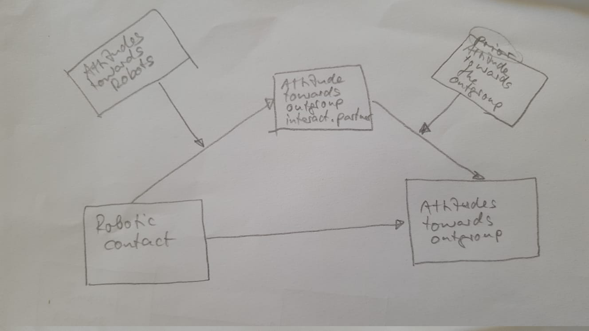

\title[mode=title]{}

\author[1,2]{Avner Peled}[type=editor,
    auid=000,bioid=1,
    prefix=Sir,
    role=Researcher,
    orcid=0000-0001-7511-2910,
    facebook=<facebook id>,
    twitter=<twitter id>,
    linkedin=<linkedin id>,
    gplus=<gplus id>]

\begin{keywords}
 Soft robotics \sep Second keyword \sep Third keyword \sep Fourth keyword
\end{keywords}

\maketitle

General introduction paragraph  
Recognizing other uses for robots in contact, such as FtF mediator and simulated contact.
Defining the scope of the work:

- Intergroup contact with emphasis on prejudice in asymmetric, conflicted groups.
- At least one group member is physically interacting with a robot in a shared space, which is operated by a member of the opposing group.

# 1. Intergroup contact hypothesis

## 1.1 Contact hypothesis

Review, leading into the need and rise of mediated contact, of which online is most prominent

## 1.2 Online contact

Review, leading into the issues with current online contact:

## 1.3 Issues with online contact

1. Lack of self-accountability

"individuals may feel less accountable for the content they post online or underestimate the social sanctioning of their behavior" [@whiteImprovingIntergroupRelations2015]

2.  Lack of engagement with a reduced social presence

 “Out-group members' reduced social presence was further associated with negative out-group attitudes, notably because the intergroup interaction itself was considered as less interesting, satisfying, cheerful, and involving” [@schumannWhenComputermediatedIntergroup2017]

3. Lack of physical turn taking cues.

"a delayed response in an interaction can also work to incite tension in the intergroup relationship...This is particularly pertinent point for online interactions where there can be a lack of physical cues" [@whiteImprovingIntergroupRelations2015]

4. Lack of opportunity for contact 
Not much opportunities for online contact, especially in the age of filter bubbles and echo chambers.

Leading into proposing telepresence robot contact as a midway between online and face to face which could solve a lot of the issues with online contact but preserve some of its benefits.

# 2. Telepresence robots

History and terminology:

- telerobot, telepresence, tele-operation, avatar, re-embodiment.
 
-  fully operated / semi-autonomous functions

# 3. Telepresence systems

A communication event that is mediated by telepresence robots could manifest in one of many different architectures. A single architecture  could be defined as a _telepresence system_. 

## 3.1 Signal and physical interactions

Before presenting the systems in focus for intergroup contact, we define two types of interactions that can exist within such system. 
Utilizing concepts from Paynter's generalized systems theory [@paynterAnalysisDesignEngineering1961], Hannaford has distinguished between the two types of interaction that occur in telepresence, _information_ and _energetic_ [@hannafordFeelingBelievingHistory2000]. We will  refer to them simply as _signal_ and _physical_ interactions. _Physical_ interactions refer to real word interactions between elements sharing a physical environment, such as a hand-shake or holding an object. In physical terms, a bidirectional _energy bond_ is formed between the interacting elements. _Signal_ interactions, on the other hand, occur on an abstract level. They represent a unidirectional logical flow of cause and effect; for example, text that is typed on one end of an online communication and appears on the other end. Intuitively, a physical interaction appears closer and more significant than a flow of signals because it involves our body. The tight bond between our cognition and our physicality is shown in a variety of conceptual frameworks [@deweyExperienceEducation1986;
@gallagherHowBodyShapes2006
@malafourisHowThingsShape2013] that reject the old cartesian dualism of a mind that is separated from the body. 

In online communication, a signal would always be a reduction and an abstraction of the physical action that caused it. When operating a telerobot through a remote control interface, the flow consists of three stages:
1. Beginning with an intent for action, a physical interaction occurs between the operator and a local control interface. 
2. Control signals are sent through a communication medium to the robot. 
3. The robot receives the signal, processes it and performs an physical interaction with its own environment. 

According to Minsky, when the control interaction is so seamless and synchronous with the robot in terms of responsiveness and feedback, the operator may feel as if they are physically present in the remote environment, i.e  _telepresence_.

## 3.2 Telepresence systems

If we consider solely the condition of _telepresence_, that is, having a telerobot operated remotely and used for communication, we identify three different systems of communication [see @fig:sym_asym]:

1. _Asymmetric_: The most commonly used system for telepresence communication. One participant is represented by a telerobot and is operating it from a remote location, typically their home, using a computer or mobile device. The other participant is interacting with the robot in a shared physical space. The system is asymmetric because the interaction experience is qualitatively different for the operator and the interlocutor. Common implementations include industry robots, surgical robots, office-based telepresence and social service robots.

2. _Symmetric bidirectional_: In this system both participants are operating a telerobot, which serves both as an avatar for their conversation partner as well a control interface for their telerobot. The interface, in that case, is completely transparent to the operator and typically uses body tracking. No control feedback is available to the operator and operation may commence without any knowledge of the remote telerobot by the participants. This type of system is more resource-heavy than the asymmetric type, and currently only a few implementations exist as prototypes and proofs-of-concept [@nagendranSymmetricTelepresenceUsing2015].

3. _Symmetric unidirectional_: In this system both participants are operating a telerobot via a control interface, without physically interacting with an avatar. The two robots share the same space, while the participants are separated. Common implementations of this system include cooperative multi-robot tasks [@sirouspourMultioperatorMultirobotTeleoperation2005] and _Robot combat_ competitions [@clarksonBattleBotsOfficialGuide2002].As in the asymmetric system, operation is usually performed from a computer or mobile device. 

{#fig:sym_asym}

While the _symmetric unidirectional_ system may facilitate contact in cooperative or confrontational events in front of an audience, since the scope of this article involves at least one person physically interacting with a robot, we would turn the focus toward the first two systems.

## 3.3 The handshake paradigm

To further illustrate the mechanics of the two systems, we will use the common example of the handshake. The handshake is an important and common social gesture in most parts of the world [@schiffrinHandworkCeremonyCase1974]. It is a reciprocal action, beginning with one person reaching out in an open request and then reciprocated by the partner. It is also a haptic gesture in which subtle forms of touch can have a great social significance [@hillewaertTacticsTactilitySensory2016].

In an asymmetric system, the telerobot is usually equipped with a camera that streams the robot's vision back to the operator. When the interaction partner reaches out their hand, the operator will see this via the interface. The operator uses the control interface to reciprocate and have the robot reach out its hand. Movement is initiated with the push of a button in the most basic interface, or by moving a motion tracking device in a more advanced one. Once the interaction partner touches the robot, the handshake is picked up via a pressure sensor on the robot's palm and is transmitted back to the control interface. The touch could manifest as a screen flicker or a sound effect on the operator's computer, or as a vibration in a motion tracking device. 

In a symmetric system, both of the participants interact only with the telerobot in front of them. The handshake is initiated when one participant reaches their hand toward the robot. The gesture is picked up by a body tracker and causes the opposing robot to mirror the behavior of its operator and reach out its hand to the interaction partner on the other side. The partner reciprocates and now both robots have their hands reached out. When touch sensors on the robots detect that both participants are now shaking their respective robot's hand, a squeezing actuation commences in both robots to generate the feeling of the handshake for both partners.

# 3.4 A CMC component in asymmetric systems

Whether participant is interacting with a telerobot, or with a control interface in a symmetric or asymmetric system, telepresence communication is always mediated by a computer (CMC: _Computer Mediated Communication_). Interactions can be therefore anonymous, visibility and identity can be manipulated and conversation content can be augmented. There is still, however, a qualitative difference between an experience of physically interacting with a robot and that of operating one via an interface. When interacting with a telerobot, the perception of it as an avatar could suspend the participant's disbelief and regard the avatar as a present social agent [@banksAvatarsAreSometimes2016]. In that moment, interaction with the avatar becomes directly embodied and the robot's function as a medium is completely transparent. One may argue that a similar suspension could be achieved in an immersive virtual reality environment, but the depth and richness of sensory feedback when operating in a real environment is still measures beyond what can be provided by a virtual one [@borgmannInformationNearnessFarness2000].  

Taking this difference into account implies that some social psychology models that apply to CMC, would only apply to one side of an asymmetric telepresence system, the side that is operating the robot via a control interface. The other side, and both sides of a symmetric system, are experiencing an interaction that resembles more of an FtF encounter than a mediated one, depending on the degree in which the robot is perceived as an avatar rather than a medium. Factors may moderate this perception are discussed in following sections.

Having a strong CMC component only on the operator side of an asymmetric systems could create a mix of behaviors in which one side has more _agency_ in the conversation than the other. The _deindivudation_ model, initially expounded by Zimbardo,[-@zimbardoHumanChoiceIndividuation1969] refers to the effect of anonymity on social behavior. The classic account warns that anonymity may release a person from social regulation and norms, resulting in radical and dangerous behavior. More recent findings, however, suggest a contrasting view in which anonymity in fact motivates individuals to act under a group context, while pronouncing enhanced norms and tropes (SIDE theory; Spears et al. 2002). This would imply an increase in group salience during interaction, and could assist in generalizing positive outcomes of online intergroup contact. Research on forms of CMC that are not anonymous, [@kimIntergroupContactOnline2018;@gollmitzerClosenessControlInterpersonal] suggests that complete anonymity is not necessary for effects of deindividuation to occur.

# 3.5 Equality in symmethetric systems

# 3. Multiple dimensions of bias

Because participants have bias toward robots, we are adding another dimension of bias.

{#fig:multiple_dimensions}

{#fig:moderated_mediation} 

# 4. The use of the operator's face and voice

## 4.1 Showing the operator's face VS a uniform avatar

Defining avatar

The 'ipad on segway' form is now the most common form of telepresence. It's not really an avatar incarnated. There is no suspension of disbelief that the robot _is_ the operator.

{#fig:telepresnce_ipad}

From the operator's side, exposing of the face could increase anxiety and reduce hyperpersonal behavior, but may increase accountability.

From the partner side, seeing the operator's face could create a more personal connection with the operator, but because it challenges the belief of the robot being an avatar, the partner perceives the robot as a communication device. This reduces the efficacy of embodied interaction. In fact, using any type of display can subvert the perception of the avatar [Can I reference the qualitative research of my own MA?]
    

## 4.2 Using the operator's voice VS an artificial voice

Using the operator's voice might have similar effects on individuation as using the face, but adding an artificial voice also provides the ability to speak in many languages The operator's voice can even be cloned. However, mistakes in translation my increase anxiety in both sides.

# 5. Appearance of the telepresence robot

## 5.1 Humanoid vs non-humanoid

Using a humanoid telerobot could increase the connection between the participant and the telerobot and could help in increasing group salience.

It could however evoke the uncanny effect.

Using non-human embodied imagery for the the operator affects group identity and anxiety [@kimTwoRoutesLeading2011]

A non-humanoid would have to work harder for emotional expression and empathy, if there are no human facial expressions, but using animalistic expressive movement or semi-anthropomorphic gestures is possible 

## 5.2 A combined approach: Group markers on a non-humanoid form

We are not limited to forms that exist in real life. It is possible to include various identifying markers on the non-humanoid avatar to increase group salience during contact. Markers such as:

 - Group symbols
 - Typical name/nickname
 - Native language
 - Other conversation content

# 6. Embodied interaction

## 6.1 Non-verbal cues in tele-operation

A robot can show non verbal cues such as: body
attitude, gaze, head nods, and facial expression (as the model allows it). They could smoothen the turn taking in the conversation and increase empathy.

However, such tacit queues are not actively initiated by the operator and would require a certain autonomous algorithm to generate them. This depends on the interface being used and is liable for glitches, abstractions and loss of information.

In asymmetrical form that involves a camera, gaze can be operated by controlling the camera and changing where the robot looks.

## 6.2 Bodily expressions

An operator could have the robot show bodily expressions. Depending on the operating interface, these could be actively initiated or captured by a gesture sensor. The active method is less prone to mistakes which could reduce anxiety.

Active bodily expressions could be triggered for example by a simple click on an emoji, or using more sophisticated forms such as body tracking, or using the phone's accelerometer.

## 6.3 Interaction with the robot

A robot could have sensors that pick up the interaction of the partner with the robot and sends it back to the operator. In the symmetric form this is the only type of interaction possible, but in asymmetric form it is possible to use a camera to capture interaction.

# 6.4 Feedback in operation

When operating a robot it is helpful to get feedback on actions chosen. It increases the smoothness of operation and reduces anxiety of appearing wrong.

In asymmetric form the operation can have visual feedback. It is possible to use mirrors, or a camera set in space (or on another robot if they are in group). Can use haptic feedback if possible.

In symmetric form there is no feedback, but there is also no real sensation of operating a robot as it is completely transparent.

# 7. Materiality and movement
Have great effect on expression, anxiety, empathy. We suggest the use of soft robotics for telepresence.

# 8. Interaction scenarios

## 8.1 Public space intervention

The operator can 'intervene' in a public space and confront passersby. In the asymmetric form would require an interface to 'call' a stranger, such as playing a sound or performing a gesture. In the symmetric form it would be a station that can be occupied by a participant, and when to participants are sitting they would start interaction.

Without interrupting the perception of avatar, the robot or the interface design could contain cues that encourage talk about the conflict and promote self-disclosure. It is also possible to place instructions for a cooperative action near the site of the robot, which would require participants to 'play' some scenario together, in which conflict-related content could be inserted.

The use of a display for showing relevant content is also possible, but could evoke disbelief in the avatar

## 8.3 Private/structured communication

In an organized contact, that is suitable both for the symmetric and asymmetric forms, the moderators can direct the conversation.

# 9. Real-world conflict considerations

## 9.1 Empowerment via education in robotics
Art therapy, theater of the oppressed.

## 9.2 Legal and ethical considerations
Border crossing, normalization, social pressure.

## 9.3 Israel-Palestine test case

# References