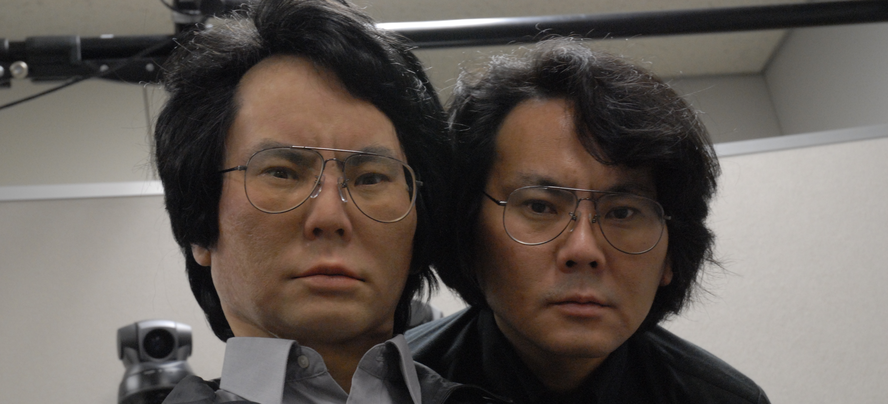

 
\title[mode=title]{}
 
\author[1,2]{Avner Peled}[type=editor,
   auid=000,bioid=1,
   prefix=Sir,
   role=Researcher,
   orcid=0000-0001-7511-2910,
   facebook=<facebook id>,
   twitter=<twitter id>,
   linkedin=<linkedin id>,
   gplus=<gplus id>]
 
\begin{keywords}
Soft robotics \sep Second keyword \sep Third keyword \sep Fourth keyword
\end{keywords}
 
\maketitle
 
The pervasive role of technology in intensifying the ability of humans to harm one another is well known; the use of technology to promote peace at both the collective and personal levels is considerably more modest. Over the years there have been calls within the Human-Computer Interaction research community to promote the use of technology to support peace in world conflicts [@hourcadeHCIPeaceCall2011;@eckertIndustryTrends20402019]. Often when people think of a technological contribution to conflict resolution, emphasis is placed on decision support and negotiation for policy makers and nation leaders. A different question that is addressed in the current paper, is how to help reconcile the ‘common’ people in a situation of conflict and build more positive intergroup relations from the bottom up.
 
One of the most prominent models that acts as a guideline for this approach is the contact hypothesis [@allportNaturePrejudice1954], that states that under the right conditions, encounters with members of the opposing group (i.e., the outgroup) can lead to reduced prejudice and more harmonious intergroup relations. We propose using telepresence robots as a communication medium for such contact, combining physical and virtual elements of face-to-face (FtF) and online interactions.
 
We begin by reviewing research on intergroup contact and the need for a new technological medium. We introduce robots as an alternative form of intergroup contact that has, to our knowledge, not been considered previously. We then present a conceptual framework based on previous research, outlining the conditions that are essential for successful robot-mediated contact and its practical and ethical implications. We conclude with an agenda for future research in this newly emerging field of robotic intergroup contact.
 
 
# 1. Intergroup contact hypothesis
 
The contact hypothesis as formulated by Gordon Allport in his seminal book _The Nature of Prejudice_ [@allportNaturePrejudice1954] specifies four conditions that need to be fulfilled during positive intergroup contact: equal status, having common goals, active cooperation, and institutional support. Fifty years later, a meta-analysis across more than 500 studies in a variety of intergroup contexts [@pettigrewMetaanalyticTestIntergroup2006] has revealed that contact is an effective means to reduce prejudice. However, the meta-analysis has also shown that Allport’s conditions are not strictly essential for a positive outcome, rather they are factors among others that facilitate it. Later research focused on expanding the theory to more conditions such as forming cross-group friendships, and identified affective drivers, such as empathy and anxiety, that play a mediating role in contact interventions, as well as factors that moderate contact effects, such as  _group salience_ that facilitates the  generalization of attitudes from the interpersonal level to the group level [@pettigrewRecentAdvancesIntergroup2011;@brownIntegrativeTheoryIntergroup2005].
 
 
## 1.2 Online contact
 
Communication technologies expand the models of contact and add new modalities of interaction while compromising on the benefits of traditional FtF encounters. Research on online intergroup contact has shown its potential to reduce prejudice and aid in conflict resolution [@amichai-hamburgerStructuredUnstructuredIntergroup2015;@haslerOnlineIntergroupContact2013;@waltherComputermediatedCommunicationReduction2015]. Virtual reality has also been studied as a medium, both as a space for dialog[@haslerVirtualPeacemakersMimicry2014], and as a tool that allows individuals to immerse themselves in the perspective of the other side [@hassonEnemyGazeImmersive2019;@kabiljoVirtualRealityFostering2019]. Nevertheless, online contact is not always constructive. The distant nature of the remote medium reduces the sense of _presence_ in the social situation [@goffmanBehaviorPublicPlaces2008;@lombardHeartItAll1997], which makes participants less accountable for their actions and less engaged in the conversation [@whiteImprovingIntergroupRelations2015;@schumannWhenComputermediatedIntergroup2017]. The lack of non-verbal cues [@burgoonNonverbalSignals1994] obstructs the path to a mutual understanding and impairs the turn-taking process, which may evoke negative feelings between the group members such as anger and frustration [@johnsonAngerFlamingComputermediated2009].
 
Critical theorists have repeatedly warned against an abstraction of human nature. Terms such as _reification_, _rationalization_, and _fetishism_ are used to describe the underlying condition of prejudice, where virtual properties are incorrectly assigned to a material being [marxCapitalCritiquePolitical2015;lukacsReificationConsciousnessProletariat2017;@silvaReificationFetishismProcesses2013;@horkheimerEclipseReason2004;@juttenColonizationThesisHabermas2011;@ahmedStrangeEncountersEmbodied2000], and the constituting role of the body in forming social cognition is shown across a variety of disciplines
[@deweyExperienceEducation1986;
@gallagherHowBodyShapes2006
@malafourisHowThingsShape2013]. Yet despite the inherent abstraction of the virtual medium, little attention has been given to robots that  exist in the physical world but are operated through a virtual medium. They provide corporeal depth to mediated contact, creating a crossing between online communication and a FtF meeting.
 
Moreover, the promise of social media networks to bridge between groups and create opportunities for contact has been negated by the presence of echo chambers and filter bubbles. Users of social media are typically exposed only like-minded people, and consume biased news that contribute to group polarization and an increase of prejudice [@delvicarioEchoChambersEmotional2016]. Telepresence robots can occupy public spaces, transcending both physical borders and virtual bubbles, making them highly suitable for contact. Before describing the different scenarios of robot-mediated contact, we define the associated terminology.
 
# 2. Terminology and scope

Originally, the term _telepresence_ was used by Marvin Minsky and Patrick Gunkel to describe a vision of a futuristic economy in which people perform manual, physical labor from remote locations [@minskyTelepresence1980]. Although the term is also used nowadays to describe a human's presence in a virtual environment [@steuerDefiningVirtualReality1992], telepresence originally refers to the experience of being in a remote environment that is _real_ , and mediated by a physical sensing agent, i.e, a _telerobot_. [@campanellaEdenWireWebcameras2000; @kacTelepresenceBioArt2005]. In phenomenological terms, the experience of operating a telerobot is dubbed _re-embodiment_ [@dolezalRemoteBodyPhenomenology2009]. Today's telerobots go beyond industrial use and are deployed in social care [@michaudTelepresenceRobotHome], education [@tanakaTelepresenceRobotHelps2014] , and interpersonal communication [@ogawaTelenoidTelepresenceAndroid2011], utilizing the internet as the medium for tele-operation.
 
When a telerobot poses as a remote manifestation of a human operator, it is referred to as its _avatar_; the human operator could then be referred to as the _inhabiter_ of that avatar. An avatar is an antonym for _agent_, a computer-controlled entity that acts autonomously without any human intervention. A telerobot is usually, however, _semi-autonomous_, combining some computer-controlled behavior with human teleoperation. A semi-autonomous telerobot is sometimes referred to as a _surrogate_ [@hughesHumanSurrogatesRemote2014;@nagendranSymmetricTelepresenceUsing2015], a combination of agent and avatar.
 
In this article we are limiting our scope to considerations of intergroup contact when at least one of the group members is represented by a robotic avatar (or surrogate), and is physically interacting with another group member. This excludes contexts in which the robot acts a mediator between two physically co-located interaction partners [@hoffmanDesignEvaluationPeripheral2015;@shenStopSeeConflict2018], or a simulated agent as a proxy for a real human interaction partner  [@haslerVirtualPeacemakersMimicry2014], or when the telerobots are interacting with each other and not with humans. 
 
# 3. A path model for telepresence contact
 
Previous research on intergroup contact provides us with conceptual and computational tools which we can use to model the path from initial contact to the eventual reduction of prejudice toward the out-group. The model suggested by Pettigrew [@pettigrewIntergroupContactTheory1998] outlines the path to prejudice reduction: contact initially _decategorizes_ the individual out-group member from its group, then reduces prejudice from the general out-group, and finally dissolves the border between in-group and out-group. Researches have also shown empirically verifiable models for various mediators and moderators involved in prejudice reduction [@vociIntergroupContactPrejudice2003;@brownIntegrativeTheoryIntergroup2005;@pagottoEffectivenessIntergroupContact2010].
 
Based on these models, we suggest a conceptual model for telepresence contact. Due to the presence of the telerobot, we add another stage on the path to prejudice reduction [@fig:path_model]. We hypothesize that an in-group member first develops an attitude toward the robot itself before projecting it onto the operating out-group member. Attitude toward the robot could be influenced by previous bias towards robots or by characteristics of the particular robot which we will discuss later in this article. We expect that the perception of the robot as a representation of the operator's agency is moderated by the degree of _co-presence_. Initially formulated by Goffman as a measure of our awareness of another human being in our physical space [@goffmanBehaviorPublicPlaces2008], the term is now used in literature to measure the feeling of "togetherness" in mediated communication, virtual [@soeffnerCopresenceSharedVirtual2007;@casanuevaEffectsAvatarsCopresence2001;@benteAvatarMediatedNetworkingIncreasing2008], and physical [@hwangAugmentedRobotAgent2008;@choiWhoThisIdentity2017]. Co-presence differs from the term _social presence_ insofar as social presence refers to people's perception of the medium as a social sphere, rather than their recognition of sharing a space with another [@buluPlacePresenceSocial2012;@nowakDefiningDifferentiatingCopresence].
Finally, as previous research on intergroup contact suggests, a generalized attitude toward the out-group will be moderated by the level of group salience apparent in the conversation. 

{#fig:path_model} 

# 4. Telepresence systems
 
A communication event that is mediated by telepresence robots could manifest in many different architectures. A single architecture can be defined as a _telepresence system_.
 
Utilizing concepts from Paynter's generalized systems theory [@paynterAnalysisDesignEngineering1961;@hannafordFeelingBelievingHistory2000], two types of interaction that occur in telepresence, _signal_ and _physical_. _Physical_ interactions refer to real word interactions between elements sharing a physical environment, such as a hand-shake or holding an object. _Signal_ interactions, on the other hand, occur on an abstract level. They represent a unidirectional logical flow of cause and effect; for example, text that is typed on one end of an online communication and appears on the other end.
 
Based on these concepts, we identify three different types of telepresence systems [see @fig:sym_asym]:
 
1. _Asymmetric_: The most commonly used system for telepresence communication. One participant (operator) is represented by a telerobot and is operating it from a remote location, using a computer or mobile device. The other participant (interlocutor) is interacting with the robot located in his or her physical environment.  The system is asymmetric because the interaction experience is qualitatively different for the operator and the interlocutor. Common implementations of this asymmetric scenario include industry robots, military robots, surgical robots, office work  telepresence and social service robots.
 
2. _Symmetric bidirectional_: In this system both participants are operating a telerobot, which serves both as an avatar for their conversation partner as well a control interface for their telerobot. The interface, in that case, is completely transparent to the operator and typically uses body tracking to map the participants’ movements onto the robot in real time. No control feedback is available to the operator and operation may commence without any knowledge of the remote telerobot by the participants. This type of system is more resource-heavy than the asymmetric type, and currently only a few implementations exist as prototypes and proofs-of-concept [@nagendranSymmetricTelepresenceUsing2015]. The lack of feedback in this system also heavily restricts the ability of the operator to travel around the space, as they are unable to see the remote environment.
 
3. _Symmetric unidirectional_: In this system both participants are operating a telerobot via a control interface, without physically interacting with an avatar. The two robots share the same physical space, while the participants are separated. Common implementations of this system include cooperative multi-robot tasks [@sirouspourMultioperatorMultirobotTeleoperation2005] and _Robot combat_ competitions [@clarksonBattleBotsOfficialGuide2002]. As in the asymmetric system, operation is usually performed from a computer or mobile device. This system may facilitate contact in cooperative or confrontational events in front of an audience, such as a joint theatrical performance of two remote operators.  

{#fig:sym_asym}
  
Although the _symmetric unidirectional_ system has its own merits, due to space limitations, we focus in the current article on a discussion of the first two systems in which at least one participant physically interacts with a robot. In the following section, we provide an example scenario that illustrates the mechanics of the two relevant systems.
 
## 4.1 The handshake paradigm
 
Handshake is an important and common social gesture in most parts of the world [@schiffrinHandworkCeremonyCase1974]. It is a reciprocal action, beginning with one person reaching out in an open request and then reciprocated by the partner. It is a haptic gesture in which subtle forms of touch can have a great social significance [@hillewaertTacticsTactilitySensory2016].
 
In an asymmetric system, the telerobot is usually equipped with a camera that streams the robot's vision back to the operator. When the interaction partner reaches out their hand, the operator will see this via the interface. The operator uses the control interface to reciprocate and have the robot reach out its hand. Movement is initiated with the push of a button in the most basic interface, or by moving a motion tracking device or haptic glove in a more advanced one. Once the interaction partner touches the robot, the handshake is picked up via a pressure sensor on the robot's palm and is transmitted back to the control interface. The touch could manifest as a screen flicker or a sound effect on the operator's computer, or as a vibration in a motion tracking device or in a haptic glove.
 
In a symmetric system, both of the participants interact only with the telerobot in front of them. The handshake is initiated when one participant reaches their hand toward the robot. The gesture is picked up by a body tracker and causes the opposing robot to mirror the behavior of its operator and reach out its hand to the interaction partner on the other side. The partner reciprocates and now both robots have their hands reached out. When touch sensors on the robots detect that both participants are now shaking their respective robot's hand, a squeezing actuation commences in both robots to generate the feeling of the handshake for both partners.
 
Add heading here (re intergroup applications ?)
 
## 4.2 A Computer Mediated Communication (CMC) component in asymmetric systems
 
Whether a participant is interacting with a telerobot, or with a control interface in a symmetric or asymmetric system, telepresence communication is always mediated by a computer (CMC: _Computer Mediated Communication_). Interactions can be therefore anonymous, visibility and identity can be manipulated and conversation content can be augmented. This implies that some theoretical models that apply to CMC, would apply to one side of an asymmetric telepresence system, the side that is operating the robot via a control interface. The participants that are interacting with the robot (both sides in case of a symmetric system), are experiencing an interaction that resembles more of an FtF encounter than a mediated one. Insofar as the robot is perceived as an avatar rather than a medium, (i.e., resulting in high levels of perceived co-presence), we hypothesize that the experience would drift further away from CMC and closer to FtF.
 
Many of the classical CMC models have been argued to affect the outcome of intergroup contact and the reduction of prejudice [@waltherComputermediatedCommunicationReduction2015]. The _deindividuation_ model warns that anonymity may release a person from social regulation and norms, leading to a negative effect on the conversation. SIDE theory [@spearsWhenAreNet2002] provides a contrasting view in which a depersonalized encounter increases group salience, as it motivates individuals to act under a group context while pronouncing enhanced norms and tropes. Models such as SIP and _hyperpersonal_ communication
[@waltherComputermediatedCommunicationImpersonal1996] advocate that more intimate interpersonal relations may form in online contact because of the need for the participants to make up for the lack of non-verbal cues. Having a strong CMC component only on one end of an asymmetric system could create a mix of behaviors in which one side experiences stronger senses of _agency_ (the sense
that I am the initiator of an act) and _ownership_ (the sense that it is my body that is moving) in the conversation than the other [@gallagherPhilosophicalConceptionsSelf2000;@coleImmunityPrincipleView2000]. Ideally, this could evolve into a positive outcome in which an out-group member on the side of the operator enjoys the benefits of anonymity and distance, while the in-group member is fully engaged in physical contact, assimilating new meanings and dissolves existing bias. Realistically however, the asymmetric nature of the conversation alone can have implications on contact, as we hypothesize in the following section.
 
## 4.3 Equality in telepresence systems
 
One of Allport’s basic conditions for positive intergroup contact is having an equal status between group members, such as an equal position in a workplace context [@allportNaturePrejudice1954, p.274]. The condition can be further differentiated to equality in status or in _situation_, that is, in contact only; a more realistic condition when group members carry persistent power differences and are in long-lasting and deep-rooted conflicts [@maozDoesContactWork2011].
 
It was shown that having symmetry and equality in communication is beneficial for contact in groups that are in asymmetric conflict such as the Israeli-Palestinian conflict [@maozEvaluatingCommunicationGroups2005]. However, this does not mean that existing power relations should be ignored during contact. In fact, it was found that a contact model that “emphasizes the conflict and power relations between the sides”, although more risky, produces a higher perceived equality within the contact [@maozDoesContactWork2011]. Furthermore, equality emerges when the interaction focuses on fulfilling the different needs of the group members. While an advantaged group member needs to feel morally accepted, a disadvantaged group strives for a sense of empowerment [@shnabelNeedsbasedModelReconciliation2008]. A failure to address inequality in status during contact may even hinder ensuing motivation for social change [@saguyIronyHarmonyIntergroup2009].
 
Symmetric telepresence systems provide the hardware foundation for equal contact. As will be shown in the proceeding sections, it is up to the software and organizational implementation to make sure that the conversation is handled in an equal manner. An asymmetric system, however, tilts the balance toward one end, and may have implications for contact.
 
In a plausible scenario, a disadvantaged-group member is operating a telerobot anonymously from their home, while the advantaged-group member is interacting with it in a public space. The operator may feel free of social anxiety in their comfort zone, and empowered by the ability to see through the robot's camera and not be seen. This in turn may encourage bringing up more difficult topics related to conflict during the conversation. However, the asymmetry in the participant's visibility may also bring up anxiety and discomfort. This hypothesis is based on observations from an initial test of  intergroup telepresence contact. This test system was implemented in / conducted in… involving participants from…. , Participants of both sides expressed discomfort regarding the unequal asymmetric setting. One member of a minority group noted that they felt as if they were a government official investigating their exposed partners [@peledSoftRoboticIncarnation2019, p.132].
 
To summarize, the easier to implement asymmetric telepresence system may create both negative and positive perturbations in contact, and therefore should be designed with great consideration. while a symmetric system provides the foundation for equal grounds, leaving it up to further design choices to maintain this balance. In the following section, we turn to design factors that are likely to influence the process and outcome of robotic telepresence contact in an intergroup context. 
 
# 5. Telerobot design for intergroup contact
 
## 5.1 The use of a 2D display and the dual-ecologies problem
 
The telepresence robot market is rapidly growing, and is predicted to accelerate even more in the upcoming years due to increasing demands for advanced technological solutions to support remote working and social services ^[https://www.marketwatch.com/press-release/telepresence-robots-market-size-2020-to-showing-impressive-growth-by-2024-industry-trends-share-size-top-key-players-analysis-and-forecast-research-2020-04-20]. Telerobot forms are continuously branching into new directions, but as of 2020 the dominant form remains to be that of a tablet device attached to a motor vehicle [@kristofferssonReviewMobileRobotic2013] (See [@fig:double_robot]). The tablet typically displays the operator’s head, as in a video call. Examples from market leaders include _Double Robotics_ ^[https://www.doublerobotics.com/], _Mantaro_ ^[http://www.mantarobot.com/products/teleme-2/index.htm] and Revolve Robotics ^[https://telepresencerobots.com/robots/kubi]. Such telepresence robots are oriented for remote offices and public service environments, such as hospitals or schools.   
 
{#fig:double_robot width=30%}
 
In a contact situation, it is likely that the telerobot operator would want to remain anonymous, or at least present themselves differently than their actual form. But there is a more fundamental, ontological issue with the use of a 2D display on a telepresence robot. The problem was described as the "dual ecologies" problem, and was investigated in a case study by Choi and Kwak [@choiCanYouFeel2016]. In their study, a remote partner's presence in a tablet-based video call was found to be stronger when it is disembodied (tablet only) than when it was attached to a wheeled robotic body. The authors explain this by referring to the different ecologies present in the same robot: One is a 2D projection of the operator's remote location and another is the physical presence of the robotic body in a shared space. They suggest that the receiver of communication experiences confusion, having to interact simultaneously with the immediate environment and with the depiction of the remote environment.
 
Our initial test also showed that even a utilitarian use of a display on the telerobot's body to perform a task, was disruptive to the participants' sense of co-presence. Instead, participants reported reverting to the experience of using a phone-like device while they were interacting with the display, despite having to touch the robot to initiate actions in the virtual interface [@peledSoftRoboticIncarnation2019, p.127]. Back projection solutions such as those of _Furhat Robotics_ ^[https://furhatrobotics.com/] attempt to solve this incongruence by projecting 3d-mapped virtual information directly onto the robot's surface. While this may moderate the negative effects of the display, it does not entirely address the dual ecologies problem of having two different spatial sources combined into one. 
 
Therefore, we hypothesize that the use of a display should be planned carefully for intergroup contact. Alternatively, the robot's appearance could be designed with an emphasis on uniformity and consistency. Considerations for appearance are discussed in the following sections.
 
## 5.2 Visual appearance
 
The effect of a robot's appearance on a human's attitude toward it has been studied extensively in literature, predominantly in studies of Human-Robot Interaction (HRI) and social robotics [@hancockMetaAnalysisFactorsAffecting2011]. A pivotal discussion revolves around the question of _anthropomorphism_: the degree in which a robot's appearance and behavior resembles that of a human. Current literature paints a picture that is manifold [@finkAnthropomorphismHumanLikeness2012]; while anthropomorphic features may increase a human's empathy toward and acceptance of the robot, the effect is context- and culture-dependentt. In some cases, people have preferred pet-shaped over human-like robots, and in other cases a human shape generated a negative attitude toward the robot. One overarching theory on robot-human-likeness has been extensively covered in literature: Mori's theory of the _Uncanny valley_  [@moriUncannyValleyField2012]. The theory suggests that a human's affinity toward a robot grows as it displays more human-like features, but at some point falls into a valley of uncanniness when the robot is _too human_ yet noticeably _inhuman_. The affinity rises back up only when theoretically no difference between the robot and a human can be discerned. Telepresence robots from Ishiguro's laboratory are known for their bold exploration of the uncanny valley [see @fig:telenoid;@becker-asanoEXPLORINGUNCANNYVALLEY2010;@ogawaTelenoidTelepresenceAndroid2011].
 
The uncanny, as it was originally described by Freud [@freudUncanny1919], invokes emotions as _morbid anxiety_; anxiety being a known negative mediator for the outcome of contact [@pettigrewMetaanalyticTestIntergroup2006, p.767]. However, the context of telepresence adds another dimension to this question. It is not a given that an attitude formed toward the telerobot would naturally project onto the operator. We therefore suggest to extend the model of the uncanny to support telepresence by adding another dimension to the equation. As noted, the level of avatar co-presence moderates the transference of affect from the avatar to the inhibitor. Adding another multiplier to the uncanny valley equation would then reflect the estimated positive effect of avatar co-presence (see @fig:extended_uncanny).
 
Problematizing appearance even further, findings indicate that the level co-presence is also moderated by the level of anthropomorphism. Research by Groom et al [@groomAmMyRobot2009] suggests that robot operators have a greater sense of _self extension_ on their avatar when it is nonhuman. They explain this finding by the fact that a humanoid robot assumes its own identity, making it harder for the operators to project themselves on the robot. But on the other hand of the conversation, research by Kuwamura et al [@kuwamuraPersonalityDistortionCommunication2012] found that the interlocutors experience a distortion of their partner's personality when it is conveyed through a nonhuman entity. For instance, compared to a humanoid telerobot, participants interacting with a stuffed-bear felt confused, and had difficulty imagining that they were talking to a human.
 
Weighing in the above factors, we hypothesize that a non-anthropomorphic approach has more benefits than the anthropomorphic approach. A combination may also work well, maintaining some expressive anthropomorphic features within non-humanoid robots. We suggest to circumvent the problem of consistency between the telerobot's and the human operator’s appearance by adding outside cues and explanations that remind the interlocutor of the human inhibitor. We will expand on it more in the section regarding group salience. When using a non-anthropomorphic appearance, such as zoomorphic or caricatured, in intergroup contact, caution should be maintained to not demean the participants or portray in-equality. As noted by Lee et al[@leeDesigningAppearanceTelepresence2015], features such as the robot's height in respect to a human may influence the perception of the human behind the robot.
 
```{#fig:extended_uncanny .pyplot caption="Extended uncanny valley model for intergroup contact" links=false}
import numpy as np
from matplotlib import pyplot as plt
from mpl_toolkits.mplot3d import Axes3D
 
x = np.arange(0., 7., 0.1)
y = np.arange(0., 7., 0.1)
 
X, Y = np.meshgrid(x, y)
 
def uncanny_function(t):
   return 1/(1 + np.exp(-(t-4)) ) - 1.2 * np.exp(-(t-6) ** 2)
 
def avatar_function(t):
   return t / 8.
 
plt.figure()
 
Z = uncanny_function(X) * avatar_function(Y)
 
ax = plt.axes(projection="3d")
 
ax.plot_wireframe(X, Y, Z)
ax.set_xlabel('Human Likeness')
ax.set_ylabel('Avatar Co-presence')
ax.set_zlabel('Attitude toward out-group member')
 
 
ax.xaxis.set_tick_params(labelsize=0)
ax.zaxis.set_tick_params(labelsize=0)
ax.yaxis.set_tick_params(labelsize=0)
 
```
 
 {#fig:telenoid width=50%}
 
{#fig:geminoid width=50%}
 
## 5.3 Voice
 
Research on user attitude toward an avatar's voice shows that as with visual appearance, one must strike a balance between relatedness and consistency. Lee and Nass studied the sense of social presence of avatars with machine-generated voices [@leeSocialPsychologicalOriginsFeelings2005] in respect to their personality (introvert or extrovert). When an avatar's voice personality is closer to that of the interlocutor, the sense of social presence is increased. However, the consistency of the voice with the portrayed personality of the avatar is essential. Social presence drops if the voice is incongruent with the textual personality. Another study by Mitchel et al [@mitchellMismatchHumanRealism2011] found that a mismatch between the voice and the face of a talking head generated an uncanny sensation. A human with a synthetic voice felt as uncanny as a robot with a human voice.
 
In a telepresence robot contact, an operator may choose to use their own voice or a synthetic voice that does not disclose their personality, gender and culture. They may also use a synthetically cloned voice that is highly similar to their natural voice [@jiaTransferLearningSpeaker2019]. A synthetic voice also adds modalities for speech augmentation and language translation as we discuss in the section regarding interaction modalities. In order to avoid anxiety and confusion, we hypothesize that an optimal voice would be one that takes the telepresent nature into account, reminding the interlocutor that there is a human operator inhabiting the avatar, but also does not diverge abruptly from the physical form of the avatar.
 
## 5.4 Materiality
 
An important factor in robot design is the choice of materials. In industrial robots, the material would be chosen _functionally_, in accordance with the task at hand. In robots designated for human interaction, instead of materials, we examine _materiality_, conceptualized by Hayle as "physical qualities that present themselves to us"[@haylesSpeculativeAestheticsObjectoriented2014]. Materiality comes into play in two main aspects of a robot's constitution: 1) The outer skin: the part of the robot that touches and is being touched, and 2) Actuation: the material that actuates, generating the robot's movements. With the former, we can place materials on a scale of firmness and rigidness; how soft it feels to touch the material. With the latter, we can define a scale of flexibility and linearity, describing the nature of the material's movement.
 
Previous research in social robotics supports the use of soft materials for the outer skin of robots, especially in interaction with children [@kozimaSocialRobotsChildren2006] and in elderly care [@broekensAssistiveSocialRobots2009;@kiddSociableRobotEncourage2006]. The reason being the presence of _affective touch_ between the robot and humans [@kerruishAffectiveTouchSocial;@stiehlDesignTherapeuticRobotic2005]. The human body and other natural forms are inherently soft, and co-exist better with other materials that are soft [@daneseSoftMachine2003]. The risk involved with soft materials is that carrying an object closer to the realm of the living may invoke an uncanny feeling, for example when touching a smooth, soft, material that is also cold [@willemseAffectiveBehavioralResponses2017;@nieCanYouHold2012].
 
A soft touch on the surface doesn't necessarily imply a softness as a whole. For example, a gripping robotic hand made from powerful servo motors that are wrapped in a soft skin could still easily, and inadvertently, crush soft tissue. _Soft Robotics_ is a rapidly developing research field for robots that operate on soft materials down the level of actuation [@baoSoftRoboticsAcademic2018]. In earlier research commonly used materials are fabrics and silicone rubbers while the most typical form of actuation is pneumatic: applying air pressure or vacuum. Presently, the largest consumers of soft robotics are the medical industry, utilizing the soft materials for invasive and surgical procedures. Nevertheless, uses and appeal of soft robots for human interaction are being studied with positive results on human affect [@bewleyDesigningBlonutDesign2018;@jorgensenAppealPerceivedNaturalness2018;@zhengSoftGrippersNot]. Our small-scale test on soft robotic telepresence has reached similar conclusions [@peledSoftRoboticIncarnation2019]. Due to its organic style of movement, soft actuation has potential to fall into the uncanny valley and should be designed appropriately. Additionally, with a few exceptions soft robots are mainly based on pneumatics, that is, the robots are tethered and restricted in their ability to move around the space [@richUntetheredSoftRobotics2018].
 
All things considered, a soft approach deems appropriate for telepresence contact. Adding soft movement and touch may increase empathy and intimacy in contact and lead to a more positive perception of the human operator, which may result in a more positive evaluation of the group that he or she represents. A soft approach also presents a notion of safety, and an inability to cause harm; a desirable climate in situations of intergroup conflict.
 
## 5.5 Designing with group salience in mind
 
The process toward forming a generalized opinion toward the out-group does not end at the interpersonal level. The most widely agreed-upon moderator for generalizing a positive attitude to the intergroup level is _group salience_, the degree in which the participants' group identity is salient during contact. Current research suggests that both group and interpersonal salience can remain high simultaneously [@brownIntegrativeTheoryIntergroup2005] during contact. One approach, suggested by Pettigrew [@pettigrewIntergroupContactTheory1998], is to expose group identities gradually, starting with a low salience, allowing initial contact to form, and increasing it over time as the interaction partners establish an interpersonal relation.
 
Group identity can be transmitted through a variety of channels in telepresence, beginning with the design of the avatar; its appearance, voice, and its surroundings, and proceeding into the content of the interaction. An avatar may have a non-humanoid appearance, but still maintain group identity through group symbols, cues, language, and so forth. It may speak in an accent, wear typical accessories or flaunt national colors. The freedom to use material objects brings up new design possibilities that are not available in an online encounter. Group cues could be positioned in subtle ways, so that they are gradually revealed by the interlocutor. If the initial appearance and behavior of the robot is engaging enough, an interpersonal bond may be formed despite the presence of group-related cues.
 
## 5.6 Avatar co-design
 
The ability to customize an avatar is widespread in video games, virtual reality and social media applications. It has been shown to improve a user's engagement with the platform [@ngExaminingEffectsAvatar2013], and to have consequences on a user's social behavior. According to studies of _self-extension_ in the digital world [@belkExtendedSelfDigital2013;@messingerReflectionsExtendedSelf2019] users tend to have an increased self-confidence and behave more extroverted when they perceive their avatar as more attractive. The effects of self-extension may be so intense that the changes in behavior remain after even usage.
 
In robotics, customizing an avatar is more complex than in a virtual environment. Possibilities for design are constrained by the hardware platform of the robot, requiring a form of co-design between the robot engineers and the user. Assembling the robot requires physical effort and basic knowledge in mechatronics, and cannot be performed intuitively as in a video game. Nevertheless, involving users in designing and assembling their robotic avatar may have potential benefits. Groom et al showed that operators had a greater sense of self-extension to a robot that was assembled by them, rather than by another [@groomAmMyRobot2009]. Robots were also successfully co-designed with children as the target users. The YOLO robot focused on creativity and storytelling, allowing children to design behaviors and movements [@alves-oliveiraYOLORobotCreativity2017], while the PAL involved children in designs for diabetes self-management [@henkemansCodesignPALRobot]. Co-design methods also improved the general attitude of students toward robots in educational settings [@reich-stiebertInvolveUserChanging2019].
 
In the context of contact, and especially in situations of intergroup conflict, co-designing avatars may have even greater virtues. Participants could control their representation and its behavior, considering how they wish to be seen by the other side; thus, supporting ‘controlled’ means for escalation and de-escalation that has been found beneficial in other media-based intergroup contact projects [@zancanaroConarratingConflictInteractive2012]. The assembly work in itself may be therapeutic, both as tactile experience [@sholtTherapeuticQualitiesClaywork2006] and as a self-expressive arts [@muriFaceArtTherapy2007]. Finally, a participatory approach for robot-building holds great potential for empowering oppressed groups and minorities by providing meaningful education in modern communication technologies.
 
 
# 6. Interaction modalities
 
In this section we explore possible affordances [@gibsonSensesConsideredPerceptual1966, p.285] in telerobot design, and theorize over different modalities [@kressMultimodalitySocialSemiotic2009], modes for interaction, that may assist in intergroup contact, and consider implementation detail.
 
## 6.1 Movement in space
 
The ability to move a body in space is what mainly distinguishes a robot from other interactive technologies. However, not all robots have the same degrees of freedom and granularity when it comes to movement. In the field of social robots,_mobile robots_ typically travel around using wheeled motion. Examples include service robots, such as Pepper^[https://www.softbankrobotics.com/emea/en/pepper] and Samsung bots^[https://research.samsung.com/robot], and telepresence robots such as Double Robotics^[https://www.doublerobotics.com/] and Beam^[https://suitabletech.com/]. Other robots only move their body while remaining stationary in place; for example, care robots such as PARO ^[http://www.parorobots.com/], and Ishiguro laboratories' telepresence robots ^[http://www.geminoid.jp/en/robots.html]. Due to the complexity of maintaining both modalities in interaction, mobile robots usually keep a physical distance from the user, interacting mostly using voice and visual information as they travel around. Stationary robots, on the other hand, tend to rely more on haptic interaction, allowing the user to hold and touch them. Only a few robots attempt to combine both modalities, such as Teo [@bonariniHuggableMobileRobot2016].
 
Touch-based human-robot interactions have an affective value [@andreassonAffectiveTouchHuman2018;@kerruishAffectiveTouchSocial] which is meaningful for intergroup contact, and so should be placed with a higher priority than the ability to move around in space. Moreover, in the case of symmetric telepresence, moving around is limited as the operator does not have a dedicated interface for traveling, and movement can rely only on limited body tracking. In asymmetric systems navigation is possible using a camera, but may still divert attention from the main task at hand, having a meaningful interpersonal interaction.
 
One exception is in situations of asymmetric conflict where the oppressed group suffers from movement restrictions in their daily life, as is the situation in Palestine [@brownImmobileMassMovement2004]. In such a case, an oppressed group may feel empowered by having the ability to travel with their avatar in areas that are normally out of reach. This, in turn, may contribute to a greater sense of equality and confidence within the conversation. 
 
## 6.2 Nonverbal communication and emotional expression
 
Nonverbal communication (NVC) plays a substantial role in our day-to-day interactions. In a pioneering work by Argyle [@argyleBodilyCommunication2013], nonverbal signals were listed as follows: facial expressions, gaze, gestures, posture, bodily contact, spatial behavior, appearance, non-verbal vocalizations and smell. The challenge in telepresence lies in picking up signals from the operator accurately, and then translating them to the telerobot's body without losing or changing their meaning.
 
The majority of NVC signals are defined by Argyle as _mostly unaware_ on part of the sender and _mostly aware_ on the receiver side [@argyleBodilyCommunication2013, p. 5]. For example, we are only slightly conscious of the fact we are smiling during a conversation, but the sentiment is registered more attentively with our conversation partner.
 
Since NVCs communicate emotion, they should be handled with great care in telepresence contact. Unaware emotional signals can be detected on the operator using facial recognition, prosodics, and body tracking, but modern deep learning system are still subjected to noise and occasional errors, and can only recognize generalized basic emotions[@zhangMultimodalDeepConvolutional2016;@hossainEmotionRecognitionUsing2019]. A mistake in communicating an emotional state could lead to confusion and frustration in the conversation, therefore it may be safer to rely strictly on explicit gestures made by the operator with full awareness. Expression of emotions in an asymmetric system could be invoked by the operator using emojis [@kayeEmojisInsightsAffordances2017] or other dedicated buttons that activate an emotional gesture in the robot. In a symmetric system, explicit body gestures could be used, or touch-based interactions, such as a pat or a stroke on the robot's body.
 
Once the operator's emotional intention is picked up, it can be expressed by the avatar. A humanoid avatar combining gaze-shifts and smooth eyebrow motion can accurately express facial expressions, as shown in the SEER robot [@todoSEERSimulativeEmotional2018]. However, their meaning is not guaranteed to be universal [jackFacialExpressionsEmotion2012] as originally thought by Darwin [@darwinExpressionEmotionsMan1998], and designing expressive facial expressions in a non-anthropomorphic robot is an intricate task.
 
Instead, we suggest to use body movement to express emotions [@hoffmanDesigningRobotsMovement2014], as dance is suggested to be cross-culturally universal [@sieversMusicMovementShare2013] and much of our emotional states are in fact expressed through body postures rather than facial expressions [Ref]. Successful attempts that use movement as a mechanism for expression in robots have made use of existing frameworks and tools, including: 1) Laban's movement analysis (LMA) [@labanMasteryMovement1971;shafirEmotionRegulationMovement2016] in[@nakataExpressionEmotionIntention1998;@masudaMotionRenderingSystem2010;[@]. 2) The PAD emotional state model [@mehrabianApproachEnvironmentalPsychology1974] in [@ardilaAdaptiveFuzzyPredictive2019;@noguchiOMOYHandheldRobotic2020].
 
Some signals, such as shifts in gaze and body orientation, are completely unaware during conversation, yet they have an impact on the turn-taking and attention signaling [@kendonConductingInteractionPatterns1990;@richardsonConversationGazeCoordination2009]. Smooth turn-taking promotes the sense of equality in contact, and was demonstrated to benefit human-robot interaction [@vazquezRobotAutonomyGroup2017;@lalaSmoothTurntakingRobot2019]. Insofar as those actions cannot be explicitly pronounced by the operator without impairing the flow of the conversation, they need to be a part of the robot's semi-autonomous functionality. In a symmetric system end-of-turn can be predicted using a number of tracking modalities [@MultimodalEndofturnPrediction], while an asymmetric interface can infer the end-of-turn using typing and clicking indicators.
 
## 6.3 Verbal communication
 
Bridging conflict narratives and reducing prejudice between groups seems virtually impossible without the use of language. It was shown that language can even make up for the lack of embodied interaction, and is often used creatively in CMC to overcome missing nonverbal modalities [@keatingChallengesConductingInteraction2017].
 
The outstanding benefit of mediated verbal interaction for intergroup contact is the ability to translate between different languages and dialects. This has significance since often groups in conflict do not speak a common language and only know about the other side from the  mass-media that may propagate biased views. Machine translation, however, may also be destructive to cultural and political nuances [@lehman-wilzigTowerBabelVs2000;@croninTranslationDigitalAge2012], and contemporary deep-learning translators exhibit stylistic and gender bias based on their training datasets [@hovyCanYouTranslate;@stanovskyEvaluatingGenderBias2019]. Models such as Timo Honkella's "peace machine" [@honkelaRauhankoneTekoalytutkijanTestamentti2017;@kouluHowWillAI] attempt to resolve this problem by preserving cultural-dependent meanings within translation. While no data exists so far on the negative implications of machine translation in intergroup contact, it is known that mediating human translators and interpreters suffer from a lack of trust by the participants who worry that their voice will not be heard [@monzo-nebotTranslatorsInterpretersAgents2019, p.22]. In our initial test for automatic language translation in contact, participants have raised concerns of being misrepresented by the machine [@peledSoftRoboticIncarnation2019,].
 
While caveats of machine translation cannot be disposed of, there are some mitigating steps that can be taken to improve the experience of the participants. First, when using speech recognition, feedback of the recognition result in the operator's native language should be given, perhaps even allowing, at the cost of maintaining a conversation flow, to confirm the result before sending it out for translation. Second, when possible, the interface should display the confidence level of the translation before it gets sent to the other side. Finally, in case a mistake was realized by the operator only after submitting, there can be a quick "oops'' button that has the robot express an apologizing gesture. While mediated translation requires the use of a machine generated artificial voice that can speak the desired language, our initial tests show that participants enjoy their newly acquired ability to speak another language, and are excited to try it [@peledSoftRoboticIncarnation2019]. If used according to the above mentioned principles of design and interaction, real time language translation could be an important facilitator for telepresence intergroup contact.
 
## 6.4 Synchrony, reciprocity and feedback
 
In both verbal and non-verbal communication it was shown that synchrony and reciprocity facilitate interpersonal sympathy and empathy.  [@bernieriInterpersonalCoordinationBehavior1991;@burgoonAdaptationDyadicInteraction1993;@sevdalisCapturedMotionDance2011]. The process is also referred to as "social entrainment" [@phillips-silverEcologyEntrainmentFoundations2010;@stupacherSynchronySympathySocial2017]. Such interactions include: rhythmic movements (e.g clapping, jumping), a smooth conversation beat,  synchronized dance, give-and-receive interactions, gaze synchrony, affective matching, and mimicry. Positive effects are also observed in human-robot interaction, particularly in care and therapy robots for children and the eldery [@aucouturierCheekChipDancing2008;@lorenzSynchronyReciprocityKey2016].
 
Achieving interpersonal synchrony over mediated communication stumbles upon the problem of _latency_ [@campbellInterpersonalCoordinationComputerMediated2015]. The unavoidable time delay due to physical distance between the participants can incite confusion and frustration when performing rhythmic and simultaneous tasks. Research in the field of online music performance is at the forefront of tackling such issues [@odaToolsTechniquesRhythmic] and can be used as an inspiration. Semi-autonomous methods in the likes of action prediction, lag compensation and global metronomes enable musicians to collaborate in jam sessions from different locations around the globe. The same methods can be used to synchronize robot-mediated activities. In a symmetric system, the participants would be coordinating the same action, for example clapping, while in an asymmetric system one participant would be using a control interface, for example tapping or shaking a mobile phone, while another would perform the action in front of the telerobot.
 
Some reciprocal actions do not require real-time synchrony between the participants and can be implemented more easily. For example, the above mentioned hand-shake paradigm and other similar gestures such as a "high five" could be performed in a turn-based flow. This may decrease the valence of the action, but still benefit the conversation as people tend to be rather forgiving toward the sluggishness of robots.
 
In an asymmetric system where the robot's operator is using a control interface, having instant feedback to the control actions increases the sense of agency and ownership within the operator [@dolezalRemoteBodyPhenomenology2009]. At the high-end of the spectrum we can find advanced control systems that mix Virtual Reality and haptic feedback such as the ones for 'Robonaus' at the Johnon space center [@colaSmallWorldMachines]. As a bare minimum, an operator should have visual feedback of how the robot acts in response to control commands. This can be achieved by placing a mirror on-site, providing the operator with multiple camera angles, and practicing the use of the robot in-advance. In our initial experiment, participants have expressed concern over their inability to see the facial expressions they were invoking with the robot, or their avatar's arm when it was being touched.
 
# 7. Peacebuilding scenarios
 
## 7.1 Public space interventions
 
Robotic avatars can be used as an advanced communication tool in organized intergroup encounters where participants are unable to meet face-to-face, but the physical presence of telerobots makes them exceptionally suitable for public space interventions. Robots can transcend national borders and occupy spaces, having potential to reach crowds that wouldn't normally engage in intergroup contact. In a symmetric system, robots could be placed in public urban spaces on both sides and wait for passersby to initiate contact. In an asymmetric system, one robot would be placed in a public space while operators would inhabit the avatar from a remote location.
 
One might consider whether the group identity of the telerobot's operator should be widely exposed to passersby, allowing them to make a voluntary decision to approach, or whether they would first approach the robot and only realize its group identity during conversation. A meta-analysis by Pettigrew et al [@pettigrewRecentAdvancesIntergroup2011] concluded that involuntarily initiated contact with out-group members may lead to negative outcomes. in contacts that had a negative outcome, it was worse when the contact was initiated involuntarily. However, when the group identity is known, members may avoid interaction [@wesselDoesDiversityUrban2009], which results in a self-selection bias in organized interventions between groups [@maozDoesContactWork2011]. A balanced approach may work well here: Some cues could be exposed, providing only hints about the telerobot's identity, allowing passersby to approach an intergroup encounter voluntarily. A robot that pops up in the middle of a public space might be intriguing enough for some people to approach, particularly for those who have negative attitudes towards robots in general. One method to get public interest would be to equip the telerobot with some actions that are designed to draw a crowd that operators can trigger at will. For example playing a sound, a musical theme, or performing an inviting gesture. In an asymmetric system, an operator has more control on the robot's interaction with the environment. They make look around by moving a camera, or even drive around using wheeled motion. When planning a public space intervention, the designated site and its demographics should be considered to increase the level of engagement.
 
 
## 7.2 Interaction content
 
Once contacted is formed, the conversation between the participants can flow freely, or be guided by the telerobot's semi-autonomous functionality. Modern types of interaction may include cooperative games and simulations that engage the participant toward a common goal, in-line with Allport's principles. Games have shown potential for peacebuilding in face-to-face meetings [@brynenPeacebuildingGamesSimulations2013] and in online contact [@haslerOnlineIntergroupContact2013]. When interacting with a robot, its body parts may be appropriated as game-controllers. For example, squeezing the robot's arms, thus indirectly forming touch interactions between the participants. When integrating interactive visuals, it is necessary to embed a 2D display within the telerobot or place one beside it. In such cases the attention of the users should be managed carefully to avoid the dual ecologies problem.
 
More traditional forms of conflict resolution can also be supported by the robot's functionality. Seen as a mediator that supports interaction, a transformative approach to conflict mediation which emphasizes recognition and empowerment rather than problem solving [@bushPromiseMediationTransformative2004] seems appropriate. The robot's interface may encourage the participants to express themselves freely and make sure that everyone has a right to be heard. The interaction could also make use of storytelling as a tool for the participants to disclose their narrative [@coburnStorytellingPeacebuildingMethod2011] to one another. At the forefront of technological conflict mediation, machine learning is being sought as a tool for peacebuilding that can understand complex sentiments and situations [@honkelaRauhankoneTekoalytutkijanTestamentti2017], predict conflict escalation before it occurs [@perryMachineLearningConflict2013], and offer help to resolve issues [@sycaraMachineLearningIntelligent1993]. As noted earlier, machine learning tools should always be used with caution and awareness of their training environment.
 
The content suggested above only scratches the surface of conflict resolution and peacebuilding methods, as the possibilities for interaction are boundless. It is important to note that in a telepresence context the sense of co-presence may be affected as the mediating autonomy of the robot increases. The robot may be perceived more as a middle-agent rather than an avatar, which in turn may reduce the effect of positive outcome toward its operator. Mediating functions should be kept as transparent and seamless as possible.
 
 
# 8. Ethical considerations
 
An organized attempt for intergroup contact should always be questioned and scrutinized regarding its internal motivation, broader scope and long-term effects. This is especially true in context of violent, asymmetric conflicts, where one group is a dominant majority and another is an oppressed minority, and even more so when technology is involved with its inherent biases and connotations of power. A common concern is that the act of levelling the play-field, treating both groups as equals in the context of contact, will dissolve the real-world injustices and reduce the motivation for social change [@saguyIronyHarmonyIntergroup2009;@hewstoneLivingApartLiving2009]. This is reflected in the context of the Israeli-Palestinian conflict by the the movement of "Anti-Normalization" [@salemAntinormalizationDiscourseContext2005], rejecting any normalization of relations with Israel that isn't predated by an overall restoration of justice in the area.
 
We have suggested some ways to tackle this concern by recognizing power relations and injustices from within the system architecture, telerobot design, and interaction content. Additionally, the practice of co-design can increase the involvement of minority groups in the process, disseminate technological knowledge, and reduce the notion of a larger power that comes from above to restore peace without perceiving the situation and its nuances. Finally, complete transparency should accompany any attempt to insert technology into a conflicted scenario. This includes disclosing any source of funding for resources, the identity of the platform designers, and the location and maintainers of the internet servers in-use. Teleoperation software and hardware must be open-sourced in their entirety, and training sets for any machine learning model used should be disclosed, opting for open-source datasets instead of data owned by commercial companies.
 
# 9. Summary table
 
The following table summerizes the hypotheses brought up in this article and considerations for their implementation.
 
 
# 10. Conclusion and further research
? 
 
# References