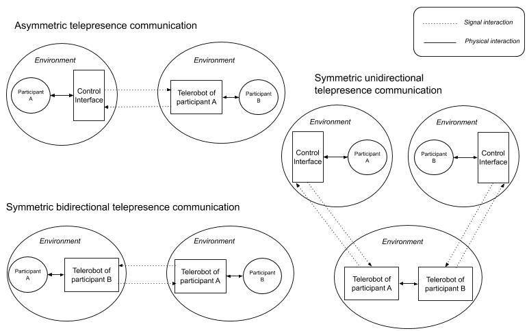

\title[mode=title]{}

\author[1,2]{Avner Peled}[type=editor,
    auid=000,bioid=1,
    prefix=Sir,
    role=Researcher,
    orcid=0000-0001-7511-2910,
    facebook=<facebook id>,
    twitter=<twitter id>,
    linkedin=<linkedin id>,
    gplus=<gplus id>]

\begin{keywords}
 Soft robotics \sep Second keyword \sep Third keyword \sep Fourth keyword
\end{keywords}

\maketitle

General introduction paragraph  
Recognizing other uses for robots in contact, such as FtF mediator and simulated contact.
Defining the scope of the work:

- Intergroup contact with emphasis on prejudice in asymmetric, conflicted groups.
- At least one group member is physically interacting with a robot in a shared space, which is operated by a member of the opposing group.


# 1. Intergroup contact hypothesis

## 1.1 Contact hypothesis

Review, leading into the need and rise of mediated contact, of which online is most prominent


## 1.2 Online contact

Review, leading into the issues with current online contact:

## 1.3 Issues with online contact

1. Lack of self-accountability

"individuals may feel less accountable for the content they post online or underestimate the social sanctioning of their behavior" [@whiteImprovingIntergroupRelations2015]

2.  Lack of engagement with a reduced social presence

 “Out-group members' reduced social presence was further associated with negative out-group attitudes, notably because the intergroup interaction itself was considered as less interesting, satisfying, cheerful, and involving” [@schumannWhenComputermediatedIntergroup2017]

3. Lack of physical turn taking cues.

"a delayed response in an interaction can also work to incite tension in the intergroup relationship...This is particularly pertinent point for online interactions where there can be a lack of physical cues" [@whiteImprovingIntergroupRelations2015]

4. Lack of opportunity for contact 
Not much opportunities for online contact, especially in the age of filter bubbles and echo chambers.

Leading into proposing telepresence robot contact as a midway between online and face to face which could solve a lot of the issues with online contact but preserve some of its benefits.

# 2. Telepresence robots

History and terminology:

- telerobot, telepresence, tele-operation, avatar, re-embodiment.
 
-  fully operated / semi-autonomous functions

# 3. A path model for telepresence contact

Previous research on intergroup contact provides us with conceptual and computational tools which we can use to model the path from initial contact to the eventual reduction of prejudice toward the generalized out-group. The stages model suggested by Pettigrew [@pettigrewIntergroupContactTheory1998] outlines the path to prejudice reduction: contact initially _decategorizes_ the individual out-group member from its group, then reduces prejudice from the general out-group, and finally dissolves the border between in-group and out-group. Researches have also shown empirically verifiable models for various mediators and moderators involved in prejudice reduction [@vociIntergroupContactPrejudice2003;@brownIntegrativeTheoryIntergroup2005;@pagottoEffectivenessIntergroupContact2010].

Inspired by those findings, we suggest a conceptual model for telepresence contact. Due to the presence of the telerobot, we add another stage on the path to prejudice reduction [@fig:path_model]. We hypothesize that an in-group member first develops an attitude toward the robot itself before projecting it on the operating out-group member. Attitude toward the robot could be influenced by previous bias on robots or by characteristics of the particular robot which we will analyze in this article. We estimate that the perception of the robot as a representation of the operator's agency is moderated by the degree of _co-presence_. Initially formulated by Goffman as a measure of our awareness to another human being in our physical space [@goffmanBehaviorPublicPlaces2008], the term is now used in literature to measure the feeling of "togetherness" in mediated communication. Co-presence is mostly discussed in relation to virtual environments and online avatars [@soeffnerCopresenceSharedVirtual2007;@casanuevaEffectsAvatarsCopresence2001;@benteAvatarMediatedNetworkingIncreasing2008], but has also been briefly addressed in telepresence robot scenarios [@hwangAugmentedRobotAgent2008;@choiWhoThisIdentity2017]. A high level of co-presence with the remote operator in robot-mediated communication would indicate that they are being veritably transported to the physical space of the interlocutor. It requires a willing, or spontaneous, _suspension of misbelief_ by the interlocutor that they ar talking to a human consciousness that is embodied within the robot. Finally, as previous research on intergroup contact suggests, a generalized attitude toward the out-group will be moderated by the level of group salience apparent in the conversation. The following sections mention various methods in which group salience could be highlighted in a telepresence robot scenario.

{#fig:path_model} 


# 4. Telepresence systems

A communication event that is mediated by telepresence robots could manifest in one of many different architectures. A single architecture  could be defined as a _telepresence system_. 

## 4.1 Signal and physical interactions

Before presenting the systems in focus for intergroup contact, we define two types of interactions that can exist within such system. 
Utilizing concepts from Paynter's generalized systems theory [@paynterAnalysisDesignEngineering1961], Hannaford has distinguished between the two types of interaction that occur in telepresence, _information_ and _energetic_ [@hannafordFeelingBelievingHistory2000]. We will  refer to them simply as _signal_ and _physical_ interactions. _Physical_ interactions refer to real word interactions between elements sharing a physical environment, such as a hand-shake or holding an object. In physical terms, a bidirectional _energy bond_ is formed between the interacting elements. _Signal_ interactions, on the other hand, occur on an abstract level. They represent a unidirectional logical flow of cause and effect; for example, text that is typed on one end of an online communication and appears on the other end. Intuitively, a physical interaction appears closer and more significant than a flow of signals because it involves our body. The tight bond between our cognition and our physicality is shown in a variety of conceptual frameworks [@deweyExperienceEducation1986;
@gallagherHowBodyShapes2006
@malafourisHowThingsShape2013] that reject the old cartesian dualism of a mind that is separated from the body. 

In online communication, a signal would always be a reduction and an abstraction of the physical action that caused it. When operating a telerobot through a remote control interface, the flow consists of three stages:
1. Beginning with an intent for action, a physical interaction occurs between the operator and a local control interface. 
2. Control signals are sent through a communication medium to the robot. 
3. The robot receives the signal, processes it and performs an physical interaction with its own environment. 

According to Minsky, when the control interaction is so seamless and synchronous with the robot in terms of responsiveness and feedback, the operator may feel as if they are physically present in the remote environment, i.e  _telepresence_.

## 4.2 Types of systems

If we consider solely the condition of _telepresence_, that is, having a telerobot operated remotely and used for communication, we identify three different systems of communication [see @fig:sym_asym]:

1. _Asymmetric_: The most commonly used system for telepresence communication. One participant is represented by a telerobot and is operating it from a remote location, typically their home, using a computer or mobile device. The other participant is interacting with the robot in a shared physical space. The system is asymmetric because the interaction experience is qualitatively different for the operator and the interlocutor. Common implementations include industry robots, surgical robots, office-based telepresence and social service robots.

2. _Symmetric bidirectional_: In this system both participants are operating a telerobot, which serves both as an avatar for their conversation partner as well a control interface for their telerobot. The interface, in that case, is completely transparent to the operator and typically uses body tracking. No control feedback is available to the operator and operation may commence without any knowledge of the remote telerobot by the participants. This type of system is more resource-heavy than the asymmetric type, and currently only a few implementations exist as prototypes and proofs-of-concept [@nagendranSymmetricTelepresenceUsing2015]. The lack of feedback in this system also heavily restricts the ability of the operator to travel around the space, as they are unable to see the remote environment.

3. _Symmetric unidirectional_: In this system both participants are operating a telerobot via a control interface, without physically interacting with an avatar. The two robots share the same space, while the participants are separated. Common implementations of this system include cooperative multi-robot tasks [@sirouspourMultioperatorMultirobotTeleoperation2005] and _Robot combat_ competitions [@clarksonBattleBotsOfficialGuide2002].As in the asymmetric system, operation is usually performed from a computer or mobile device. 

{#fig:sym_asym}


While the _symmetric unidirectional_ system may facilitate contact in cooperative or confrontational events in front of an audience, since the scope of this article involves at least one person physically interacting with a robot, we would turn the focus toward the first two systems.

## 4.3 The handshake paradigm

To further illustrate the mechanics of the two systems, we will use the common example of the handshake. The handshake is an important and common social gesture in most parts of the world [@schiffrinHandworkCeremonyCase1974]. It is a reciprocal action, beginning with one person reaching out in an open request and then reciprocated by the partner. It is also a haptic gesture in which subtle forms of touch can have a great social significance [@hillewaertTacticsTactilitySensory2016].

In an asymmetric system, the telerobot is usually equipped with a camera that streams the robot's vision back to the operator. When the interaction partner reaches out their hand, the operator will see this via the interface. The operator uses the control interface to reciprocate and have the robot reach out its hand. Movement is initiated with the push of a button in the most basic interface, or by moving a motion tracking device in a more advanced one. Once the interaction partner touches the robot, the handshake is picked up via a pressure sensor on the robot's palm and is transmitted back to the control interface. The touch could manifest as a screen flicker or a sound effect on the operator's computer, or as a vibration in a motion tracking device. 

In a symmetric system, both of the participants interact only with the telerobot in front of them. The handshake is initiated when one participant reaches their hand toward the robot. The gesture is picked up by a body tracker and causes the opposing robot to mirror the behavior of its operator and reach out its hand to the interaction partner on the other side. The partner reciprocates and now both robots have their hands reached out. When touch sensors on the robots detect that both participants are now shaking their respective robot's hand, a squeezing actuation commences in both robots to generate the feeling of the handshake for both partners.

# 4.4 A CMC component in asymmetric systems

Whether participant is interacting with a telerobot, or with a control interface in a symmetric or asymmetric system, telepresence communication is always mediated by a computer (CMC: _Computer Mediated Communication_). Interactions can be therefore anonymous, visibility and identity can be manipulated and conversation content can be augmented. There is still, however, a qualitative difference between an experience of physically interacting with a robot and that of operating one via an interface. When interacting with a telerobot, the perception of it as an avatar could suspend the participant's disbelief and regard the avatar as a present social agent [@banksAvatarsAreSometimes2016]. In that moment, interaction with the avatar becomes directly embodied and the robot's function as a medium is nearly transparent. One may argue that a similar suspension could be achieved in an immersive virtual reality environment, but the depth and richness of sensory feedback when operating in a real environment is still measures beyond what can be provided by a virtual one [@borgmannInformationNearnessFarness2000].  

Taking this difference into account implies that some social psychology models that apply to CMC, would apply to one side of an asymmetric telepresence system, the side that is operating the robot via a control interface. The participants that are interacting with the robot (both sides in case of a symmetric system), are experiencing an interaction that resembles more of an FtF encounter than a mediated one. Insofar as the robot is perceived as an avatar rather than a medium, we hypothesize that the experience would drift further away from CMC and closer to FtF. Factors that may moderate this effect are discussed in following sections.

A number of CMC models that affect the outcome of contact and the reduction of prejudice in conversation have been identified by researchers[@waltherComputermediatedCommunicationReduction2015]. The _deindividuation_ model warns that anonymity may release a person from social regulation and norms, leading to a negative effect on the conversation. The SIDE theory [@spearsWhenAreNet2002] provides a contrasting view in which a depersonalized encounter increases group salience, as it motivates individuals to act under a group context while pronouncing enhanced norms and tropes. Models such as SIP and _hyperpersonal_ communication 
[@waltherComputermediatedCommunicationImpersonal1996] advocate that more intimate interpersonal relations may form in online contact because of the need for the participants to make up for the lack of non-verbal cues. Having a strong CMC component only on one end of an asymmetric system could create a mix of behaviors in which one side experiences stronger senses of _agency_ (the sense
that I am the initiator of an act) and _ownership_ (the sense that it ismy body that is moving) in the conversation than the other [@gallagherPhilosophicalConceptionsSelf2000;@coleImmunityPrincipleView2000]. Ideally, this could evolve into a positive outcome in which an out-group member on the side of the operator enjoys the benefits of anonymity and distance, while the in-group member is fully engaged in physical contact, assimilating new meanings and dissolves existing bias. Realistically however, the asymmetric nature of the conversation alone can have implications on contact, as we hypothesize in the following section.

# 4.5 Equality in telepresence systems

One of Allport’s basic conditions for positive intergroup contact is having an equal status between group members, such as an equal position in a workplace context (Allport 1954, 274). While the general idea was verified in multiple studies [@pettigrewMetaanalyticTestIntergroup2006], the condition can be further differentiated to equality in status or in _situation_, i.e in contact only; a more realistic condition when group members carry persistent power differences and are in long-lasting and deep-rooted conflicts [@maozDoesContactWork2011].

It was shown that having symmetry and equality in communication, such as equal turn-taking and mutual respect, is beneficial for contact in groups that are in asymmetric conflict such as Israelis and Palestinians [@maozEvaluatingCommunicationGroups2005]. However, this does not mean that existing power relations should be ignored during contact. In fact, it was found that a communication model that “emphasizes the conflict and power relations between the sides”, although more risky, produces a higher equality within the contact [@maozDoesContactWork2011]. Furthermore, equality emerges when the interaction focuses on fulfilling the different needs of the group members. While an advantaged group member needs to feel morally acceptance, a disadvantaged group requires a feeling of empowerment [@shnabelNeedsbasedModelReconciliation2008]. A failure to address inequality in status during contact may even hinder ensuing motivation for social change [@saguyIronyHarmonyIntergroup2009]. 

Symmetric telepresence systems provide the hardware foundation for equal contact. As will be shown in the proceeding sections, it is up to the software and organizational implementation to make sure that the conversation is handled in an equal manner. An asymmetric system, however, tilts the balance toward one end, and may have implications for contact. 

Consider the situation in which a disadvantaged-group member is operating a telerobot anonymously from their home, while the advantaged-group member is interacting with it in a public space. The operator may feel free of social anxiety in their comfort zone, and empowered by the ability to see through the robot's camera and not be seen. This in turn may encourage bringing up more difficult topics related to conflict during the conversation. However, the asymmetry in the participant's visibility may also bring up anxiety and discomfort. In our initial test for intergroup telepresence contact, participants of both sides expressed discomfort regarding the unequal asymmetric setting. One member of a minority group noted that they felt as if they are a government official investigating their exposed partners [@peledSoftRoboticIncarnation2019, p.132].

Conversely, in an an asymmetric system inequality may surface due to a difference in freedom of movement and in appearance between the robotic avatar and the human interlocutor. While some have raised concerns of social robots restricting the freedom of humans [@whitby15YouWant2011;@hoornTheoryRobotCommunication2018a], the opposite is also possible, as humans are in many cases more free and resilient than their robotic counterparts. Moreover, in the case of oppressed group members that are experiencing day-to-day restrictions on movement, an asymmetric system may highlight the power relations and reduce the sense of equality in the conversation. To summarize, the easier to implement asymmetric telepresence system may create both negative and positive perturbances in contact, and therefore should be designed with great consideration. while a symmetric system provides the foundation for equal grounds, leaving it up to further design choices to maintain this balance.

TODO: rephrase this paragraph, I talk about this also in _movement_

# 4. The use of a 2D display and the dual-ecologies problem

The telepresence robot market is rapidly growing, and is predicted to accelerate even more in the upcoming years with increase needs for remote working and social services ^[https://www.marketwatch.com/press-release/telepresence-robots-market-size-2020-to-showing-impressive-growth-by-2024-industry-trends-share-size-top-key-players-analysis-and-forecast-research-2020-04-20]. Telerobot forms are continuously branching into new directions, but as of 2020 the dominant form remains to be that of a tablet device attached to a motoric vehicle [@kristofferssonReviewMobileRobotic2013] (See [@fig:double_robot]). The tablet typically displays the operators head, as in a Skype call. Examples from market leaders include _Double Robotics_ ^[https://www.doublerobotics.com/], _Mantaro_ ^[http://www.mantarobot.com/products/teleme-2/index.htm] and Revolve Robotics ^[https://telepresencerobots.com/robots/kubi]. Such telepresence robots are oriented for remote offices and public service environments such as hospitals or schools.    

{#fig:double_robot width=3   0%}

In a contact situation, it is likely that the telerobot operator would want to remain anonymous, or at least present themselves differently than their actual form. In this case, it is best if the exposure of the face would be optional, or that the operator could manipulate the image. However, there is a more fundamental, ontological issue with using a 2D display on a telepresence robot. The problem was described as the "dual ecologies" problem, and was investigated in a case-study by Choi and Kwak [@choiCanYouFeel2016]. In their study, a remote partner's presence in a tablet-based video call was found to be stronger when it is disembodied (tablet only) than when it was attached to wheeled robotic body. The authors explain this by referring to the different ecologies present on the same robot: One is a 2D projection of the operator's remote location and another is the physical presence of the robotic body in a shared space. They suggest that the receiver of communication experiences confusion, having to interact simultaneously with the immediate environment and with he depiction of the remote environment. 

The dual ecologies problem could be extended further, as our initial test shows that even utilitarian use of a display on the telerobot's body to perform a task, has disrupted the participants' view of the robot as a uniform avatar. Instead, participants reported reverting to the experience of using a phone-like device while they were interacting with the display, despite having to touch the robot to initiate actions in the virtual interface [@peledSoftRoboticIncarnation2019, p.127]. Back projection solutions such as those of _Furhat Robotics_ ^[https://furhatrobotics.com/] attempt to solve this incongruence by projecting 3d-mapped virtual information directly on the robot's surface. While this may moderate the negative effects of the display, it does address entirely the dual ecologies problem of having two different spaces combined into one.  

An interference with the experience interacting with the avatar may negate the positive benefits of physical interaction such as non verbal cues and direct engagement, and disrupt the flow of attitude forming toward the out-group member. Therefore, the use of a display should be planned carefully for intergroup contact. Alternatively, the robot's appearance could be designed with an emphasis on uniformity and consistency. Considerations for appearance are discussed in the following section.


# 5. Telerobot design for contact

## 5.1 Visual appearance

The affect of a robot's design on a human's attitude toward it has been studied extensively in literature, predominantly in studies of Human-Robot Interaction (HRI) and social robotics [@hancockMetaAnalysisFactorsAffecting2011]. A pivotal discussion revolves around the question of _anthropomorphism_: the degree in which a robot's appearance and behavior resembles that of a human. Current literature paints a picture that is manifold [@finkAnthropomorphismHumanLikeness2012]; while anthropomorphic features may increase a human's empathy and acceptance of the robot, the effect is context-dependent, culture-dependent, and works only to some extent. In some cases, people have preferred pet-shaped over human-like robots, and in other cases a human shape generated a negative attitude toward the robot. One over-reaching theory on robot-human-likeness has been extensively covered in literature - Mori's theory of the _Uncanny valley_  [@moriUncannyValleyField2012]. The theory suggest that a human's affinity toward a robot grows as it displays more human-like features, but at some point falls into a valley of uncanniness when the robot is _too human_ yet noticeably _inhuman_. The affinity rises back up only when theoretically no difference between the robot and a human can be discerned.

The theories above assume that the robot in question is fully autonomous, with no human controller in the loop. The context of telepresence naturally adds another element of complexity to the matter at hand and research specific to this question is more scant. A review by Lee et al [@leeDesigningAppearanceTelepresence2015] set to find an optimal design for a telepresence robot, recommended a mid-point between human and nonhuman with a caricatured nature. While keeping the uncanny valley in mind, adding some human-like aspects is justified by common research of affinity to anthropomorphic features. The argument for using a nonhuman form was based on research by Groom et al [@AmMyRobot2009]. The authors showed that robot operators have a greater sense of _self extension_ on their avatar when it is nonhuman. They explain this finding by the fact that a humanoid robot assumes its own identity, making it harder for the operators to project themselves on the robot. However, the study by Groom et al did not measure the effect of the non-humanoid form on the conversation from the side of the interlocutor, the person interacting with the robot. Research by Kuwamura et al [@kuwamuraPersonalityDistortionCommunication2012] found that the interlocutors experience a distortion of their partner's personality when it is conveyed through a nonhuman. Compared to a humanoid telerobot, participants interacting with a stuffed-bear felt confused, and had difficulty imagining that they are talking to a human.

Taking us back to the context of intergroup contact, the findings above have great significance. First, the uncanny, as it was originally described by Freud [@freudUncanny1919], invokes emotions as _morbid anxiety_; anxiety being a known mediator for the outcome of contact [@pettigrewMetaanalyticTestIntergroup2006, p.767]. 
Furthermore, the findings in regards to self extension and personality distortion also hold a potential to mediate the result. Nevertheless, as discussed previously, it is not a given that an attitude formed toward the telerobot would naturally project onto the operator. We therefore suggest to extend the model of the uncanny to support telepresence by adding another dimension to the equation. As noted, the level of Avatar co-presence moderates the transference of affect from the avatar to the inhabiter. Adding another multiplier to the uncanny valley equation would then reflect the estimated positive effect of avatar co-presence (see @fig:extended_uncanny). Assuming a high co-presence also implies that the problems of personality distortion presented by Kuwamara et al are mitigated. It should be noted, however, that even with high co-presence, not all nonhuman forms may fit the context of intergroup contact, especially in the context of conflict. Some caricatured forms may undermine the statue of the participant or even invoke a sense of disrespect. To summarize, we conclude that a midpoint between human and non-human may be suited for intergroup contact, but only if avatar co-presence is maintained, for example through outside cues, avoiding dual ecologies, etc, and if the form does not demean the participants.

TODO: Replace WSOD with Co-Presence

{#fig:telenoid width=50%}

{#fig:geminoid width=50%}

## 5.4 Voice

Research on user attitude toward an avatar's voice shows that as with visual appearance, one must strike a balance between relatedness and consistency. Lee and Nass studied the sense of social presence of avatars with machine-generated voices [@leeSocialPsychologicalOriginsFeelings2005] in respect to their personality (introvert or extrovert). When an avatar's voice personality is closer to that of the interlocutor, the sense of social presence is increased. However, the consistency of the voice with the portrayed personality of the avatar is essential. Social presence drops if the voice is incongruent with the textual personality. Another study by Mitchel et al [@mitchellMismatchHumanRealism2011] found that a mismatch between the voice and the face of a talking head generated an uncanny sensation. A human with a synthetic voice felt as uncanny as a robot with a human voice. 

In a telepresence robot contact, an operator may choose to use their own voice or a synthetic voice that does not disclose their personality, gender and culture. They may also use a synthetically cloned voice that is highly similar to their natural voice [@jiaTransferLearningSpeaker2019]. A synthetic voice also adds modalities for speech augmentation and language translation as we discuss in the section regarding interaction modalities. In order to avoid anxiety and confusion, we hypothesize that an optimal voice would be one that takes the telepresent nature into account, reminding the interlocutor that there is a human operator inhabiting the avatar, but also does not diverge abruptly from the physical form of the avatar.

## 5.2 Designing with group salience in mind

Naturally, the process toward forming a generalized opinion toward the out-group does not end at the interpersonal level. The most widely agreed-upon moderator for generalizing a positive attitude to the intergroup level is _group salience_, the degree in which the participants' group identity is salient during contact.  Earlier research on contact found a bipolar, antagonistic correlation between group identity salience and interpersonal relationship [@brownInterpersonalIntergroupBehaviour1981]: When the group identity is so present, it is harder for the participants to find their commonalities and create new bonds and friendships. Later research, however, suggests that there is now a sufficient evidence that group and interpersonal salience can remain high simultaneously [@brownIntegrativeTheoryIntergroup2005]. One approach,suggested by Pettigrew [@pettigrewIntergroupContactTheory1998], is to expose group identities gradually, starting with a low salience, allowing initial contact to form, and increasing it over time.

Group identity can be transmitted through a variety of channels in telepresence, beginning with the design of the avatar; its appearance, voice, and its surroundings, and proceeding into the content of the interaction. Although the physical medium is not as easily manipulated as a virtual environment [@haslerOnlineIntergroupContact2013], there is still room for creativity in the way group identity is revealed during contact. For example, an avatar may have a non-humanoid appearance, but still maintain group identity through group symbols, cues, language, and so forth. It may speak in an accent, wear typical accessories or flaunt national colors. The freedom to use material objects brings up new design possibilities that are not available in an online encounter. Group cues could be positioned in subtle ways, so that they are gradually revealed by the interlocutor. If the initial appearance and behavior of the robot is engaging enough, an interpersonal bond may be formed despite the presence of group-related cues.

```{#fig:extended_uncanny .pyplot caption="Extended uncanny valley model for intergroup contact" links=false}
import numpy as np
from matplotlib import pyplot as plt
from mpl_toolkits.mplot3d import Axes3D

x = np.arange(0., 7., 0.1)
y = np.arange(0., 7., 0.1)

X, Y = np.meshgrid(x, y)

def uncanny_function(t):
    return 1/(1 + np.exp(-(t-4)) ) - 1.2 * np.exp(-(t-6) ** 2)

def avatar_function(t):
    return t / 8.

plt.figure()

Z = uncanny_function(X) * avatar_function(Y)

ax = plt.axes(projection="3d")

ax.plot_wireframe(X, Y, Z)
ax.set_xlabel('Human Likeness')
ax.set_ylabel('Avatar WSOD')
ax.set_zlabel('Attitude toward out-group member')


ax.xaxis.set_tick_params(labelsize=0)
ax.zaxis.set_tick_params(labelsize=0)
ax.yaxis.set_tick_params(labelsize=0)

```

## 5.3 Materiality

An important factor in robot design is the choice of materials. In industrial robots, the material would be chosen _functionally_, in accordance with the task at hand. In robots designated for human interaction, instead of materials, we examine _materiality_, conceptualized by N. Katherine Hayle as "physical qualities that present themselves to us"[@haylesSpeculativeAestheticsObjectoriented2014]. Materiality comes into play in two main aspects of a robot's constitution: 1) The outer skin: the part of the robot that touches and is being touched, and 2) Actuation: the material that actuates, generating the robot's movements. With the former, we can place materials on a scale of firmness and rigidness; how soft it feels to touch the material. With the latter, we can define a scale of flexibility and linearity, describing the nature of the material's movement.

Previous research in social robotics supports the use of soft materials for the outer skin of robots, especially in interaction with children [@kozimaSocialRobotsChildren2006] and in elderly care [@broekensAssistiveSocialRobots2009;@kiddSociableRobotEncourage2006]. The reason being the presence of _affective touch_ between the robot and humans [@kerruishAffectiveTouchSocial;@stiehlDesignTherapeuticRobotic2005]. The human body and another natural forms are inherently soft, and co-exist better with other materials that are soft [@daneseSoftMachine2003]. Nevertheless, here too, carrying an object closer to the realm of the living may invoke an uncanny feeling, for example when touching a smooth, soft, material that is also cold [@willemseAffectiveBehavioralResponses2017;@nieCanYouHold2012].

A soft touch on the surface doesn't necessarily imply a softness as a whole. For example, a gripping robotic hand made from powerful servo motors that are wrapped in a soft skin could still easily, and inadvertently, crush soft tissue. _Soft Robotics_ is a rapidly developing research field for robots that operate on soft materials down the level of actuation [@baoSoftRoboticsAcademic2018]. Research is often, but not always, bio-inspired; commonly used materials are fabrics and silicone rubbers while the most common form of actuation is pneumatic: applying air pressure or vacuum. Presently, the largest consumers of soft robotics are the medical industry, utilizing the soft materials for invasive and surgical procedures. Nevertheless, uses and appeal of soft robots for human interaction are being studied [@bewleyDesigningBlonutDesign2018;@jorgensenAppealPerceivedNaturalness2018;@zhengSoftGrippersNot], uniformly arriving to the conclusion that the smooth, organic-like motion of soft actuators has an expressive quality, and affects humans in a manner highly different from traditional robotics. Our small-scale test on soft robotic telepresence has reached similar conclusions [@peledSoftRoboticIncarnation2019, p.126]. As predicted by Mori, movement has an effect on the uncanny, and soft actuation has potential to fall into the a negative category. If designed correctly, movmement can bestow a robot with a relatable, expressive quality, despite it having a  non-anthropomorphic appearance [@hoffmanDesigningRobotsMovement2014].  

All things considered, a soft approach deems appropriate for telepresence contact. Insofar as the presentation of the avatar remains balanced in respet to the principles outlined in this section, adding soft movement and touch may increase empathy and initmacy in contact and lead to a more positive outcome. A soft approach also presents a notion of safety, and an inability to cause harm; a desirable climate in situations of intergroup conflict.

TODO: Robot’s Height, in equality?

## 5.5 Avatar co-design

The ability to customize an avatar is widespread in video games and social media applications. It was shown to improve a user's engagement in the platform [@ngExaminingEffectsAvatar2013], and to have consequence on a user's social behavior. According to studies of _self-extension_ in the digital world [@belkExtendedSelfDigital2013;@messingerReflectionsExtendedSelf2019] users tend to have an increased self-confidence and behave more extroverted when they perceive their avatar as more attaractive. The effects of self-extension may be so intense that the changes in behavior remain after even usage.

In robotics, customizing an avatar is more complex than in a virtual environment. Possiblities for design are constrained by the hardware platform of the robot, requiring a form of co-design between the robot engineers and the user. Assembling the robot requires physical effort and basic knowledge in mechatronics, and cannot be performed intuitively as in a video game. Nevertheless, involving users in designing and assembling their robotic avatar may have great benefits. In the study by Groom et al[@groomAmMyRobot2009], it was shown that operators had a greater sense of self-extension to a robot that was assembled by them, rather than by another. Robots were also succesfully co-designed with children as the target users. The YOLO robot focused on creativity and storytelling, allowing children to design behaviors and movements [@alves-oliveiraYOLORobotCreativity2017], while the PAL involved children in designs for diabetes self-management [@henkemansCodesignPALRobot]. Co-design methods also improved the genreal attitude of students toward robots in educaitonal settings [@reich-stiebertInvolveUserChanging2019].

In the context of contact, and especially in situations of intergroup conflict, co-designing avatars may have even greater virtues. Participants could control their representation and its behavior, considering how they wish to be seen by the other side; thus, supporting ‘controlled’ means for escalation and de-escalation that has been found beneficial in other media-based intergroup contact projects [@zancanaroConarratingConflictInteractive2012]. The assembly work in itself may be theraputic, both as tactile experience [@sholtTherapeuticQualitiesClaywork2006] and as a self-expressive arts [@muriFaceArtTherapy2007]. Finally, a participatory approach for robot-building holds great potential for empowering oppressed groups and minorities by providing meaningful education in modern communication technologies.


# 6. Interaction modalities

As described in the beginning of this article, the term _physical interaction_ delineates the missing element in a signal-based, online interaction. Physical interactions occurs in a real environment where matter creates an energy bond with matter. This includes _embodied interactions_ : subject-to-object interactions between a human body and an object such as a robot, and object-to-object interactions, e.g when the robot is interacting with other objects in the environment. In telepresence contact, we want to create a real sense of intersubjectivity between human and avatar, as close as possible to situated FtF encounter. Phenomelogist Merlau-Ponty coined the term _intercorporeality_ to describe the strong and co-dependent physical nature of intersubjectivity [@merleau-pontyVisibleInvisibleFollowed1968]. Today, researchers in the field of emobided cognition are studying the specific mechanisms behind this phenomenon. 

In this section we explore possible affordances [@gibsonSensesConsideredPerceptual1966, p.285] in telerobot design, and theorize over different modalities [@kressMultimodalitySocialSemiotic2009]: modes for interaction, that may assist in intergroup contat. We detail suggestions toward implementation in the two types of systems discussed: symmetric and asymmetric. For every implementation, we consider the level of agency alloted to the operator, and conversely the level of autonomy required from the robot. While we strive to grant full agency to the operator, some modalities require an intervention from the robot to ensure a smooth exprience, while other modalities may benefit from being augmented with the robot's capabilities.

## 6.1 Movement in space

The ability to move a body in space is what mainly distinguishes a robot from other interactive technologies. However, not all robots have the same degrees of freedom and granularity when it comes to movement. In the field of social robots,_mobile robots_ typically travel around using wheeled motion. Examples include service robots, such as Pepper^[https://www.softbankrobotics.com/emea/en/pepper] and Samsung bots^[https://research.samsung.com/robot], and telepresence robots such as Double Robotics^[https://www.doublerobotics.com/] and Beam^[https://suitabletech.com/]. Other robots only move their body while remaining stationary in place. For example care robot such as PARO ^[http://www.parorobots.com/], and Ishiguro laboratories' telepresence robots ^[http://www.geminoid.jp/en/robots.html]. Due to the complexity of maintaining both modalities in interaction, mobile robots usually keep a physical distance from the user, interacting mostly using voice and visual information as they travel around. Stationary robots, on the other hand, tend to rely more on haptic interaction, allowing the user to hold and touch them. Only a few robots attempt to combine both modalities, such as Teo [@bonariniHuggableMobileRobot2016].

Touch-based interactions' affective role in human-robot relations  [@andreassonAffectiveTouchHuman2018;@kerruishAffectiveTouchSocial] renders them meaningful for contact, as it was shown that the outcome of contact is tightly integrated with affective measures. Thus it may prove beneficial to place touch modalities in a higher priority than the ability to move around in space. Moreover, in the caes of symmetric telepresence, moving around is nearly impossible, as the operator does not have a dedicated interface for traveling, and movement can rely only on limited body tracking. Even in asymmetric systems, complexities added by the need to navigate a robot using a camera may divert attention from the main task at hand, having a meaningful interpersonal interaction.

One exeception in which acquiring mobility may be paramount is in situations of assymetrical conflict where the oppressed group suffers from movement restricitons in their daily life, as is the situation in Palestine [@brownImmobileMassMovement2004]. In such case, an oppressed group may get empowered by having the ability to travel around, using their telepresence robot, in areas that are normally out of their reach. This, in turn, may contribute to greater sense of equality and confidence within the conversation.  

## 6.2 Nonverbal communication and emotional expression

Nonverbal communcation (NVC) plays a substantial role in our day-to-day interactions. In a pioneering work by Michael Argyle [@argyleBodilyCommunication2013], nonverbal signals were listed as follows: facial expressions, gaze, gestures, posture, bodily contact, spatial behavior, appearance, non-verbal vocalizations and smell. A telerobot has the capacity to use all of those signals, but the main challenge lies with the reliable transmision of signals from the operator's intention to the re-emboided form of the robot. Signals have to picked up accurately from the operator, and then translated to the telerobot's body to convey the same meaning.

Argyle categorizes types of NVCs according to their level of awarenss within the sender and the receiver. The majority of NVCs are defined as _mostly unaware_ on part of the sender and _mostly aware_ on the receiver side. For example: we are only slighty conscious of the fact we are smiling during a covnersation, but the sentiment is registered more attentively with our conversation partner. 

Since NVCs communicate emotion, they should be handled with great care in telepresence contact. While unaware emotional signals can be detected on the operator using facial recognition, prosodics, and body tracking, modern deep learning system are still subject to noise and occasional error, and can only recognize generalized basic emotions[see @zhangMultimodalDeepConvolutional2016;@hossainEmotionRecognitionUsing2019]. Theories of universiality in facial expression, originating in Darwin's account of emotional expression [@darwinExpressionEmotionsMan1998suggest] suggest a common basis for expression across cultures [@hareliFacialExpressionsEmotion2017], but the findings are inconclusive [@jackFacialExpressionsEmotion2012]. A mistake in an assumption of a participant's emotional state could lead to confusion and frustration in the conversation, therefore it may be safer to rely stricly on explicit gestures made by the operator with full awareness. Expression of emotions in an asymmetric sytem could be invoked by the operator using Emojis[@kayeEmojisInsightsAffordances2017] or other dedicated buttons. In a symmetric system, explicit body gestures could be used, or touch-based interactions such as a pat or a stroke on the robot's body.

Once the operator's intention is picked up, it can be expressed by the avatar, and here too is a risk of confusion. If using a humanoid avatar, a combination of gaze and smooth eyebrow motion can display expressive facial expressions, as shown in the SEER robot [@todoSEERSimulativeEmotional2018]. , and studies of emotion expression in virtual humanoids avatar have shown that they add an element of confusion and mis-representation [@pelczerExpressionsEmotionsVirtual2007]. When using a non-humanoid, facial expressions are very limited. Instead, body movement can be used to express emotions. Laban's movement analysis  [@labanMasteryMovement1971] (LMA), a framework from the field of dance was shown to be applicable for robots [@nakataExpressionEmotionIntention1998;@masudaMotionRenderingSystem2010]. LMA analyzes movements components such as _effort_ and _shape_, that can be assigned to basic emotions [@shafirEmotionRegulationMovement2016]. Using dance as an inspiration for robotic expression also benefits from its cross-culture universality [@sieversMusicMovementShare2013]. Another model, the PAD emotional state model [@mehrabianApproachEnvironmentalPsychology1974], was successfully applied to robot movement design [@ardilaAdaptiveFuzzyPredictive2019;@noguchiOMOYHandheldRobotic2020]. PAD describes emotions in three dimensions: Pleasure, Arousal and Dominace. Defining and evaluating the robot's emotional state on the PAD scale allows designers to correlate emotions with specific mechanical movements.

Some signals, such as shifts in gaze and body orientation, are completely unaware during conversation, yet they have an impact on the turn-taking and attention signaling [@kendonConductingInteractionPatterns1990;@richardsonConversationGazeCoordination2009]. Smooth turn-taking promotes the sense of equality in contact, and was demonstrated to benefit human-robot interaction [@vazquezRobotAutonomyGroup2017;@lalaSmoothTurntakingRobot2019]. Insofar as those actions cannot be explicitly pronounced by the operator without impairing the flow of the conversation, they need to be a part of the robot's semi-autonomous functionality. When physically interacting with a robot, end-of-turn can be  predicted using a number of tracking modalities [@MultimodalEndofturnPrediction]. In an assymetric interface when communication is simply typed or clicked, end-of-turn can be inferred directly from the operator, and signals such as a typing indicator could be sent. In the opposing end however, the camera-based view does not properly transmit turn-taking siganls, and may break the flow of the conversation, as is widely seen in video conferencing applications[@fischerVideoConferencingTransregional].

## 6.3 Verbal communication

Bridging conflict narratives and reducing prejudice between groups seems virtually impossible without the use of language. Whether one holds a more embodied approach of speech  [@merleau-pontyPhenomenologyPerception2013], or views language as the logical foundation of he lifeworld [@habermasTheoryCommunicativeAction1984], there is a consensus on its constitutive role in forming intersubjectivity [@haysomCommunicatingDepthHabermas2009]. In fact, it was shown that language can make up for the lack of embodied interaction, and is often used creatively in CMC to overcome missing nonverbal modalities [@keatingChallengesConductingInteraction2017]. For the above reasons we consider language modalities to be essential in telepresence contact.

The outstanding benefit of mediated verbal interaction for intergroup contact is the ability to translate between different languages and dialects. This has significance since often groups in conflict do not speak a common langauge and communicate only through mass-media which propogates biased views. Machine translation, however, may also be destructive to cultural and political nuiances [@lehman-wilzigTowerBabelVs2000;@croninTranslationDigitalAge2012], and contemprary deep-learning translators exhibit stylistic and gender bias based on their training datasets [@hovyCanYouTranslate;@stanovskyEvaluatingGenderBias2019]. Models such as Timo Honkella's "peace machine" [@honkelaRauhankoneTekoalytutkijanTestamentti2017;@kouluHowWillAI] attempt to resolve this problem by preserving cultural-dependent meanings within translation. While no data exists so far on the negative implications of machine translation in intergroup contact, it is known that mediating human translators and interpreters suffer from a lack of trust by the participants who worry that their voice will not be heard [@monzo-nebotTranslatorsInterpretersAgents2019, p.22]. In our initial test for automatic language translation in contact, participants have raised concerns of being mispresented by the machine [@peledSoftRoboticIncarnation2019, p.130].

While caveats of machine translation cannot be disposed of, there are some mitigating steps that can be taken to improve the expreience of the participants. First, when using speech recognition, feedback of the recogition result in the operator's native language should be given, perhaps even allowing, at the cost of maintaining a conversation flow, to confirm the result before sending it out for translation. Second, when possible, the interface should display the confidence level of the translation before it gets sent to other side. Finally, in case a mistake was realized by the operator only after submitting, there can be a quick "oops" button that has the robot express an apolgetic gesture. While mediated translation requires the use of a machine generated artificial voice that can speak the desired langauge, our initial tests show that participants enjoy their newly acquired ability to speak another language, and are excited to try it [@peledSoftRoboticIncarnation2019, p.130]. If used according to the above mentioned principles of design and interaction, real time language translation could be an important facilitator for telerpesence intergroup contact.

## 6.4 Synchrony, reciprocity and feedback

Whether communication is verbal or not, it is shown that synchrony and reciprocity faciliate interpersonal sympathy and empathy, also referred to as "social entrainment" [@bernieriInterpersonalCoordinationBehavior1991;@burgoonAdaptationDyadicInteraction1993;@phillips-silverEcologyEntrainmentFoundations2010;@sevdalisCapturedMotionDance2011l@stupacherSynchronySympathySocial2017]. Such interactions include: rhythmic movements (e.g clapping, jumping), a smooth converation beat,  syncronized dance,  give-and-receive interactions, gaze synchrony, affective mathcing, and mimicry. The same positive effects are observed in human-robot interaction, particulary in care and therapy robots for children and the eldery [@aucouturierCheekChipDancing2008;@lorenzSynchronyReciprocityKey2016].

The biggest problem in achieving interpersonal synchrony over mediated communication is that of _latency_ [@campbellInterpersonalCoordinationComputerMediated2015]. The unavoidable time delay due to physical distance between the participants can incite confusion and frustration when performing rhythmic and simultanous tasks, even if the internet round-trip amounts to a few hundred milliseconds. Research in the field of online music performance is at the forefront of tackling such issues [@odaToolsTechniquesRhythmic]. Semi-autonmous methods in the likes of action prediction, lag compensation and global metronomes enable muscians to collaobrate in jam sessions from different locations around the globe. The same methods can be used to synchronize robot-mediated activities such as gesture mimcri, dance, music and cooperative gaming. Synchronize actions can be performed both in symmetric and asymmetric systems. In a symmetric system the pariticipants would be coordinating the same action, for example clapping, while in an asymmetric system one participant would be using a control interface, for example tapping or shaking a mobile phone, while another would perform the action in front of the telerobot. 

Some reciprocal actions do not require real-time sychrony between the participants and can be implemented more easily. For example, the above mentioned hand-shake paradigm and other similar gestures such as a "high five" could be performed in a turn-based flow. This may decrease the valence of the action, but still benefit the conversation; people tend to be rather forgiving toward the slugginesh of robots. Additionally, the semi-autnomous function of the telerobot could simulate instant feedback and nonverbal rections such as gaze shifting in response to the interlocutor's actions. 

In an asymmetric system where the robot's operator is using a control interface, having instant feedback to the control actions increases the sense of agency and ownership within the opreator [@dolezalRemoteBodyPhenomenology2009]. At the high-end of the spectrum we can find advance control systems that mix Virtual Reality and haptic feedback such as the ones for 'Robonaus' at the Johnon space center [@colaSmallWorldMachines]. As a bare minimum, however, an operator should have visual feedback of how the robot acts in response to control commands. This can be acheived by placing a mirror on-site, providing the operator with multiple camera angles, and practicing the use of the robot in-advance. In our initial experiment, participants have expressed cocnern over their inability to see the facial expressions they were invoking with the robot. The lack of feedback was especially notable when performing a reciprocal action such as a hand-shake. When participants were unable to see their avatar's arms they could only guess what is happening. It is thus critical to supply ample feedback to the operator in an asymmetric system.

# 7. Peacebuilding scenarios

## 7.1 Public space interventions

Robotic avatars can be used as an advanced communication tool in organized intergroup encouters where participants are unable to meet face-to-face, but the physical presence of telerobots makes them expetionally suitable for random public space interventions. Robots can transcend national borders and occupy spaces, with potential to reach crowds that wouldn't normally engage in intergroup contact. In a symmetric system, robots could be placed in public urban spaces of both sides and wait of passersby to initiate contact. In an asymmetric system, one robot would be placed in a public space while operators would inhabit the avatar from a remote location. 

In such a scenario, one might consider whether the group identity of the telerobot's operator should be widely exposed to passersby, allowing them to make a voluntary decision to approach, or whether they would first approach the robot and only realize its group identity during conversation. A meta-analysis by Pettigrew et al [@pettigrewRecentAdvancesIntergroup2011] concluded that in contacts that had a negative outcome, it was far worse when the contact was initiated involuntarily. However, when the group identity is known, members may avid interaction [@wesselDoesDiversityUrban2009], even in organized interventions between groups [@maozDoesContactWork2011]. Once again a balanced approach may work well here. Some external cues could exposed, providing only hints about the telerobot's identity, allowing passersby to approach voluntarily while considering the robot's group identity. A robot that pops up in the middle of a public space might be intriguing enough for some people to approach. Depending on the robot's design and on a person's bias toward robots, some may also deter from approaching this unfamiliar entity. One method to get public interest would be to equip the robot with some actions that are designed to draw a crowd, and allow operators to trigger them. For example playing a sound, a musical theme, or performing some inviting gesture. In an asymmetric system, an operator has more control on the robot's interaction with the environment. They make look around by moving a camera, or even drive around using wheeled motion. When planning a public space intervention, the designated site and its demogrpahics should be considered. A design that is tailored to the site and context would have a higher chance to succeed.


## 7.2 Interaction content

Once contact if formed, the conversation between the participants can flow freely, or may be guided by the telerobot's semi-autonomus functionality. Modern types of interaction may include cooperative games and simulations that engage the pariticpant toward a common goal, in-line with Allport's principles. Games have already shown potential in face-to-face meetings [@brynenPeacebuildingGamesSimulations2013] and in online contact [@haslerOnlineIntergroupContact2013]. When interacting with a robot, its body parts may be appropriated as game-controllers. For example, squeezing the robot's arms, thus indirectly forming touch interactions between the pariticipants. In games that offer visual content, it is necessary to embed a 2D display in the telerobot or place one beside it. In that case, attention of the users should be managed carefully, and content should be distinct from the avatar's body to avoid the dual ecologies problem and a reduced co-presence. 

More traditional forms of conflict resolution and peacebuilding can also be supported by the robot's functionality. Seen as a mediator that supports interaction, a transformative approach to conflict mediation which emphasizes recognition and empowerement rather than problem solving [@bushPromiseMediationTransformative2004] seems appropriate. The robot's interface may encourage the participants to express themselves freely and make sure that everyone has a right to be heard. The interaction could also make use of storytelling as a tool for the participants to disclose their narrative [@coburnStorytellingPeacebuildingMethod2011] to one another. At the forefront of technological conflict mediation, machine learning is being sought as a tool for peacebuilding that can understand complex sentiments and situations [@honkelaRauhankoneTekoalytutkijanTestamentti2017], predict conflict escalation before it occurs [@perryMachineLearningConflict2013], and offer help to resolve issues [@sycaraMachineLearningIntelligent1993]. As noted earlier, machine learning tools should always be used with caution and awareness of their training environment.

The content suggested above only scratches the surface of conflict resolution and peacebuilding methods, as the possibilities for interaction are boundless. It is important to note, howver, that in a telepresence context the sense of co-presence may be affected as the mediating autonomy of the robot increases. The robot may be perceived more as a middle-agent rather than an avatar, which in turn may reduce the effect of positive outcome toward its operator. Mediating functions should be kept as transparent and seemless as possible.

# 9. Ethical considerstions

# 10. Summary table
| Aspect | Hypothesis | Considerations for asymmetrics systems | Considerations for symmetric systems | 
| ------ | ---------- | -------------------------------------- | ------------------------------------ |
| boo    | baa        | boo                                    | baa                                  |
| boo    | baa        | boo                                    | baa                                  |
| boo    | baa        | boo                                    | baa                                  |

# References