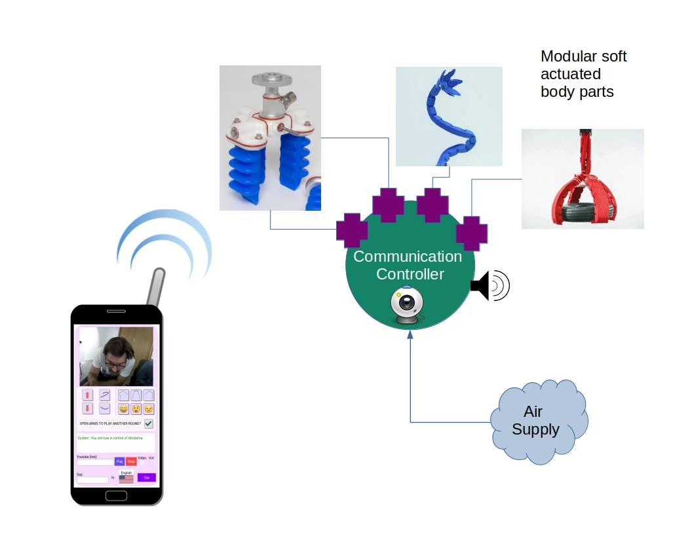

\maketitle
\newpage
\tableofcontents
\pagebreak
    
# Statement
The proposed research studies how robots can facilitate profound contact between people who are unable to meet face-to-face. Telepresence robots (robots that are remotely operated by humans) are increasingly being used in social situations, from public services such as health care and education to the private sector working places and residential homes. New demands for robotic avatars also surfaced in light of the COVID-19 pandemic, where physical distancing is imposed on society.  Driven by the dire need for innovative solutions to the violent, long-term conflict in my home country, Israel, with its Arab neighbors , the proposed research examines the viability of telepresence robots as a new tool for intergroup conflict resolution. From this extreme use-case, wider-scale lessons regarding social robot design, physical interaction, and mediated communication can be acquired that apply also in other (non-violent) contexts.

I am a first-year doctoral student at Aalto University’s school in Arts, Design, and Architecture in the department of media. My Master’s thesis: Soft Robotic Incarnation [@peledSoftRoboticIncarnation2019], was written under the same department. In the past decade, I have been focusing my efforts on technological mediation between people, navigating prior experience in science, programming, and information security at the Israeli military, toward media art and social activism. This grant application asks for funding for my second year of doctoral studies.

The social psychology theory of intergroup contact argues that for two social groups to improve their attitude of one another and reduce prejudiced opinions, they first have to meet. Once contact is formed, the theory defines conditions that should take place for it to be positive, leading to improved relations between the groups. Since initiating large-scale face-to-face contact between groups in protracted and violent conflicts is incredibly challenging, conflict resolution efforts have expanded into various forms of indirect contact, including contact mediated by technology. Within the scope of technological mediation, virtual forms of encounter such as online gaming and virtual reality have taken the center stage, whereas little attention has been given to robots. This, despite apparent shortcomings that emerged due to the shallow and abstract nature of virtual contact. This research will contribute to the academic community in three main vectors over four years: 1) The first contact hypothesis for telepresence robots; theorizing on the conditions required for a positive robot-mediated encounter, 2) A novel design for a robotic avatar toolkit that is tailored specifically for telepresence contact and is designed to be fabricated by an inexperienced user, and 3) The first field test for telepresence robot contact in conflict, between Israelis and Palestinians. Each milestone includes a publication, with the final dissertation aggregating and concluding the research. We plan to submit the first article in the next couple of months to the journal _Computers in Human Behavior_.

The research uses lessons learned from my previous soft robotic telepresence: HITODAMA ^[https://vimeo.com/370821209], as well as some of its software and hardware platform. Now, we plan to produce a new toolkit that allows inexperienced workshop participants to design and produce their avatar. By opening the robot’s production to a participatory workshop in an intergroup conflict context, we hope to achieve two main outcomes: 1) proliferation of technical and scientific knowledge and empowerment in an oppressed group. 2) Facilitating artistic and emotional expression in situations of conflict. 

# Grant request
For the first year of my research between February of 2020 and February of 2021, I was able to get hired as a paid researcher by Aalto university. Starting in March 2021, I will be without funding. **I, therefore, apply for a full-time one-year grant of 26 000 € to support my second year of studies between March of 2021 March of 2022**. 

# Research overview

## The Telepresence Contact Hypothesis: Dissolving prejudice with robots

This dissertation focuses on prejudice as a major component of intergroup conflict [@pettigrewIntergroupPrejudiceIts2011] and its dissolution as a key method for resolution. Gordon Allport’s _Nature of Prejudice_ [-@allportNaturePrejudice1954] lays the foundation for the _contact hypothesis_. The theory specifies four conditions that need to be fulfilled during contact for it to be effective: an equal status, having common goals, active cooperation, and institutional support. Fifty years later, a meta-analysis validated the hypothesis across a large number of studies [@pettigrewMetaanalyticTestIntergroup2006]. It was shown, however, that Allport’s conditions are not strictly essential for a positive outcome, rather they are factors among others that facilitate it. Later research focuses on identifying the affective drivers, such as empathy and anxiety, that play a mediating role in contact, and on conditions that support the generalization of attitudes from the interpersonal level to the group level [@brownIntegrativeTheoryIntergroup2005].

Communication technologies expand the models of contact and add new modalities of interaction while giving up the benefits of traditional face-to-face encounters. Research on online intergroup contact has shown that despite the obstacles set by the medium, there is potential for online intergroup contact to reduce prejudice and aid in conflict resolution [@amichai-hamburgerStructuredUnstructuredIntergroup2015;@haslerOnlineIntergroupContact2013;@waltherComputermediatedCommunicationReduction2015]. Virtual reality has also been studied as a medium, both as a space for dialog, and as an “empathy machine” that allows intergroup members to immerse themselves in the perspective of the other side [@haslerVirtualPeacemakersMimicry2014;@hassonEnemyGazeImmersive2019;@kabiljoVirtualRealityFostering2019]. Nevertheless, online contact is not always constructive. The distant nature of the remote medium reduces our sense of _presence_ in the social situation [@goffmanBehaviorPublicPlaces2008;@lombardHeartItAll1997], which in turn makes us less accountable for our actions and less engaged in the conversation [@whiteImprovingIntergroupRelations2015;@schumannWhenComputermediatedIntergroup2017]. The lack of non-verbal cues [@burgoonNonverbalSignals1994] obstructs the path to a mutual understanding and impairs the turn-taking process, which may evoke negative feelings between the group members such as anger and frustration [@johnsonAngerFlamingComputermediated2009].

The crucial role of the corporeal and the physical in forming socialities has long been advocated by researches and philosophers across disciplines and fields. From the historical materialism of Marx [@marxCapitalCritiquePolitical2015] and Lukacs [@lukacsReificationConsciousnessProletariat2017], through the phenomenology of the intercorporeal [@merleau-pontyVisibleInvisibleFollowed1968] and pedagogical theories of "learning by doing" [@deweyDemocracyEducationIntroduction1923], and up to the four Es of embodied cognition [@gallagherBodyImageBody1995]. Critical theorists have repeatedly warned against an abstraction of human nature. Terms such as _reification_, _rationalization_, and _fetishism_ are used to describe the condition in which virtual properties are incorrectly assigned to a material being[@silvaReificationFetishismProcesses2013;@horkheimerEclipseReason2004;@juttenColonizationThesisHabermas2011;@ahmedStrangeEncountersEmbodied2000].

Telepresence robots add corporeal depth to mediated contact, as they represent a midway between online communication and meeting face-to-face. On one hand, the operator is inhabiting a robotic avatar remotely through a medium, but on the other hand, the interaction partner is physically present with the robot, using their body as they would do face-to-face with a person.  It remains to be asked: How should such interaction be designed to achieve the optimal result? What should a telerobot look like and what materials should be used? What interaction modalities are more facilitating than others? How should a contact situation be organized? We attempt to answer these questions in a conceptual article: _the telepresence robot contact hypothesis_. Relying on previous research and methodologies, we theorize over the contingencies of robot-mediated contact and lay the groundwork for future implementations.


## A toolkit for making robotic avatars

Research conducted on my Master's thesis provided initial conclusions on the use of telepresence robots for intergroup contact [@peledSoftRoboticIncarnation2019], as well as a software and hardware basis for implementation. A non-humanoid form made from soft materials was explored and found promising for designing a neutral yet expressive and organic-looking avatar that diverges from the traditional appearance of telepresence robots (see [@fig:comparison]). A qualitative analysis of user response to numerous design and interaction elements also provided important guidelines for future research. In this dissertation, we have opted for a semi-participatory approach. We will design a toolkit that enables anyone to design their robotic avatar in a workshop using readily available materials and a telepresence platform provided by us. The potential for custom-designed social robots was already demonstrated[@suguitanBlossomHandcraftedOpenSource2019], and it was shown that assembling your robotic avatar increases the sense of _self extension_ into the robot [@groomAmMyRobot2009]. We will take this further: not only allowing the user to design the appearance and assemble their robot, but also to plan its movement and actuation. 
Using flexible methods and soft materials, such as origami-inspired structures [@peraza-hernandezOrigamiinspiredActiveStructures2014], participants would craft their body part modules and connect them to a central pneumatic system. Our communication controller would automatically provide conversation and actuation capabilities, including language translation and remote control via a mobile web interface (see [@fig:diagram]).

{#fig:comparison}

A participatory workshop for avatar-making could be designed under the principles of expressive art therapy. The participants would get a chance to freely mold their self-image into an avatar, which may have therapeutic benefits [@muriFaceArtTherapy2007;@sholtTherapeuticQualitiesClaywork2006]. Applying self-expression techniques with oppressed groups could also benefit from Boal’s theory of _theatre of the oppressed_ [@boalTheatreOppressed2008].  a collection of participatory theatrical techniques designed to promote positive social change . The controllers would be able to design their expressions into the robot, whether it is an offensive hand gesture or an offer for peace; thus, supporting ‘controlled’ means for escalation and de-escalation that has been found beneficial in other media-based intergroup contact projects [@zancanaroConarratingConflictInteractive2012]. Combining technological and expressive arts techniques with pedagogy and empowerment of the oppressed provides a transdisciplinary approach to conflict resolution in asymmetrical intergroup conflicts.


{#fig:diagram}


To illustrate the process, a use-case scenario is presented as follows:

1. Participant A from Palestine decides they want to appear as a talking bird, colored according to the flag of Palestine.
2. Participant A creates the body and face of the bird from soft materials such as fabrics and soft plastics and wraps the body around the provided controller unit.
3. Participant A creates two bending origami actuators ^[https://www.youtube.com/watch?v=3PQT3vRf-qA] as the wings of the bird, covers them with feathers, and attaches their air vent to the main controller unit.
4. The robot bird is placed in a public park in Israel, and participant A connects to the control interface with his mobile phone.
5. Participant A notices through the robot's camera an Israeli couple passing by, and triggers a recording of a bird call that they prepared in advance on the interface.
6. The couple notices the bird and approaches the robot.
7. Participant A types in Arabic "Hello there, would you listen to my story?" and instructs the robot to speak in Hebrew.
8. The couple answers "Yes" in Hebrew and the robot records and translates their response to Arabic before it is shown on Participant A's interface.
9. Participant A flaps the bird's wings using the web interface, the couple approaches and touches the wings.
10. Participant A starts telling their story.

Upcoming technical research will focus on new soft actuator designs that favor simplicity and flexibility over strength and precision. Insofar as the avatar is designed for expressiveness and social communication rather than explicit functional tasks, organic mistakes and deformations are a welcomed addition and not a mark of failure. We draw inspiration from the maker culture and the _Hebocon_ robot competition ^[https://spectrum.ieee.org/automaton/robo
tics/diy/hebocon-the-best-worst-robot-competition], as well from on my own experience in delivering workshops ^[https://vimeo.com/210919628]. Additional research will be dedicated to developing remote control methods that take better advantage of the soft medium and allow for more fluid control. One example could be the use of the phone's accelerometer or finger-sliding, to control the pneumatic system in real-time, producing a fluid motion.

# Advisors 

I have confirmed the availability of three advisors for my studies: 

1. **Prof. Teemu Leinonen:** Head of the Learning Environments research group and supervisor of my studies. 

2. **Dr. Béatrice Hasler:** Founder of VR-CORE: Virtual Reality Lab for Conflict Research in IDC Herzliya research school in Israel. Béatrice has years of experience researching virtual intergroup contact in the Israeli-Palestinian conflict and has studied online collaboration. Beatrice graciously offered to advise and participate in this research and has introduced me to missing links in social psychology that are essential for this dissertation.

3. **Dr. Mia Muurimäki:** A former Aalto Media Lab faculty and now a service designer team leader in Futurice. Mia has helped me during my Master's thesis in a multitude of ways. She directed me to relevant literature, suggested design changes and advised me on project management and schedules. Mia has been conducting participatory and co-design workshops in Futurice and I am sure she will also be able to advise me in that field.

# Time-line

The studies are divided into four milestones in four years. Three milestones will produce a publication and the final product is the dissertation, aggregating and concluding the research. The milestones suggested are as follows:

1. **The telepresence robot contact hypothesis**: A literature review and theoretical guideline for the use of telepresence robots in intergroup contact. We analyze and categorize different system architectures, robot designs, interaction modalities, and real-world considerations from the perspective of prejudice reduction between groups.

2. **An avatar making toolkit**: We will present a pedagogical and therapeutic toolkit for creating your  robotic avatar, and evaluate it with a test group study. The method and robot design would be evaluated against other types of telepresence robots. Additionally, we will weigh the benefits of a building robotic avatars in a participatory workshop rather than using pre-made robots. 

3. **Telepresence robot contact in Israel-Palestine**: Based on results from the previous studies, the toolkit would be put to the test in a real-world scenario in Israel-Palestine. I will be conducting workshops in Palestine and place the robots in Israel. The potential for reducing prejudice would be evaluated.

4. **Dissertation**: The final dissertation would aggregate the three papers and invoke an encompassing discussion on the conclusions, suggesting alternatives and devising plans to move forward.

Additionally, during the studies, I will take 60 ECTS of courses.

**At the time of this writing we are beginning the 5th month of research, currently  with the first article ready for submission in a couple of months to the journal _Computers in Human Behavior_**. 

 The following graph outlines the planned schedule for the studies on a month-by-month basis. I refer to the four milestones as _Telepresence Contact, Avatar Toolkit, Workshops, and Dissertation_:

```{#fig:timeline .pyplot caption="Research timeline draft" links=false}
import numpy as np
from matplotlib import pyplot as plt
import matplotlib.patches as mpatches

x_arr = np.zeros(48)
y_arr = np.arange(48)

x_arr[0] = -24
x_arr[1] = 24
x_arr[2] = -24
x_arr[4] = 24
x_arr[6] = -24
x_arr[10] = -24
x_arr[12] = 24
x_arr[14] = -24
x_arr[15] = 24
x_arr[18] = -24
x_arr[19] = 24 
x_arr[21] = -24
x_arr[22] = 24
x_arr[24] = -24
x_arr[26] = 24
x_arr[28] = -24
x_arr[30] = 24
x_arr[32] = 24
x_arr[34] = -24
x_arr[36] = 24
x_arr[41] = -24
x_arr[42] = 24
x_arr[47] = 24

plt.hlines(y_arr, 0, x_arr, color='red')  # Stems
plt.plot(x_arr, y_arr, 'D')  # Stem ends
plt.plot([0, 0], [y_arr.min(), y_arr.max()], '--')  # Middle bar
plt.ylabel("Month")
ax = plt.gca()
ax.invert_yaxis()
ax.annotate("Beginning of studies", xy=(-24, 0), xytext=(0,10), textcoords="offset points", fontsize='large')
ax.annotate("Telepresence contact:\nliterature review", xy=(24, 1), xytext=(-180,-30), textcoords="offset points", fontsize='large')
ax.annotate("Courses:\nGeneral doctoral studies", xy=(-24, 2), xytext=(0,-30), textcoords="offset points", fontsize='large')
ax.annotate("Grant applications\nfor next year", xy=(-24, 6), xytext=(0,-30), textcoords="offset points", fontsize='large')
ax.annotate("Telepresence contact:\nWriting article", xy=(24, 4), xytext=(-180,-30), textcoords="offset points", fontsize='large')
ax.annotate("Telepresence contact:\nSubmit article", xy=(-24, 10), xytext=(0,-30), textcoords="offset points", fontsize='large')
ax.annotate("Telepresence contact:\nPublish reviewed article", xy=(24, 12), xytext=(-180,-30), textcoords="offset points", fontsize='large')
ax.annotate("Avatar toolkit:\ndesign research", xy=(-24, 14), xytext=(0,-30), textcoords="offset points", fontsize='large')
ax.annotate("Courses:\nMechanical engineering", xy=(24, 15), xytext=(-180,-30), textcoords="offset points", fontsize='large')
ax.annotate("Avatar toolkit:\ntechnical experiments", xy=(-24, 18), xytext=(0,-30), textcoords="offset points", fontsize='large')
ax.annotate("Avatar toolkit:\nbegin implementation", xy=(24, 19), xytext=(-180,-30), textcoords="offset points", fontsize='large')
ax.annotate("Courses:\nArtitsic research", xy=(-24, 21), xytext=(0,-30), textcoords="offset points", fontsize='large')
ax.annotate("Avatar toolkit:\nimplementation experiment", xy=(24, 22), xytext=(-180,-30), textcoords="offset points", fontsize='large')
ax.annotate("Avatar toolkit:\npublish article", xy=(-24, 24), xytext=(0,-30), textcoords="offset points", fontsize='large')
ax.annotate("Workshops:\ndesign research", xy=(24, 26), xytext=(-180,-30), textcoords="offset points", fontsize='large')
ax.annotate("Workshops:\nfinal implementation design +\nbudget planning", xy=(-24, 28), xytext=(0,-43), textcoords="offset points", fontsize='large')
ax.annotate("Coordinate Palestine collaboration", xy=(24, 30), xytext=(-195,-17), textcoords="offset points", fontsize='large')
ax.annotate("Coures:\nGeneral studies", xy=(24, 32), xytext=(-180,-30), textcoords="offset points", fontsize='large')
ax.annotate("Workshops:\ndocumentation planning", xy=(-24, 34), xytext=(0,-30), textcoords="offset points", fontsize='large')
ax.annotate("Workshops:\nimplementation rounds", xy=(24, 36), xytext=(-180,-30), textcoords="offset points", fontsize='large')
ax.annotate("Workshops:\npublish article+exhibition", xy=(-24, 41), xytext=(0,-30), textcoords="offset points", fontsize='large')
ax.annotate("Finalizing dissertation\nmanuscript", xy=(24, 42), xytext=(-180,-30), textcoords="offset points", fontsize='large')
ax.annotate("End of studies", xy=(24, 47), xytext=(-80, -17), textcoords="offset points", fontsize='large')

ax.axes.get_xaxis().set_ticks([])

circle = mpatches.Ellipse((7, 8), 2.5,1.6, color='m')
plt.text(9, 9, "We are now here\n06/2020", ha="left", family='sans-serif', size=12, weight="bold")

ax.add_patch(circle)

fig = plt.gcf()
fig.set_size_inches(8, 12)
``` 

## Tangent research: AI
Over the past year, I have been involved as a co-creator in the _Marrow_ project with Shirin Anlen^[https://shirin.works/Marrow-dev-phase-Machine-learning-immersive-theater-WIP]. The project speculates about the possibility of mental illness occurring in AIs and uses storytelling and theatrical methods to discuss its research findings. We intend to add machine learning elements to our telerobot platform, for example, language translation, voice synthesis, gesture recognition, and adaptive reinforcement learning. My experience from Marrow teaches me that AI should be used cautiously and critically, with high awareness of the learning process behind the machine. The importance of transparency of AI will be discussed in the research articles exploring the use of telepresence in conflict resolution.  

# Budget and funding:
Funding for the first year of my studies was secured through a hired doctoral candidate position in the Learning Environments group at Aalto University.
**Now I am applying for a full-year working grant of 26 000 € to support my second year of studies.**
Assembling telepresence robots is costly, but in 2021 research will focus on sporadic experiments, proofs-of-concept, and prototypes for the avatar-making toolkit. Therefore I intend to cover material costs from the working grant budget. The budget for the third year is expected to be higher, requiring materials for workshop development and assembly of multiple telepresence robots.  

# References
